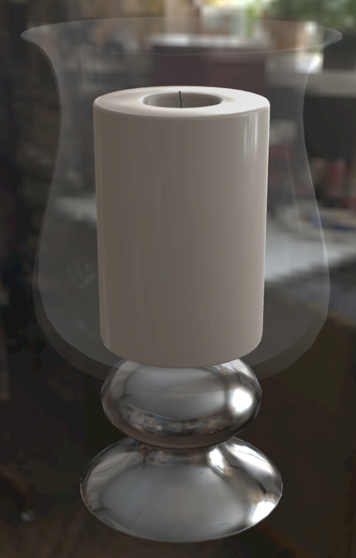
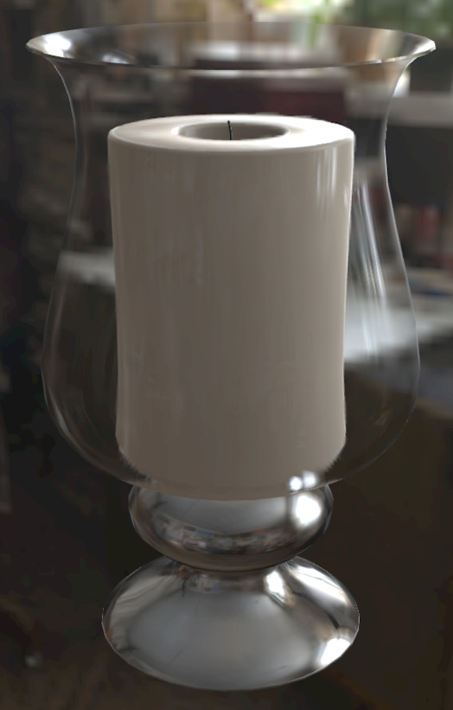
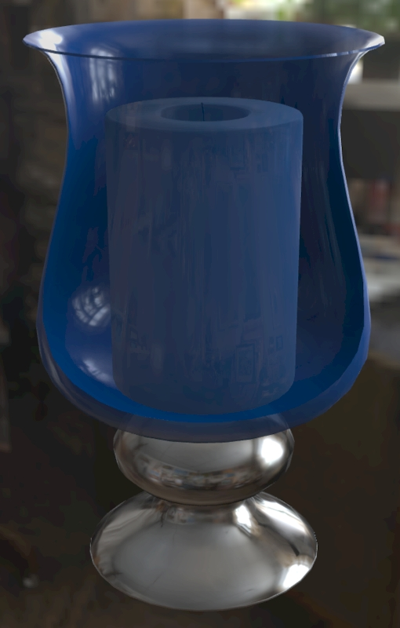
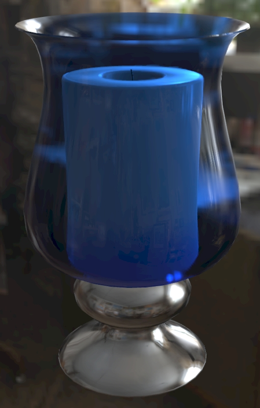

[Table of Contents](README.md) | Next: [Using Visual Studio Code](AddingMaterialExtensions_002_UsingVisualStudioCode.md)

# Why add Extensions?

Glass and other transparent surfaces have historically been difficult to reproduce in glTF. Lately however the new extensions for transmission and volume have become available, adding significant rendering improvements for refraction and absorption.

Until now, Alpha Coverage was the method for rendering transparent surfaces, with some significant drawbacks. It is used to control the overall visibility of a surface, so it can’t recreate clear glass or liquids. The surface reflectivity is reduced as the surface becomes more transparent. Black pixels will completely hide the surface, grays will cause partial visibility, and white will keep the surface fully visible. Alpha Coverage is useful for materials like leaves mapped onto cards, burlap with gaps between the fibers, wicker with gaps, etc. but it’s not recommended for glass or liquids.

 

_Alpha Coverage for glass (left) vs. Transmission & Volume (right). On the left, notice the glass looks foggy instead of clear, reflections are nearly invisible, and there are no refractions. Transmission on the right fixes these issues._

 

_Alpha Coverage for colored glass (left) vs. Transmission & Volume (right). On the left notice the inside is rendering on top of the outside, the glass color is weaker, and there are no refractions. Transmission on the right fixes these issues, and Volume shows absorption in the thicker glass at the bottom._

[Table of Contents](README.md) | Next: [Using Visual Studio Code](AddingMaterialExtensions_002_UsingVisualStudioCode.md)