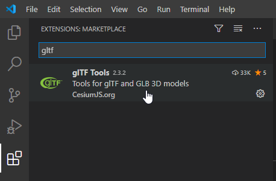
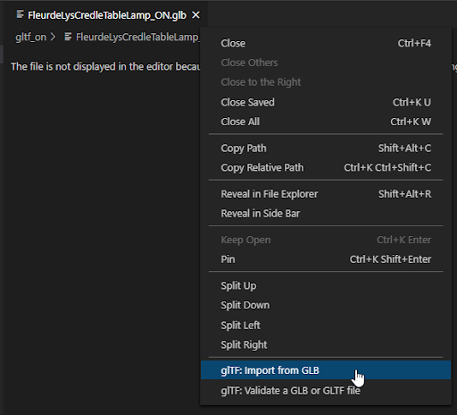
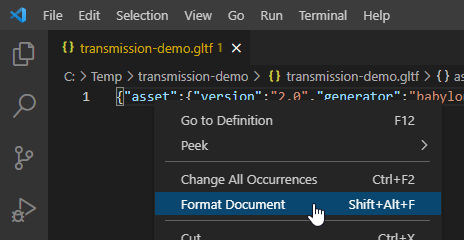
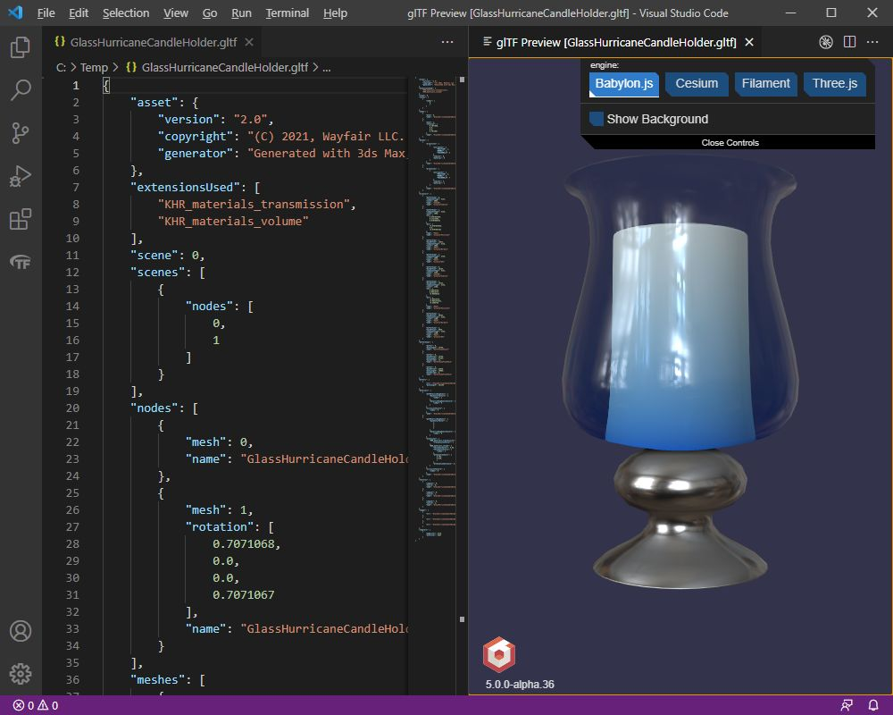
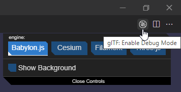
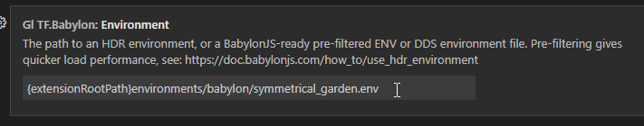
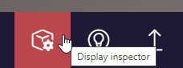
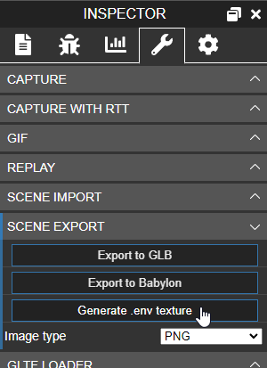
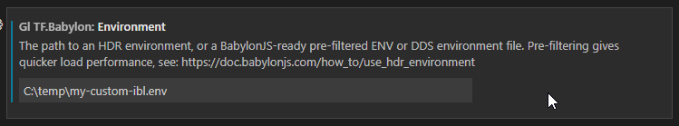
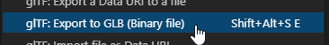

Previous: [Why add Extensions?](AddingMaterialExtensions_001_WhyAddExtensions.md) | [Table of Contents](README.md) | Next: [KHR_materials_transmission and KHR_materials_volume](AddingMaterialExtensions_003_TransmissionAndVolume.md)

# Using Visual Studio Code

While any text editor can be used to modify glTF files, Visual Studio Code has a great toolkit for visual editing, proof-reading, and converting glTF formats. 

Go to the releases section [https://code.visualstudio.com/download](https://code.visualstudio.com/download) to download the appropriate installer, then install it.

Add the extension glTF Tools. This includes many useful functions for editing glTF models, including a live debugger, a 3D preview window, conversion between glTF and GLB, etc. To add the extension, open Visual Studio Code then go to the Extensions tab and search for _gltf_

The extension has several great tools for working with glTF models. It dynamically checks for syntax errors or badly-formatted textures, with helpful popups suggesting potential solutions.

More information [about glTF Tools here](https://github.com/AnalyticalGraphicsInc/gltf-vscode).

## glTF Formats 

When adding extensions, it’s easier to use the text-based .glTF format, as this will open readily in a text editor. 

The binary .GLB format can also be used. It is typically smaller and self-contained with textures and mesh data all together inside one file. This makes the model more portable, but is not as easy to edit.

## Opening glTF in Visual Studio Code

A binary .GLB will need to be converted into a text-format .glTF file for editing. The glTF Tools extension has a tool for this. The conversion is usually lossless, and once editing is complete the model can be converted back into a self-contained GLB. 

Right-click on the tab, and choose _glTF: Import from GLB_:

If the model is already in text-based .glTF format, it can be opened without conversion. 

If the glTF is all on one line it can be converted into a more readable format. Right-click on the first line and choose _Format Document_:

## glTF 3D Preview

Use the glTF Preview (Alt+G) to see the model. 

To update the view, save the .glTF (Ctrl+S). Similarly, if the textures need to be edited the glTF Preview will automatically update as soon as they are saved.

Several renderers are supported. Babylon.js has a built-in editor which can be opened using the button _glTF: Enable Debug Mode_ at top right:

The Babylon.js debug editor does not save back into the glTF file from within Visual Studio Code, but it’s great for quickly testing various glTF features.

## Custom IBLs in Visual Studio Code

Image-based lighting (IBL) environments can be customized for the 3D viewers.  

Go to the Extensions section at left and click on glTF Tools. A new tab will open for glTF Tools. Click on the _Manage_ (gear) icon, and choose _Extension Settings._

The path here can be edited to point to a custom IBL:

The IBL for Babylon.js must use the .env format, which can be created in the Babylon.js Sandbox. 

1. Find a suitable HDR panorama. HDRs can be downloaded from various sources, for example [https://polyhaven.com/a/artist_workshop](https://polyhaven.com/a/artist_workshop).
2. Go to [https://sandbox.babylonjs.com/](https://sandbox.babylonjs.com/)
3. Load any glTF model.
4. Drag-and-drop the HDR. 
5. Click on the Display Inspector button at bottom right:

6. Go to the Tools tab, open the SCENE EXPORT section, and click on _Generate .env texture_:

It is a good idea to put the .env in a custom location, because the default folder may be overwritten whenever glTF Tools is updated. For example:

The viewers three.js and Filament each use their own IBL file formats; the details can be found in the glTF Tools settings.

To see the new custom IBL, close and restart the 3D viewer.

## Export to GLB

Once editing is completed, Visual Studio Code can be used to pack the model back into a single binary GLB file. This is not strictly necessary, but can make it easier to distribute the model.

Make sure to close the 3D preview window first. Then right-click on the tab and choose _glTF: Export to GLB (Binary file)_:

Previous: [Why add Extensions?](AddingMaterialExtensions_001_WhyAddExtensions.md) | [Table of Contents](README.md) | Next: [KHR_materials_transmission and KHR_materials_volume](AddingMaterialExtensions_003_TransmissionAndVolume.md)