Previous: [Using Visual Studio Code](AddingMaterialExtensions_002_UsingVisualStudioCode.md) | [Table of Contents](README.md) | Next: [Using a Raytracer](AddingMaterialExtensions_004_UsingARaytracer.md)

# KHR_materials_transmission and KHR_materials_volume

Visual Studio Code can be used to add extensions to the glTF model. 

Add a new _“extensionsUsed”_ section after the _“asset” _section. If it exists already, don’t add another one, just add the extensions inside the existing one.

```
         "extensionsUsed": [
             "KHR_materials_transmission",
             "KHR_materials_volume"
         ],
```

In this example, two extensions are being added at the same time: Transmission and Volume. Transmission on its own will make thin-walled refraction, as if the surface is infinitely thin and does not bend light. The Volume extension defines a depth for the surface, so light can be bent via refraction, and/or colored via absorption.

Before: 

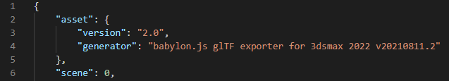

After: 

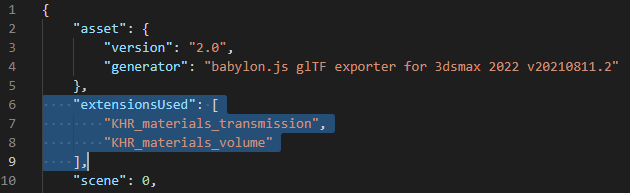

This glTF file was generated using the Max2Babylon glTF exporter for 3ds Max. However any other glTF generator can be used.

Go to the section for "materials" to find the material for the model, and add a new section for _“extensions”_: 

```
                 "extensions": {
                     "KHR_materials_transmission": {
                         "transmissionFactor": 1
                     },
                     "KHR_materials_volume": {
                         "thicknessFactor": 0.01
                     }
                 },
```

Before: 

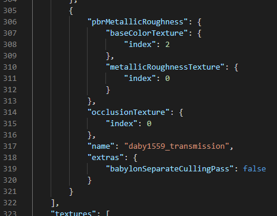

After: 

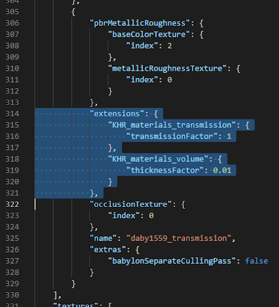

## thicknessFactor and thicknessTexture

The thicknessFactor controls how thick the glass/plastic/liquid is in Meters. Refraction bending and light absorption will not occur if this is not provided. 

Thickness is in meters, but refraction may not be completely accurate so it is OK to fine-tune the thickness to look OK. A word of warning though, going beyond physical values may cause unwanted side effects, so it’s usually best to stick as close to accurate values as possible.

For “thin wall” transmission, set thicknessFactor to zero. This is useful when there’s a very thin transmission surface, for example a lightbulb made of clear glass. If the glass were set to the thickness of the whole bulb it would refract like a solid glass paperweight.

A thicknessTexture is optional. This is a grayscale texture that gives a hint to rasterizers about how variable the thickness is across the model, for example the stem under a wine glass is thicker than the sides so it will refract & absorb more. This texture can be “baked” from the model. 

Several tools can be used to bake a thickness texture: 

* 3ds Max - [Render Surface Map: SubSurface Map](https://help.autodesk.com/view/3DSMAX/2022/ENU/?guid=GUID-08738349-9267-4D9C-986F-C6198E9AA900)
* Blender - [Render Bake](https://www.blendernation.com/2018/09/12/baking-thickness-maps-in-blender-2-8/)
* Gestaltor - [Bake Thickness Map](https://docs.gestaltor.io/#create-a-volume-effect-using-a-thickness-map)
* Marmoset Toolbag - [Baker](https://marmoset.co/posts/toolbag-baking-tutorial/#maptypes)
* Substance 3D Painter - [Thickness Baker](https://substance3d.adobe.com/documentation/spdoc/thickness-142213479.html)
* etc.

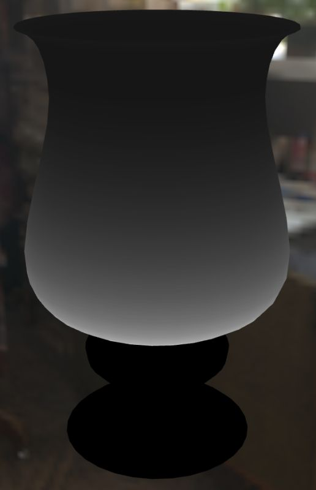 

_Thickness texture (left) vs. rendering with Transmission & Volume (right). Absorption can be seen in the thicker glass at the bottom, which is informed by the thickness texture._

The thicknessTexture may need to be edited after baking to improve the visual result. White in the thicknessTexture will use the thicknessFactor value; this is the thickest part of the surface. Black applies zero thickness. If there are black areas in the texture they may need to be increased to a darker gray to promote suitable refraction.

The thicknessTexture may also need to be blurred to simulate a smoother mesh surface. If the thicknessTexture is baked from a low-resolution model it may have facets or hard edges. Blurring the image can reduce these artifacts, even if it is not strictly accurate.

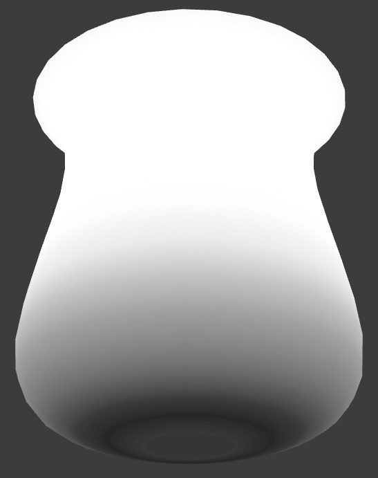 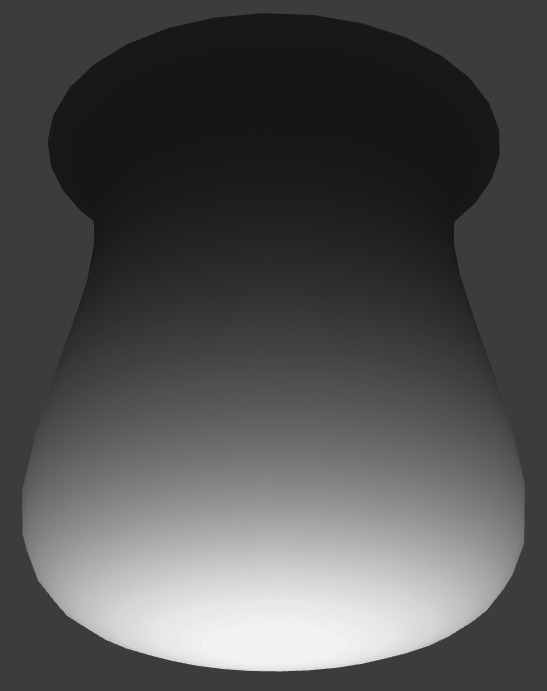

_A raw thickness bake (left) shows some artifacts: the gradient is reversed, instead the bottom should be brighter since it’s thicker. Also the gradient shows hard edges which can be fixed by blurring the bake. The thicknessTexture after being fixed (right)._

## Adding Textures for Transmission and Volume

If a texture is needed for transmission or thickness, these can be added in Visual Studio Code.

Go to the sections for "textures" and “images” to add the new textures. Copy the code for one of the existing textures, and edit the “name” and increment the “source”:

Before: 

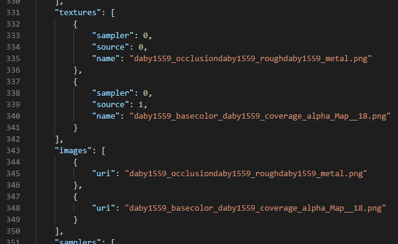

After: 

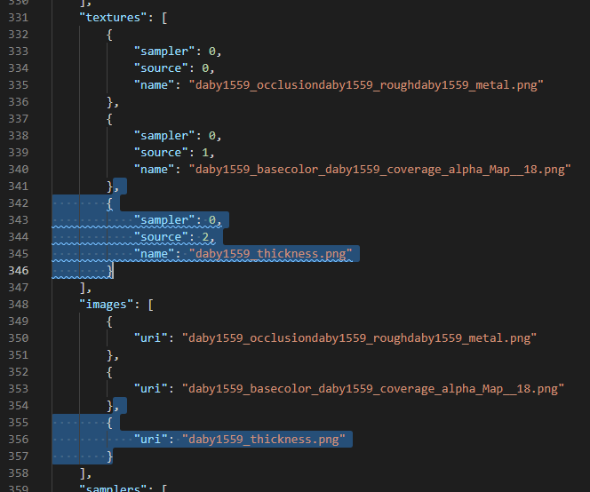

Go to the section for “materials”, find the suitable material and add the new texture. Set the “index” to match the element in the “textures” section. Note that elements are zero-based, so in this case the third texture element is actually index 2.

```
                                 ,
                         "thicknessTexture": {
                             "index": 2
                         }
```

Before: 

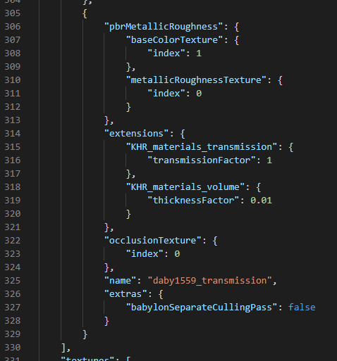

After: 

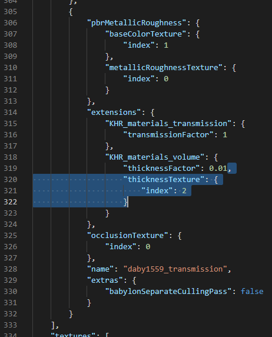

Use the 3D preview (Alt+G) to test the material appearance, and adjust as needed.

## attenuationColor and attenuationDistance

The attenuationColor and attenuationDistance help the 3D viewer to simulate how a thick tinted glass or liquid can absorb light the further it goes into the volume. For example a cup made of colored glass is often darker in the base where the glass is thicker.

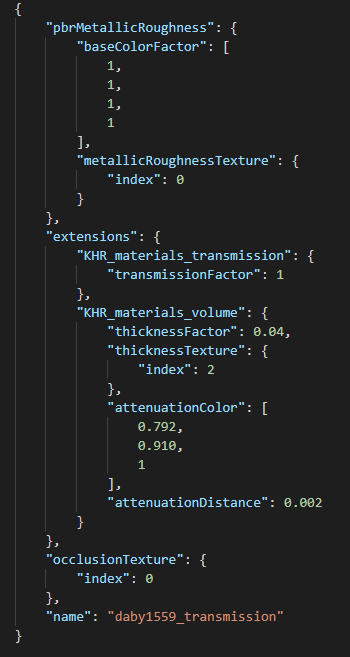 

When using attenuation, it may be beneficial to change the baseColor to white, and put all the color into attenuationColor. This helps improve the contrast for the absorption because it’s not fighting with the baseColor. 

If the glass is multicolored or patterned then a baseColorTexture will probably be needed instead. The attenuationColor does not use a texture; the color would be uniform throughout the material.


Previous: [Using Visual Studio Code](AddingMaterialExtensions_002_UsingVisualStudioCode.md) | [Table of Contents](README.md) | Next: [Using a Raytracer](AddingMaterialExtensions_004_UsingARaytracer.md)
