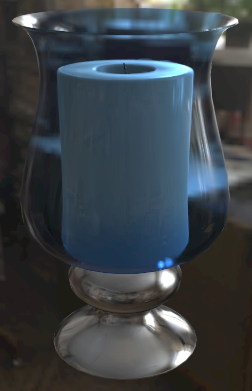

Previous: [KHR_materials_transmission and KHR_materials_volume](AddingMaterialExtensions_003_TransmissionAndVolume.md) | [Table of Contents](README.md) | Next: [Transmission Limitations](AddingMaterialExtensions_005_TransmissionLimitations.md)

# Using a Raytracer

When adjusting material parameters, it’s a good idea to check the “ground truth” appearance with a raytracer. 

glTF models can be rendered on a variety of renderers, but some need to take shortcuts to update at an interactive frame rate. With augmented reality or virtual reality, rendering speed is of the utmost importance; rasterizers are typically used for these applications because they don’t require high-end raytracing GPUs. 

The thicknessFactor and thicknessTexture are used by rasterizers to simulate the depth properties of volumetric surfaces. These are “hints” for the rasterizer to improve speed, but ignored by raytracers since they can use the actual geometry depth instead.

 

_A glTF model  rendered in the [Microsoft Babylon.js](https://sandbox.babylonjs.com/) rasterizer (above left) and the [Dassault Enterprise PBR](https://dassaultsystemes-technology.github.io/dspbr-pt/) pathtracer (above right). The thicknessFactor and thicknessTexture are inaccurate here, they should be adjusted to better match the raytraced ground truth._

 

_After adjustments, the rasterizer (above left) is a better match to the raytracer (above right)._

Previous: [KHR_materials_transmission and KHR_materials_volume](AddingMaterialExtensions_003_TransmissionAndVolume.md) | [Table of Contents](README.md) | Next: [Transmission Limitations](AddingMaterialExtensions_005_TransmissionLimitations.md)