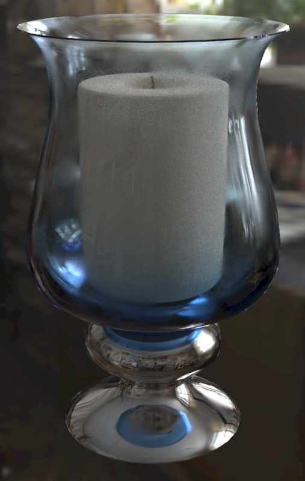

Previous: [Using a Raytracer](AddingMaterialExtensions_004_UsingARaytracer.md) | [Table of Contents](README.md)

# Transmission Limitations

When rendered in a rasterizer, transmission can cause some significant visual artifacts.

Rasterizers usually rely on a fast but somewhat inaccurate rendering method. First all transmission surfaces are hidden, then the scene is rendered into a temporary texture. Next this texture is distorted based on the thicknessFactor and thicknessTexture and normalTexture (a normal bump map). Finally, the texture is projected it back onto the transmission surface from the camera’s viewing angle. This is all done in real-time, many times per second.

This method is fast and often works well, but it causes only one layer of transmission to be rendered. If surfaces overlap one another only the nearest will be rendered; any surfaces with transmission behind the first one will be invisible.

 

_In the raytraced render (left) the inside surface of the glass shows reflections from the windows. In the rasterizer render (right) only one layer of transmission is visible; the inside surface of the glass is not rendered behind the outside surface._

This is OK in many cases, but can be problematic if rendering a model with multiple transmission surfaces. If this is unacceptable there are a couple potential fixes: 

One solution would be to apply transmission only to the parts of the model that need it. This is a good setup as it will improve render performance. However it will cause the rest of the model to be rendered as opaque. 

Another solution could be to use alpha coverage for some surfaces and transmission for others, because alpha coverage will still be refracted behind transmission. Alpha coverage has its own rendering problems, as mentioned before. But seeing something behind transmission is often better than seeing nothing.

Previous: [Using a Raytracer](AddingMaterialExtensions_004_UsingARaytracer.md) | [Table of Contents](README.md)