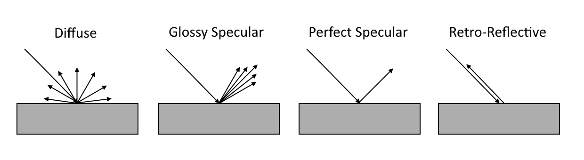
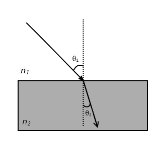
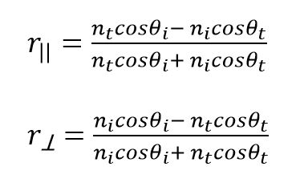
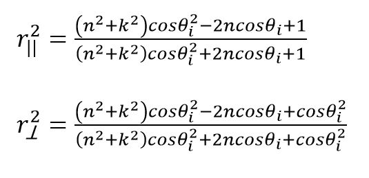
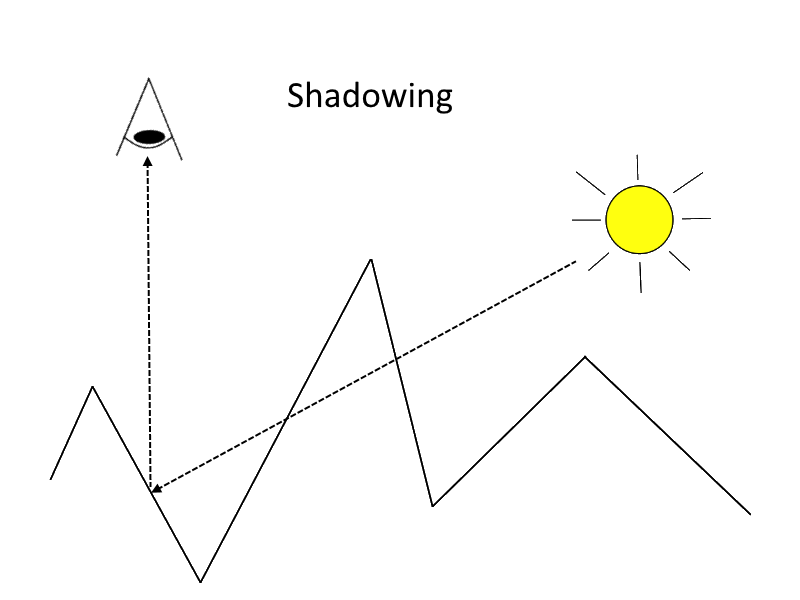
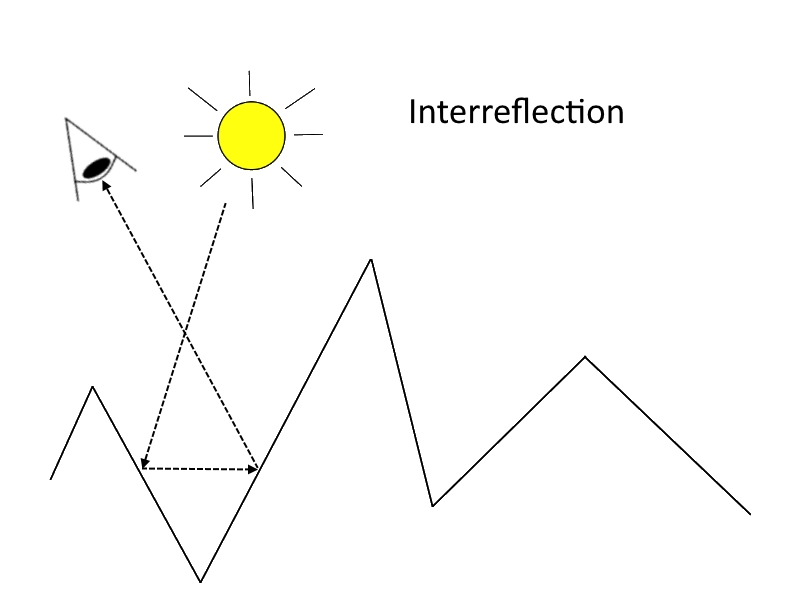

# Physically-Based Rendering: From Theory to glTF
Mohamad Moneimne, University of Pennsylvania

## What is PBR?
Physically-Based Rendering (PBR) refers to techniques that attempt to simulate light in order to render photorealistic images. As indicated by the name, these techniques focus on our understanding of physics to model how light interacts with surfaces that have different physical properties. Since these interactions happen on a very fine level, PBR techniques often use statistical models to add realism and complexity to renders.

PBR has been around for several years now, but was initially too computationally expensive to be a viable option for real-time applications. However, with the continuous advancement of computing power, it has increasingly become an industry standard in real-time graphics. In fact, much of the real-time software we see today such as Unreal Engine 4, Unity 5, Frostbite, and many others use physically-based rendering techniques to provide their users with the ability to create highly realistic 3D scenes.

The goal of this article is to provide some intuition behind PBR theory and cover a bit of the mathematical foundation before discussing the relationship between PBR and glTF.

</img>
From Marmoset Toolbag Tutorials: [Physically-Based Rendering, And You Can Too!](https://www.marmoset.co/posts/physically-based-rendering-and-you-can-too/), by Joe "Earthquake" Wilson

## How do we model light-object interactions in PBR?
The physics law most central to PBR is the law of conservation of energy. This law states that the total amount of energy within an isolated system remains constant, but how does this relate to rendering? In PBR, radiance is the energy that is conserved, meaning the amount of incoming light at any point in the scene is equal to the sum of the reflected, transmitted, and absorbed light at that point.

Within any environment, it is easy to see several examples of complicated surfaces that seem to interact with light differently. For example, mirrors reflect perfect images, plastics are shiny, and chalkboards are matte. All of these unique properties can be modeled by considering general mathematical functions called **Bidirectional Scattering Distribution Functions** (**BSDFs**). These functions describe how light scatters upon contact with a surface based on the properties that surface holds. More specifically, they follow a statistical model to tell the user how likely the incident light is scattered in a specific outgoing direction.

BSDF sounds like a very complicated term for what it actually means, so let’s break it up and explain its parts...  
* **Bidirectional** refers to the notion that at any point on a surface, light comes in and light goes out.
* **Scatter** describes that light coming from one direction onto a surface can end up splitting into a range of directions. For example, light can either scatter by being reflected from or transmitted through the surface in certain directions.
* Finally, the details for how light scatters can be described using **distribution functions**, which entail how light is likely to be distributed in certain directions based on the physical properties of the surface. This can be anything from an equal scatter in all directions to a perfect reflection in a single direction.

To help better understand the kinds of BSDFs that occur, we can consider two general types...
* **BRDFs** (Bidirectional Reflectance Distribution Functions) specifically correspond to BSDFs that describe how light is _reflected_ from a surface. This reflected light refers to the colors we see coming directly from a surface. At this point, it is normal to ask something along the lines of the following: If I shine a white light at a banana, why does it appear yellow instead of white? This is because not all light is just reflected from a surface. While surfaces reflect light of certain colors (wavelengths), they absorb or transmit the remaining energy. For bananas, wavelengths in the yellow spectrum are mainly reflected while other wavelengths are absorbed.
* **BTDFs** (Bidirectional Transmittance Distribution Functions) specifically correspond to BSDFs that describe how light is _transmitted_ through a surface. This can be seen in examples such as glass and plastics where we can see light that has traveled through the surface.

There exist other types of density functions that account for effects such as subsurface scattering (the effect in which light enters a material and bounces around before exiting again in some other position and direction).

## What are the reflection models?
There are four general surface types with reflection distribution functions (BRDFs) that describe the probability that light scatters in all directions:
* **Diffuse** – surfaces that scatter light equally in all directions, e.g., even color of a chalkboard
* **Glossy specular** – surfaces that scatter light preferentially in a set of reflected directions and show blurry reflections, e.g., specular highlights on plastic
* **Perfect specular** – surfaces that scatter light in a single outgoing direction such that the angle of incident light is equal to the outgoing light with respect to the surface normal, e.g., perfect reflection of mirrors
* **Retro-reflective** – surfaces that scatter light primarily back along the incident direction of the light source, e.g., specular highlights on velvet

</img>

However, it is highly unlikely that a surface in reality will follow only one of these models. Because of this, most materials can be modeled as a complex mix of these.

For each of these types of reflection, the distributions can be isotropic or anisotropic.
* **Isotropic** – The amount of light reflected doesn’t change at a point when rotating the object about its normal. This is true for most surfaces we see in daily life.
* **Anisotropic** – The amount of light varies at a point as the object is rotated about its normal. This occurs because the small bumps and grooves on the surface are mostly oriented in the same direction instead of randomly, which results in elongated and blurry reflections. This can be seen in certain materials such as in brushed metal and velvet.

## What about BTDFs?
The types of reflection distributions also apply to transmission (excluding retro-reflection), but conversely discuss how light travels after passing through a surface. The direction light travels after passing through the material is often dependent on the properties of the material itself.

To discuss how this differs from reflection, consider a single light ray that has passed through a surface, as in the case of perfect specular transmission. For perfect specular transmission, the angle at which the light continues to propagate depends on the **index of refraction** of the medium. This follows **Snell’s Law**, which is described using the equation **_n1θ1 = n2θ2_**.

</img>

where _n_ is the index of refraction of the first and second media and _θ_ is the angle of the light with respect to the normal as it hits then passes through the surface. This means that if the indices of refraction of both media are the same, then light continues perfectly straight. However, if the indices are different, light will bend in a different direction once passing on to the next medium. A good example of this is how light moving from the air into water gets bent, causing distortions in what we see in the water.

This is unlike perfect specular _reflection_ where the incident angle will always be equal to the outgoing angle.

## How much light is reflected and transmitted?
It is important for physically-based renderers to know how much light is reflected or transmitted on a surface. It is a combination of these effects that describe substances such as honey and stained glass that both have color and can be seen through. 

These amounts are directly related to each other and described by the **Fresnel equations**. The equations are described for two types of media, _dielectrics_ and _conductors_. 
* **Dielectrics**: These are media such as glass, plastic, and ceramics, that transmit electricity without conducting (i.e. insulators). We can approximate the amount of energy that is reflected and transmitted by these surfaces using the following equations...

    </img>

    where _r||_ is the Fresnel reflectance for parallel polarized light and _r⟂_ is the reflectance for perpendicular polarized light. The subscripts correspond to incident (_i_) and transmitted (_t_) directions.
For unpolarized light, Fresnel reflectance can be modeled as **_Fr = 0.5(r||2 + r⟂2)_**. Then, due to conservation of energy, Fresnel transmittance can be modeled as **_Ft = 1 - Fr_**.

* **Conductors**: These are media such that transmit heat and electricity with a certain capacity. Some examples include most (but not all) metals such as copper, silver, and gold. Unlike dielectrics, conductors don’t transmit light. Instead, they absorb some of the incident light, which gets transferred into heat. The amount of absorbed light is described using an **absorption coefficient**, _k_, for the conductor.
These are approximated using the following terms...
	
	</img>

    and Fresnel reflectance is modeled as **_Fr = 0.5(r||2 + r⟂2)_**.

## Are all surfaces the same roughness?
It is very useful to be able to show the roughness or smoothness of a surface without having to directly create the geometry or provide a bump map. Instead, surfaces can be modeled as a collection of small **microfacets** where the more rough a surface is, the more jagged microfacets it has. These microfacets can be thought of as small ridges on the surface of an object, varying the surface normal on a very fine level, which adds a lot of realism to rendered images. The distribution of microfacets on a surface can be described using a statistical model, examples of which include the [Oren-Nayar model](http://www1.cs.columbia.edu/CAVE/publications/pdfs/Oren_SIGGRAPH94.pdf), the [Torrance-Sparrow model](http://www.graphics.cornell.edu/~westin/pubs/TorranceSparrowJOSA1967.pdf), and the [Blinn Microfacet Distribution model](http://dl.acm.org/citation.cfm?id=563858.563893).

With knowledge of these microfacets, we can simulate some interesting geometric interactions between light and adjacent ridges. Consider the following three scenarios:

1. An adjacent microfacet can block the light reflected from another, causing **masking**.
2. An adjacent microfacet can block incoming light, causing **shadowing**.
3. An adjacent microfacet can reflect light coming from the reflection of another, causing **interreflection**.

</img></img></img>

Simulating these three phenomena can help augment the realism of roughness on a surface.

## What is a material?
Materials are high-level descriptions used to model surfaces specified by mixtures of BRDFs and BTDFs. These BSDFs are specified as parameters that help frame the visual properties of the material. For example, we can describe a matte material by providing a diffuse reflection value to describe how light interacts with the surface and a scalar roughness value to describe its texture. To move from a matte to a plastic, we could simply add a glossy specular reflection value to the matte material to recreate the specular highlights that can be seen on plastics.

Once a material has been described, we can then use this material on meshes throughout a 3D scene. You could create a single material and assign it to every object within a scene, but that would make for quite a boring application. With physically-based materials, we can create complex materials that bring a scene to life and offer visually compelling experiences to the user.

To get a better idea of what we can create with this abstraction, here is a list of some common materials and what their descriptions might entail...
* **Mirror** - Perfect specular reflection
* **Metal** - Diffuse and specular reflections described by the Fresnel equations for conductors
* **Clear Glass** - A combination of specular reflection and transmission
* **Stained Glass** - Specular reflection and transmission as in clear glass, but with added diffuse reflection to account for the color

## Where does glTF come in?
As you may know, [glTF](https://www.khronos.org/gltf) is a 3D file format that allows efficient transmission and loading of 3D scenes, including materials.

With the rise in demand for PBR materials within realtime applications, it has become clear that there is little consistency in the language used to describe these materials. For example, the parameters for physically-based materials used in Unreal Engine 4 are base color, roughness, metallic, and specular while Marmoset uses albedo, microsurface, and reflectivity. This creates a language barrier between artists and developers who use different applications and makes it difficult for users to import and export files easily between them.

With this in mind, glTF aims to bring PBR to runtime engines in a consistent way that is simple to implement and sufficient for most use cases. This allows developers to reuse exporters and pipeline tools instead of creating application-specific ones. 

## References
* [_Physically-Based Rendering, And You Can Too!_](https://www.marmoset.co/posts/physically-based-rendering-and-you-can-too/), by Joe "Earthquake" Wilson
* [_Physically Based Rendering, Second Edition: From Theory To Implementation_](http://www.pbrt.org/), by Matt Pharr and Greg Humphreys
* [Cornell CS667 Lecture Notes on Scattering](http://www.cs.cornell.edu/courses/cs6630/2012sp/notes/03brdf.pdf), by Steve Marschner

## Acknowledgements
* Adam Mally
* Akshay Shah
* Patrick Cozzi
