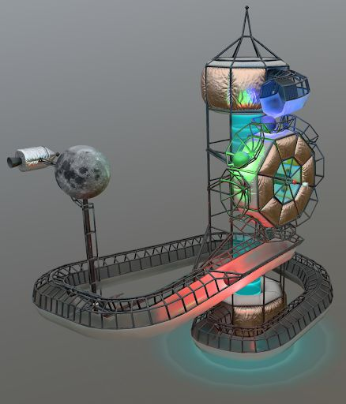
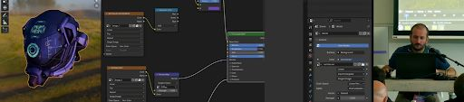
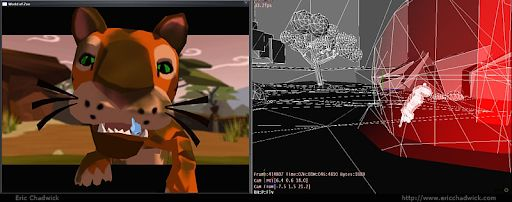
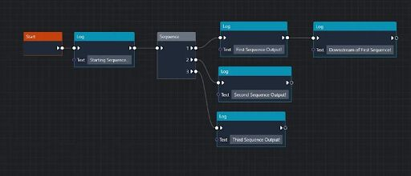
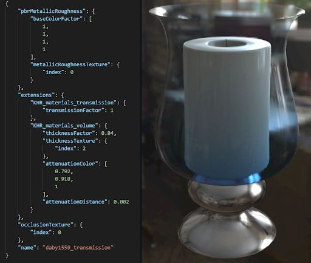

# Tooling Support for Creatives
by Eric Chadwick, 1 May 2026

## The Ask
The Khronos Group's 3D Formats Working Group asked me to create _“A report with illustrations and recommendations identifying areas where tooling support is inadequate, inconsistent, incongruous, or unsuitable. The report will be used to guide future tooling development and educational material.”_

My general findings are:
- Creators often build content that pushes the boundaries of technology. 
- Creators can be engineers or artists, but artists usually need tools with graphical user interfaces that support interactive editing.
- Artists need live editing for iterative work, with “what you see is what you get” feedback.
- Output is reduced significantly when artists are forced through slow “export-to-see” workflows.

## Marbles Forever asset
The working group tasked me with creating a physics "showcase" demonstration asset. I leveraged the setup of the existing [Water Wheel example](https://eoineoineoin.github.io/glTF_Physics_Babylon/packages/demo/dist/#sceneIndex=6) by [eoineoineoin](https://github.com/eoineoineoin), re-creating it with new art and added functionality. 

Ultimately this resulted in a good asset, but it was very difficult to create.

 
_The MarblesForever glTF sample asset_

The asset is currently submitted as a Pull Request, and is awaiting fixes to the renderers that support the new glTF physics extensions. See https://github.com/KhronosGroup/glTF-Sample-Assets/pull/256

This asset could not have been created without the physics tooling in Blender:
- Many controls are available.
- It can simulate most things directly in Blender.
- Some features can only be seen by exporting & loading into a web viewer (export-to-see).
- It was difficult to problem-solve, requires deep domain knowledge (Thanks Eoin!).
- Access to the source .blend files were essential for learning.
- There is some [gltf physics documentation](https://github.com/eoineoineoin/glTF_Physics_Blender_Exporter#usage) already, however I think artists need more in-depth information, explaining what each setting does. [Blender physics documentation](https://docs.blender.org/manual/en/latest/physics/rigid_body/properties/collisions.html#collisions) is also sparse. 
- Artists will need documentation that breaks down specific examples, explaining the reasoning behind each physics setting, in context.

## Successful glTF Tooling Examples
 
_[The Complete glTF Asset Creation Pipeline](https://www.youtube.com/watch?v=KTPdNUGwIGc), Blender editing with Julien Duroure_

These tools do not yet support glTF physics nor glTF interactivity, however they are good examples of existing successful glTF tooling. 

- [glTF Sample Viewer](https://github.khronos.org/glTF-Sample-Viewer-Release/) great for quick analysis, but no editing.
- [Babylon.js Sandbox](https://sandbox.babylonjs.com/) great for editing, but editing is often not glTF-specific.
- [glTF Editor](https://www.gltfeditor.com/) great for editing, full-featured, glTF-specific.
- [glTF Compressor](https://github.khronos.org/glTF-Compressor-Release/) great for testing many compressions, glTF-specific, but buggy.
- [Three.js Editor](https://threejs.org/editor/) great for editing, glTF-specific.
- [Needle Viewer](https://viewer.needle.tools/) great for editing, full-featured, glTF-specific.
- [Gestaltor](https://gestaltor.com/) great for editing, full-featured, glTF-specific.
- [Blender](https://docs.blender.org/manual/en/2.80/addons/io_scene_gltf2.html) great for editing, but editing is often not glTF-specific.
- [Enterprise PBR Sample Renderer](https://dassaultsystemes-technology.github.io/dspbr-pt/) great for analysis of pathtracer vs. rasterizer ([three.js now too!](https://threejs.org/editor/)).
- [Godot](https://docs.godotengine.org/en/stable/classes/class_gltfdocument.html) editor can selectively disable features to mimic glTF limitations.

## glTF Physics Tooling

Tooling for working with glTF physics is minimal at present.

- [glTF_Physics_Blender_Exporter](https://github.com/eoineoineoin/glTF_Physics_Blender_Exporter) great for building, but incomplete playback, difficult to learn
- [glTF Sample Viewer Physics](https://github.khronos.org/glTF-Sample-Viewer-Release/physics/) great for playback, limited analysis, no editing
- [glTFhysics! Babylon.js Viewer](https://eoineoineoin.github.io/glTF_Physics_Babylon/packages/demo/dist/#sceneIndex=0) great for playback, limited analysis, no editing

Ideal editing scenario for creatives:
1. Create visuals/animations/proxies in DCC, export to glTF.
1. Import into interactive tool to add/edit physics, play/pause/step, x-ray analysis.
1. Export the edited asset to finished glTF format.

An interactive physics editing tool could ideally be built on an existing glTF editor, would allow editing of all physics properties, simulation playback/stepping controls, “x-ray” style analysis of physics shapes & controls.

 
_Example of a Havok physics editor running on the Nintendo Wii_

## glTF Interactivity Tooling

Tooling for working with glTF interactivity is minimal at present.

- [Khronos glTF-InteractivityGraph-AuthoringTool](https://github.khronos.org/glTF-InteractivityGraph-AuthoringTool/)
- [Needle glTF Interactivity Editor](https://gltf-interactivity.needle.tools/)
- [Babylon.js Flow Graph](https://github.com/BabylonJS/Babylon.js/pull/16201)

Ideal editing scenario for creatives:
1. Create visuals/animations/proxies in DCC, export to glTF.
1. Import into interactive tool to add/edit interactivity, play/pause/step, x-ray analysis.
1. Export the edited asset to finished glTF format.

Artists will need to be able to load example files into these editors, to learn how functionality can be implemented effectively.

 
_Screenshot from "Voices of VR Podcast" with Kent Bye and Ben Houston_

## glTF Training Materials
Creatives need both complex “real-world” examples, and specific “atomic” examples.
- Real-world examples demonstrate what’s possible, why it matters, provides inspiration.
- Atomic examples provide specific code for creatives to slow into their own assets.
- Documentation is needed to explain the implementation reasoning ([good example here](https://www.khronos.org/blog/gltf-interactivity-specification-released-for-public-comment#:~:text=three%20event%20flows%3A-,Start%20of%20the%20Graph%3A,-This%20initiates%20a)).
- Documentation needed to explain performance implications (e.g. simple vs. complex physics shapes, behavior tree traversals, etc.).
- Creatives need to know what ISN’T supported, limitations of the tech.

 
_Screenshot from [Adding Material Extensions to glTF Models](https://github.com/KhronosGroup/glTF-Tutorials/blob/main/AddingMaterialExtensions/README.md)_
