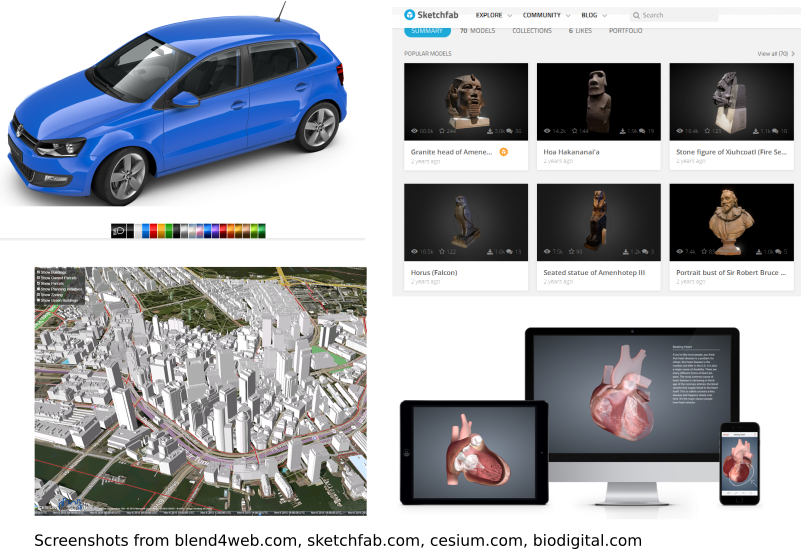
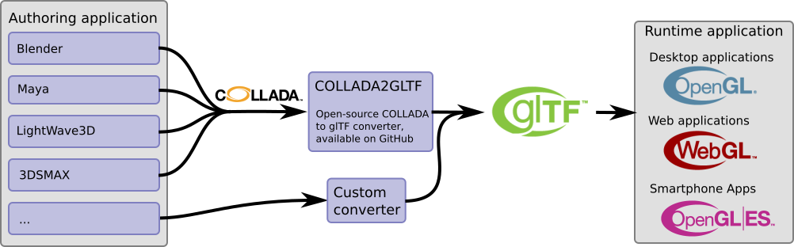

## Introduction to glTF

There is an increasing number of applications and services that are based on 3D content. Online shops are offering product configurators with a 3D preview. Museums are digitizing their artifacts with 3D scans, and allow exploring their collection in virtual galleries. City planners are using 3D city models for planning and information visualization. Educators are creating interactive, animated 3D models of the human body. In many cases, these applications are running directly in the web browser, which is possible because all modern browsers support efficient, OpenGL-based rendering with WebGL.

### 3D content creation

The 3D content that is rendered in the client application comes from different sources. In some cases, the raw 3D data is obtained with a 3D scanner, and the resulting geometry data is stored as the [OBJ](https://en.wikipedia.org/wiki/Wavefront_.obj_file), [PLY](https://en.wikipedia.org/wiki/PLY_(file_format)) or [STL](https://en.wikipedia.org/wiki/STL_(file_format)) files. These file formats only support simple geometric objects and do not contain information about how the objects should be rendered. Additionally, they cannot describe more complex 3D scenes that involve multiple objects. Such sophisticated 3D scenes can be created with authoring tools. These tools allow editing the overall structure of the scene, the light setup, cameras, animations, and, of course, the 3D geometry of the objects that appear in the scene. Each authoring tool defines its own file format in which the 3D scenes are stored. For example, [Blender](https://www.blender.org/) stores the scenes in `.blend` files, [LightWave3D](https://www.lightwave3d.com/) uses the `.lws` file format, [3ds Max](http://www.autodesk.com/3dsmax) uses the `.max` file format, and [Maya](http://www.autodesk.com/maya) scenes are stored as `.ma` files. For the exchange of data between 3D authoring applications, different standard file formats have been developed. For example, Autodesk has defined the [FBX](http://www.autodesk.com/products/fbx/overview) format. The web3D consortium has set up [VRML and X3D](http://www.web3d.org/standards) as international standards for web-based 3D graphics. And the [COLLADA](https://www.khronos.org/collada/) specification defines an XML-based data exchange format for 3D authoring tools. The [List of 3D graphics file formats on Wikipedia](https://en.wikipedia.org/wiki/List_of_file_formats#3D_graphics) shows that there is an overwhelming number of more than 70 different file formats for 3D data, serving different purposes and application cases.  

### 3D content rendering

Although there are so many different file formats for 3D data, there is only one open, truly platform-independent and versatile way of *rendering* 3D content - and that is OpenGL. It is used for high-performance rendering applications on the desktop, on smartphones, and directly in the web browser, using WebGL. In order to render a 3D scene that was created with an authoring tool, the input data has to be parsed, and the 3D geometry data has to be converted into the format that is required by OpenGL. The 3D data has to be transferred to the graphics card memory, and then the rendering process can be described with shader programs and sequences of OpenGL API calls.

### 3D content delivery

There is a strong and constantly increasing demand for 3D content in various applications. Many of these applications should receive the 3D content over the web. In many cases, the 3D content should also be rendered directly in the browser, with WebGL. But until now, there is a gap between the 3D content creation and the efficient rendering of the 3D content in the runtime applications:    

The existing file formats are not appropriate for this use case: Some of them are do not contain any scene information, but only geometry data. Others have been designed for exchanging data between authoring applications, and their main goal is to retain as much information about the 3D scene as possible. As a result, the files are usually large, complex and hard to parse. None of the existing file formats was designed for the use case of efficiently transferring 3D scenes over the web and rendering them as efficiently as possible with OpenGL.

### glTF: A transmission format for 3D scenes

The goal of glTF is to define a standard for the efficient transfer of 3D scenes that can be rendered with OpenGL. So glTF is not "yet another file format". It is the definition of a *transmission* format for 3D scenes:

- The scene structure is described with JSON, which is very compact and can easily be parsed
- The 3D data of the objects is stored in a form that can directly be used by OpenGL, so there is no overhead for decoding or pre-processing the 3D data

Different content creation tools may now provide the 3D content in the glTF format, and an increasing number of client applications is able to consume and render glTF. So glTF may help to bridge the gap between content creation and rendering:  

The content creation tools may either provide glTF directly, or use one of the open-source conversion utilities like [obj2gltf](https://github.com/AnalyticalGraphicsInc/obj2gltf) or [COLLADA2GLTF](https://github.com/KhronosGroup/glTF/tree/master/COLLADA2GLTF) to convert legacy formats to glTF.
