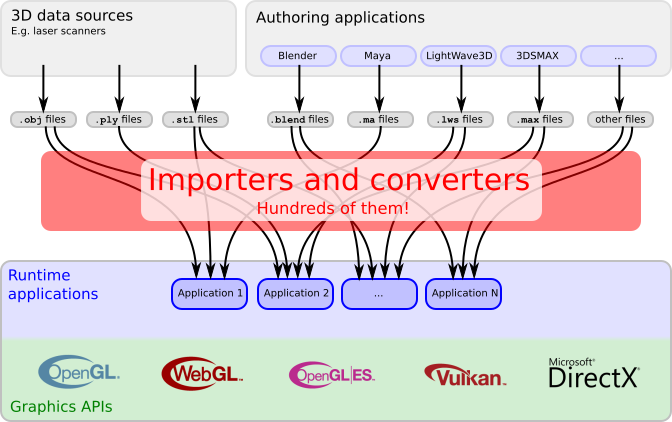
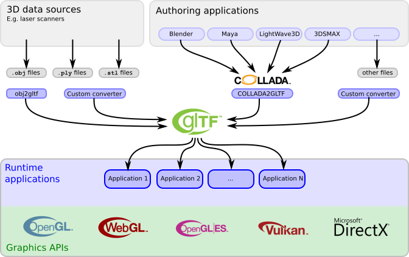

[Table of Contents](README.md) | Next: [Basic glTF structure](gltfTutorial_002_BasicGltfStructure.md)

## Introduction to glTF

There is an increasing number of applications and services that are based on 3D content. Online shops are offering product configurators with a 3D preview. Museums are digitizing their artifacts with 3D scans, and allow exploring their collection in virtual galleries. City planners are using 3D city models for planning and information visualization. Educators are creating interactive, animated 3D models of the human body. Many of these applications are running directly in the web browser, which is possible because all modern browsers support efficient rendering with WebGL.

 
Image 1a: Screenshots of different websites and applications showing 3D models

So there is a strong and constantly increasing demand for 3D content in various applications. In many cases, the 3D content has to be transferred over the web, and has to be rendered efficiently on client side. But until now, there is a gap between the 3D content creation and the efficient rendering of the 3D content in the runtime applications.

### 3D content pipelines

The 3D content that is rendered in the client application comes from different sources, and is stored in different file formats. The [List of 3D graphics file formats on Wikipedia](https://en.wikipedia.org/wiki/List_of_file_formats#3D_graphics) shows that there is an overwhelming number of more than 70 different file formats for 3D data, serving different purposes and application cases.  

For example, the raw 3D data may be obtained with a 3D scanner. These scanners usually provide the geometry data of a single object, which is stored in [OBJ](https://en.wikipedia.org/wiki/Wavefront_.obj_file), [PLY](https://en.wikipedia.org/wiki/PLY_(file_format)) or [STL](https://en.wikipedia.org/wiki/STL_(file_format)) files. These file formats do not contain information about the scene structure, or how the objects should be rendered.

More sophisticated 3D scenes can be created with authoring tools. These tools allow editing the structure of the scene, the light setup, cameras, animations, and, of course, the 3D geometry of the objects that appear in the scene. The applications store this information in their own, custom file formats. For example, [Blender](https://www.blender.org/) stores the scenes in `.blend` files, [LightWave3D](https://www.lightwave3d.com/) uses the `.lws` file format, [3ds Max](http://www.autodesk.com/3dsmax) uses the `.max` file format, and [Maya](http://www.autodesk.com/maya) scenes are stored as `.ma` files.

In order to render such 3D content, the runtime application has to be able to read different input file formats. The scene structure has to be parsed, and the 3D geometry data has to be converted into the format that is required by the graphics API. The 3D data has to be transferred to the graphics card memory, and then the rendering process can be described with sequences of graphics API calls. Thus, each runtime application has to create importers, loaders or converters for all file formats that it would like to support:

 
Image 1b: The 3D content pipeline today

### glTF: A transmission format for 3D scenes

The goal of glTF is to define a standard for representing 3D content, in a form that is suitable for the use in runtime applications. The existing file formats are not appropriate for this use case: Some of them do not contain any scene information, but only geometry data. Others have been designed for exchanging data between authoring applications, and their main goal is to retain as much information about the 3D scene as possible. As a result, the files are usually large, complex and hard to parse. Additionally, the geometry data may have to be preprocessed so that it may be rendered with the client application.

None of the existing file formats was designed for the use case of efficiently transferring 3D scenes over the web and rendering them as efficiently as possible. But glTF is not "yet another file format". It is the definition of a *transmission* format for 3D scenes:

- The scene structure is described with JSON, which is very compact and can easily be parsed
- The 3D data of the objects is stored in a form that can directly be used by the common graphics APIs, so there is no overhead for decoding or pre-processing the 3D data

Different content creation tools may now provide the 3D content in the glTF format. And an increasing number of client applications is able to consume and render glTF. Some of these applications are shown in [Image 1b](#applications-png). So glTF may help to bridge the gap between content creation and rendering:  

 
Image 1c: The 3D content pipeline with glTF

An increasing number of content creation tools will be able to provide glTF directly. Alternatively, other file formats can be used to create glTF assets, using one of the open-source conversion utilities listed in the [Khronos glTF repository](https://github.com/KhronosGroup/glTF#converters). For example, nearly all authoring applications can export their scenes in the [COLLADA](https://www.khronos.org/collada/) format. So the [COLLADA2GLTF](https://github.com/KhronosGroup/glTF/tree/master/COLLADA2GLTF) tool can be used to convert scenes and models from these authoring applications to glTF. `OBJ` files may be converted to glTF using [obj2gltf](https://github.com/AnalyticalGraphicsInc/obj2gltf). For other file formats, custom converters can be used to create glTF assets, and thus, to make the 3D content available for a broad range of runtime applications.

[Table of Contents](README.md) | Next: [Basic glTF structure](gltfTutorial_002_BasicGltfStructure.md)
