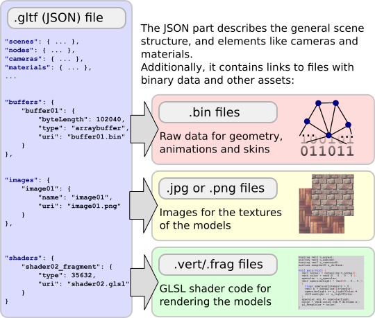

## The basic structure of glTF

The core of glTF is a JSON file. This file describes the whole contents of the 3D scene. It consists of a description of the scene structure itself, which is given by a hierarchy of nodes that define a scene graph. The 3D objects that appear in the scene are defined using meshes that are attached to the nodes. Animations describe how the 3D objects are transformed (e.g. rotated to translated) over time. Materials and textures define the appearance of the objects, and cameras describe the view configuration for the renderer.

## The JSON structure

The scene objects are stored in dictionaries in the JSON file. They can be accessed using an ID, which is the key of the dictionary:

```javascript
"meshes": {
    "FirstExampleMeshId": { ... },
    "SecondExampleMeshId": { ... },
    "ThirdExampleMeshId": { ... }
}
```


These IDs are also used to define the *relationships* between the objects. The example above defines multiple meshes, and a node may refer to one of these meshes, using the mesh ID, to indicate that the mesh should be attached to this node:

```javascript
"nodes:" {
    "FirstExampleNodeId": {
        "meshes": [
            "FirstExampleMeshId"
        ]
    },
    ...
}
```

More information about the top-level elements and the relationships between these elements will be given in the [Scene structure](gltfTutorial_003_SceneStructure.md) section.


## References to external data

The binary data, like geometry and textures of the 3D objects, are usually not contained in the JSON file. Instead, they are stored in dedicated files, and the JSON part only contains links to these files. This allows the binary data to be stored in a form that is very compact and can efficiently be transferred over the web. Additionally, the data can be stored in a format that can be used directly in OpenGL, without having to parse, decode or preprocess the data.    



As shown in the image above, there are three types of objects that may contain such links to external resources, namely `buffers`, `images` and `shaders`. These objects will later be explained in more detail.


### Reading and managing external data

Reading and processing a glTF asset starts with parsing the JSON structure. After the structure has been parsed, the `buffers`, `images` and `shaders` are available as dictionaries. The keys of these dictionaries are IDs, and the values are the [`buffer`](https://github.com/KhronosGroup/glTF/tree/master/specification#reference-buffer), [`image`](https://github.com/KhronosGroup/glTF/tree/master/specification#reference-image) and [`shader`](https://github.com/KhronosGroup/glTF/tree/master/specification#reference-shader) objects, respectively.    

Each of these objects contains links, in form of URIs that point to external resources. For further processing, this data has to be read into memory. Usually it will be stored in a dictionary (or map) data structure, so that it may be looked up using the ID of the object that it belongs to.


### Binary data in `buffers`

A [`buffer`](https://github.com/KhronosGroup/glTF/tree/master/specification#reference-buffer) contains a URI that points to a file containing the raw, binary buffer data:

```javascript
"buffer01": {
    "byteLength": 12352,
    "type": "arraybuffer",
    "uri": "buffer01.bin"
}
```

This binary data has no inherent meaning or structure. It only is a compact representation of data that can efficiently be transferred over the web, and then be interpreted in different ways. For example, it may later be interpreted as geometry-, skinning- and animation data. For the case of geometry data, it can directly be passed to an OpenGL-based renderer, without having to decode or pre-process it. Until then, it is just a raw block of memory that is read from the URI of the `buffer`:

> **Implementation note:**

> The data that is read for one buffer may combine different data blocks. It is therefore important to store the data in a way that later allows obtaining *parts* or *segments* of the whole buffer:

>  * In **JavaScript**, the buffer data is received as the response of sending an [`XMLHttpRequest`](https://developer.mozilla.org/en/docs/Web/API/XMLHttpRequest) to the URI. It will be an [`ArrayBuffer`](https://developer.mozilla.org/en/docs/Web/JavaScript/Reference/Global_Objects/ArrayBuffer). Parts of this buffer may then be obtained by creating a [`TypedArray`](https://developer.mozilla.org/en-US/docs/Web/JavaScript/Reference/Global_Objects/TypedArray) from the desired part of the `ArrayBuffer`.

>  * In **Java**, the buffer data may be read from the [`InputStream`](https://docs.oracle.com/javase/8/docs/api/java/io/InputStream.html) of the URI. It may be stored in a [`ByteBuffer`](https://docs.oracle.com/javase/8/docs/api/java/nio/ByteBuffer.html). In order to easily pass the data to OpenGL, this should be a *direct* `ByteBuffer`. Typed views on parts of the buffer may then be created from this buffer, for example, as a [`FloatBuffer`](https://docs.oracle.com/javase/8/docs/api/java/nio/ByteBuffer.html#asFloatBuffer--).  

>  * In **C++**, the data is read from an [`std::istream`](http://www.cplusplus.com/reference/istream/istream/) and stored in an [`std::vector<uint8_t>`](http://www.cplusplus.com/reference/vector/vector/). The raw data pointer of this vector may then be used to construct vectors that represent parts of the buffer.  


### Image data in `images`

An [`image`](https://github.com/KhronosGroup/glTF/tree/master/specification#reference-image) refers to an external image file that can be used as the texture of a rendered object:

```javascript
"image01": {
    "uri": "image01.png"
}
```

The reference is given as a URI that usually points to a PNG or JPG file. These formats significantly reduce the size of the files, so that they may efficiently be transferred over the web, and they still can be decoded quickly and easily.

> **Implementation note:**

>  * In **JavaScript**, the data will be an [`ImageData`](https://developer.mozilla.org/en-US/docs/Web/API/ImageData) that is obtained from a [`CanvasRenderingContext2D`](https://developer.mozilla.org/en-US/docs/Web/API/CanvasRenderingContext2D/getImageData) after setting the image URI as the source of the [`Image`](https://developer.mozilla.org/en-US/docs/Web/API/HTMLImageElement/Image) that was rendered into the render context. Or just see [this stackoverflow answer](http://stackoverflow.com/a/17591386/) for an example...
>  * In **Java**, the data will be a [`ByteBuffer`](https://docs.oracle.com/javase/8/docs/api/java/nio/ByteBuffer.html) that is filled with the pixel data from an image that was read with [`ImageIO`](https://docs.oracle.com/javase/8/docs/api/javax/imageio/ImageIO.html) from the [`InputStream`](https://docs.oracle.com/javase/8/docs/api/java/io/InputStream.html) of the URI   
>  * In **C++**, it can be an [`std::vector<uint8_t>`](http://www.cplusplus.com/reference/vector/vector/) that is filled with the pixel data of an image. The data is read from an [`std::istream`](http://www.cplusplus.com/reference/istream/istream/) that either points to a file or to a URI and decoded using a C++ image loading library.

> There are some caveats regarding the *format* of this pixel data. It has to be in a form that can be passed to OpenGL. Some libraries contain utility methods for reading and converting the pixel data from images. The section about [Textures, Images and Samplers](gltfTutorial_005_MeshesTexturesImagesSamplers.md) contains more information about the image formats, and how the images are passed to OpenGL.


### GLSL shader data in `shaders`

A GLSL vertex- or fragment [`shader`](https://github.com/KhronosGroup/glTF/tree/master/specification#reference-shader) that should be used for rendering the 3D objects contains a URI that points to a file containing the shader source code:

```javascript
"fragmentShader01": {
    "type": 35632,
    "uri": "fragmentShader01.glsl"
}
```

The shader source code is stored as plain text, so that it can directly be compiled with OpenGL.
