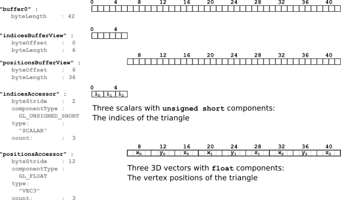

Previous: [Basic glTF structure](gltfTutorial_002_BasicGltfStructure.md.md) | [Table of Contents](README.md) | Next: [Scenes and nodes](gltfTutorial_004_ScenesNodes.md)


# A minimal glTF file

The following is a minimal but complete glTF asset, containing a single triangle. You can copy and paste it into a `gltf` file, and every glTF-based application should be able to load and render it. This section will explain the basic concepts of glTF based on this example.

```javascript
{
  "scene" : "scene0",
  "scenes" : {
    "scene0" : {
      "nodes" : [ "node0" ]
    }
  },
  "nodes" : {
    "node0" : {
      "meshes" : [ "mesh0" ]
    }
  },
  "meshes" : {
    "mesh0" : {
      "primitives" : [ {
        "attributes" : {
          "POSITION" : "verticesAccessor"
        },
        "indices" : "indicesAccessor",
        "material" : "material0",
        "mode" : 4
      } ]
    }
  },
  "materials" : {
    "material0" : { }
  },

  "buffers" : {
    "buffer0" : {
      "uri" : "data:application/octet-stream;base64,AAABAAIAAAAAAAAAAAAAAAAAAACAPwAAAAAAAAAAAAAAAAAAgD8AAAAA",
      "byteLength" : 42,
      "type" : "arraybuffer"
    }
  },
  "bufferViews" : {
    "indicesBufferView" : {
      "buffer" : "buffer0",
      "byteOffset" : 0,
      "byteLength" : 6,
      "target" : 34963
    },
    "verticesBufferView" : {
      "buffer" : "buffer0",
      "byteOffset" : 6,
      "byteLength" : 36,
      "target" : 34962
    }
  },
  "accessors" : {
    "indicesAccessor" : {
      "bufferView" : "indicesBufferView",
      "byteOffset" : 0,
      "byteStride" : 2,
      "componentType" : 5123,
      "count" : 3,
      "type" : "SCALAR",
      "max" : [ 2.0 ],
      "min" : [ 0.0 ]
    },
    "verticesAccessor" : {
      "bufferView" : "verticesBufferView",
      "byteOffset" : 0,
      "byteStride" : 12,
      "componentType" : 5126,
      "count" : 3,
      "type" : "VEC3",
      "max" : [ 1.0, 1.0, 0.0 ],
      "min" : [ 0.0, 0.0, 0.0 ]
    }
  },
  "asset" : {
    "version" : "1.0"
  },
}
```

<p align="center">
<br>
<a name="triangle-png"></a>Image 3a: A single triangle
</p>


## The `scene` and `nodes` structure

The [`scene`](https://github.com/KhronosGroup/glTF/tree/master/specification#reference-scene) is the entry point for the description of the scene that is stored in the glTF. When parsing a glTF JSON file, the traversal of the scene structure will start here. Each scene contains an array called `nodes`, which contains the IDs of [`node`](https://github.com/KhronosGroup/glTF/tree/master/specification#reference-node) objects. These nodes are the root nodes of a scene graph hierarchy.

The example here consists of a single scene, called `"scene0"`. It refers to the only node in this example, which is the node with the ID `"node0"`. This node, in turn, refers to the only mesh, which has the ID `"mesh0"`:


```javascript
  "scene" : "scene0",
  "scenes" : {
    "scene0" : {
      "nodes" : [ "node0" ]
    }
  },
  "nodes" : {
    "node0" : {
      "meshes" : [ "mesh0" ]
    }
  },
```

More details about scenes and nodes and their properties will be given in section about [Scenes and nodes](gltfTutorial_004_ScenesNodes.md).


## The `meshes` and `materials`

A [`mesh`](https://github.com/KhronosGroup/glTF/tree/master/specification#reference-mesh) represents an actual geometric object that appears in the scene. The mesh itself usually does not have any properties, but only contains an array of [`mesh.primitive`](https://github.com/KhronosGroup/glTF/tree/master/specification#reference-mesh.primitive) objects, which serve as building blocks for larger models. Each mesh primitive contains a description of the geometry data that the mesh consists of, and a reference to a [`material`](https://github.com/KhronosGroup/glTF/tree/master/specification#reference-material) that defines how the object will be rendered.   

The example consists of a single mesh, which has the ID `"mesh0"`, and has a single `mesh.primitive` object. The mesh primitive has an array of `attributes`. These are the attributes of the vertices of the mesh geometry, and in this case, this is only the `POSITION` attribute, describing the positions of the vertices. The mesh primitive describes an *indexed* geometry consisting of triangles, which is indicated by the reference to the `indices` and the given rendering `mode`. Finally, the mesh primitive refers to a `material`. The material in this example is empty, which will cause the object to be rendered with a default material.

The actual geometry data of the mesh primitive is given by the `attributes` and the `indices`. These both refer to `accessor` objects, which will be explained below.

```javascript
  "meshes" : {
    "mesh0" : {
      "primitives" : [ {
        "attributes" : {
          "POSITION" : "verticesAccessor"
        },
        "indices" : "indicesAccessor",
        "material" : "material0",
        "mode" : 4
      } ]
    }
  },
  "materials" : {
    "material0" : { }
  },
```

A more detailed description about meshes and mesh primitives can be found in the [Meshes](gltfTutorial_005_Meshes.md) section. Materials and the related concepts are explained in the section about [Materials, Techniques, Programs and Shaders](gltfTutorial_006_MaterialsTechniquesProgramsShaders.md).


## The `buffer`, `bufferView` and `accessor` concepts

### Buffers

As described in the section about [Binary data in buffers](gltfTutorial_002_BasicGltfStructure.md#binary-data-in-buffers), a [`buffer`](https://github.com/KhronosGroup/glTF/tree/master/specification#reference-buffer) defines a block of raw, unstructured data with no inherent meaning. It contains a `uri`, which can either point to an external file that contains the data, or it can be a [data URI](gltfTutorial_002_BasicGltfStructure.md#binary-data-in-buffers) that encodes the data directly in the JSON file.

In the example file, the second approach is used: There is a single buffer with the ID `"buffer0"`, containing 42 bytes, and the data of a this buffer is encoded as a data URI:

```javascript
  "buffers" : {
    "buffer0" : {
      "uri" : "data:application/octet-stream;base64,AAABAAIAAAAAAAAAAAAAAAAAAACAPwAAAAAAAAAAAAAAAAAAgD8AAAAA",
      "byteLength" : 42,
      "type" : "arraybuffer"
    }
  },
```
<p align="center">
<br>
<a name="buffer-png"></a>Image 3b: The buffer, containing 42 bytes
</p>

In the given example, this data contains the indices of the triangle, and the vertex positions of the triangle. But in order to actually use this data as the geometry data of a mesh primitive, additional information about the *structure* of this data is required.


### Buffer views

The first step of structuring the data is to define [`bufferView`](https://github.com/KhronosGroup/glTF/tree/master/specification#reference-bufferView) objects. A `bufferView` basically describes a "chunk" or a "slice" of the whole, raw buffer data. In the given example, there are two buffer views. They both refer to the same buffer, using its ID. The first buffer view refers to the part of the buffer that contains the data of the indices. The second buffer view refers to the part of the buffer that contains the vertex positions.

```javascript
  "bufferViews" : {
    "indicesBufferView" : {
      "buffer" : "buffer0",
      "byteOffset" : 0,
      "byteLength" : 6,
      "target" : 34963
    },
    "verticesBufferView" : {
      "buffer" : "buffer0",
      "byteOffset" : 6,
      "byteLength" : 36,
      "target" : 34962
    }
  },
```

<p align="center">
<br>
<a name="bufferBufferView-png"></a>Image 3c: The buffer views, referring to parts of the buffer
</p>


### Accessors

The second step of structuring the data is accomplished with  [`accessor`](https://github.com/KhronosGroup/glTF/tree/master/specification#reference-accessor) objects. They define how the raw data of a `bufferView` has to be interpreted, by providing information about the data types and the layout.

```javascript
  "accessors" : {
    "indicesAccessor" : {
      "bufferView" : "indicesBufferView",
      "byteOffset" : 0,
      "byteStride" : 2,
      "componentType" : 5123,
      "count" : 3,
      "type" : "SCALAR",
      "max" : [ 2.0 ],
      "min" : [ 0.0 ]
    },
    "verticesAccessor" : {
      "bufferView" : "verticesBufferView",
      "byteOffset" : 0,
      "byteStride" : 12,
      "componentType" : 5126,
      "count" : 3,
      "type" : "VEC3",
      "max" : [ 1.0, 1.0, 0.0 ],
      "min" : [ 0.0, 0.0, 0.0 ]
    }
  },
```

<p align="center">
<br>
<a name="bufferBufferViewAccessor-png"></a>Image 3d: The accessors defining how to interpret the data of the buffer views
</p>

As described above, a `mesh` may now refer to these accessors, using their IDs. The renderer can resolve the underlying buffer views and buffers, and send the required parts of the buffer to the graphics card, together with the information about the data types and layout, so that the geometry data may be rendered.

A more detailed description of how the accessor data is obtained and processed by the renderer is given in the section about [Buffers, BufferViews and Accessors](gltfTutorial_007_BuffersBufferViewsAccessors.md) and the section about [Materials, Techniques, Programs and Shaders](gltfTutorial_006_MaterialsTechniquesProgramsShaders.md)


## The `asset` description

In glTF 1.0, this property is still optional, but in subsequent glTF versions, the JSON file is required to contain an `asset` property that contains the `version` number:

```javascript
  "asset" : {
    "version" : "1.1"
  },
```

The `asset` property may contain additional metadata that is described in the [`asset` specification](https://github.com/KhronosGroup/glTF/blob/master/specification/README.md#reference-asset). The example here is compatible to version 1.1, but does not contain any features that are specific for version 1.1.


Previous: [Basic glTF structure](gltfTutorial_002_BasicGltfStructure.md.md) | [Table of Contents](README.md) | Next: [Scenes and nodes](gltfTutorial_004_ScenesNodes.md)
