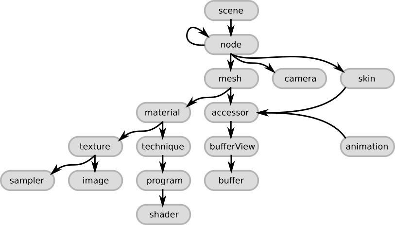

# The glTF scene structure

The following image (adapted from the [glTF concepts section](https://github.com/KhronosGroup/glTF/tree/master/specification#concepts)) gives an overview of the top-level elements of a glTF:

These elements are summarized here quickly, to give an overview, with links to the respective sections of the glTF specification. More detailed explanations of the relationships between these elements will be given in the following sections.

- The [`scene`](https://github.com/KhronosGroup/glTF/tree/master/specification#reference-scene) is the entry point for the description of the scene that is stored in the glTF. It refers to the `node`s that define the scene graph.
- The [`node`](https://github.com/KhronosGroup/glTF/tree/master/specification#reference-node) is one node in the scene graph hierarchy. It can contain a transformation (like rotation or translation), and it may refer to further (child) nodes. Additionally, it may refer to `mesh` or `camera` instances that are "attached" to the node, or to a `skin` that describes a mesh deformation.
- The [`camera`](https://github.com/KhronosGroup/glTF/tree/master/specification#reference-camera) defines the view configuration for rendering the scene.
- A [`mesh`](https://github.com/KhronosGroup/glTF/tree/master/specification#reference-mesh) describes a geometric object that appears in the scene. It refers to `accessor` objects that are used for accessing the actual geometry data, and to `material`s that define the appearance of the object when it is rendered
- The [`skin`](https://github.com/KhronosGroup/glTF/tree/master/specification#reference-skin) defines parameters that are required for vertex skinning , which allows the deformation of a mesh based on the pose of a virtual character. The values of these parameters are obtained from an `accessor`.
- An [`animation`](https://github.com/KhronosGroup/glTF/tree/master/specification#reference-animation) describes how transformations of certain nodes (like rotation or translation) change over time.
- The [`accessor`](https://github.com/KhronosGroup/glTF/tree/master/specification#reference-accessor) is used as an abstract source of arbitrary data. It is used by the `mesh`, `skin` and `animation`, and provides the geometry data, the skinning parameters and the time-dependent animation values. It refers to a [`bufferView`](https://github.com/KhronosGroup/glTF/tree/master/specification#reference-bufferView), which is a part of a [`buffer`](https://github.com/KhronosGroup/glTF/tree/master/specification#reference-buffer) that contains the actual raw binary data.
- The [`material`](https://github.com/KhronosGroup/glTF/tree/master/specification#reference-material) contains the parameters that define the appearance of an object. It can refer to a `texture` that will be applied to the object, and it refers to the `technique` for rendering an object with the given material. The [`technique`](https://github.com/KhronosGroup/glTF/tree/master/specification#reference-technique) refers to a [`program`](https://github.com/KhronosGroup/glTF/tree/master/specification#reference-program) that contains the OpenGL GLSL vertex- and fragment [`shader`](https://github.com/KhronosGroup/glTF/tree/master/specification#reference-shader)s that are used for rendering the object.  
- The [`texture`](https://github.com/KhronosGroup/glTF/tree/master/specification#reference-texture) is defined by a [`sampler`](https://github.com/KhronosGroup/glTF/tree/master/specification#reference-sampler) and an [`image`](https://github.com/KhronosGroup/glTF/tree/master/specification#reference-image). The `sampler` defines how the texture `image` should be placed on the object.   
