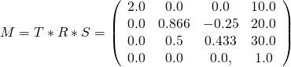

Previous: [A minimal glTF file](gltfTutorial_003_MinimalGltfFile.md) | [Table of Contents](README.md) | Next: [Buffers, BufferViews, Accessors](gltfTutorial_005_BuffersBufferViewsAccessors.md)

# Scenes and nodes

## Scenes

There may be multiple scenes stored in one glTF file, but in many cases, there will only be a single scene, which then also is the default scene. Each scene contains an array of `nodes`, which are the IDs of the root nodes of the scene graphs. Again, there may be multiple root nodes, forming different hierarchies, but in many cases, the scene will have a single root node. The most simple possible scene description has already been shown in the previous section, consisting of a single scene with a single node:

```javascript
  "scenes" : {
    "scene0" : {
      "nodes" : [ "node0" ]
    }
  },
  "nodes" : {
    "node0" : {
      "meshes" : [ "mesh0" ]
    }
  },
```


## Nodes forming the scene graph

Each [`node`](https://github.com/KhronosGroup/glTF/tree/master/specification#reference-node) can contain an array called `children` that contains the IDs of its child nodes. So each node is one element of a hierarchy of nodes, and together they define the structure of the scene as a scene graph.  

<p align="center">
<br>
<a name="sceneGraph-png"></a>Image 4a: The scene graph representation stored in the glTF JSON
</p>

Each of the nodes that are given in the `scene` can be traversed, recursively visiting all its children, to process all elements that are attached to the nodes. The simplified pseudocode for this traversal may look as follows:

```
traverse(node) {
    processMeshes(node.meshes);
    processOtherElements(node); // Cameras, Skins, Joints, Skeletons - discussed later
    for each (child in node.children) {
        traverse(child);
    }
}
```

In practice there will some additional information be required for the traversal: The processing of some elements that are attached to nodes will require information about *which* node they are attached to. Additionally, the information about the transforms of the nodes have to be accumulated during the traversal. This will be detailed in the following section.


### Local and global transforms

Each node can have a transform. Such a transform will define a translation, rotation and/or scale. This transform will be applied to all elements that are attached to the node itself and to all its child nodes. The hierarchy of nodes thus allows to structure the translations, rotations and scalings that are applied to the scene elements.


#### Local transforms of nodes

There are different possible representations for the local transform of a node. The transform can be given directly by the `matrix` property of the node. This is an array of 16 floating point numbers that describe the matrix in column-major order. For example, the following matrix describes a scaling about (2,1,0.5), a rotation about 30 degrees around the x-axis, and a translation about (10,20,30):

```javascript
"node0": {
    "matrix": [
        2.0,    0.0,    0.0,    0.0,
        0.0,    0.866,  0.5,    0.0,
        0.0,   -0.25,   0.433,  0.0,
       10.0,   20.0,   30.0,    1.0
    ]
}    
```

So the matrix defined here is

<p align="center">
<br>
<a name="matrix-png"></a>Image 4b: An example matrix
</p>


The transform of a node can also be given using the `transform`, `rotation` and `scale` properties of a node - which is sometimes abbreviated as *TRS*:  

```javascript
"node0": {
    "translation": [ 10.0, 20.0, 30.0 ],
    "rotation": [ 0.259, 0.0, 0.0, 0.966 ],
    "scale": [ 2.0, 1.0, 0.5 ]
}
```

Each of these properties can be used to create a matrix, and the product of these matrices then is the local transform of the node:

- The `translation` just contains the translation in x-, y- and z-direction. For example, from a translation of `[ 10.0, 20.0, 30.0 ]`, one can create a translation matrix that contains this translation as its last column:

<p align="center">
<br>
<a name="translationMatrix-png"></a>Image 4c: A translation matrix
</p>


- The `rotation` is given as a [quaternion](https://en.wikipedia.org/wiki/Quaternion). The mathematical background of quaternions is beyond the scope of this tutorial. For now, the most important information is that a quaternion is a compact representation of a rotation about an arbitrary angle and around an arbitrary axis. For example, the quaternion `[ 0.259, 0.0, 0.0, 0.966 ]` describes a rotation about 30 degrees, around the x-axis. So this quaternion can be converted into a rotation matrix:

<p align="center">
<br>
<a name="rotationMatrix-png"></a>Image 4d: A rotation matrix
</p>


- The `scale` contains the scaling factors along the x-, y- and z-axis. The corresponding matrix can be created by using these scaling factors as the entries on the diagonal of the matrix. For example, the scale matrix for the scaling factors `[ 2.0, 1.0, 0.5 ]` is

<p align="center">
<br>
<a name="scaleMatrix-png"></a>Image 4e: A scale matrix
</p>

When computing the final, local transform matrix of the node, these matrices are multiplied together. It is important to perform the multiplication of these matrices in the right order. The local transform matrix always has to be computed as `M = T * R * S`, where `T` is the matrix for the `translation` part, `R` is the matrix for the `rotation` part, and `S` is the matrix for the `scale` part. So the pseudocode for the computation is

```
translationMatrix = createTranslationMatrix(node.translation);
rotationMatrix = createRotationMatrix(node.rotation);
scaleMatrix = createScaleMatrix(node.scale);
localTransform = translationMatrix * rotationMatrix * scaleMatrix;
```

For the example matrices given above, the final, local transform matrix of the node will be

<p align="center">
<br>
<a name="produtMatrix-png"></a>Image 4f: The final local transform matrix computed from the TRS properties
</p>

This matrix will cause the vertices of the meshes to be scaled, then rotated and then translated according to the `scale`, `rotation` and `translation` properties that have been given in the node.

When any of the three properties is not given, then the identity matrix will be used. Similarly, when a node does neither contain a `matrix` property nor TRS-properties, then its local transform will be the identity matrix.


#### Global transforms of nodes

Regardless of the representation in the JSON file, the local transform of a node can be stored as a 4x4 matrix. The *global* transform of a node is given by the product of all local transforms on the path from the root to the respective node:

                         local transform      global transform
    root                 R                    R
     +- nodeA            A                    R*A
         +- nodeB        B                    R*A*B
         +- nodeC        C                    R*A*C

It is important to point out that these global transforms can *not* be computed only once after the file was loaded. Later, it will be shown how *animations* may modify the local transforms of individual nodes. And these modifications will affect the global transforms of all descendant nodes. Therefore, when the global transform of a node is required, it has to be computed directly from the current local transforms of all nodes. Alternatively, and as a potential performance improvement, an implementation could cache the global transforms, detect changes in the local transforms of ancestor nodes, and update the global transforms only when necessary. The different implementation options for this will depend on the programming language and the requirements for the client application, and thus are beyond the scope of this tutorial.


Previous: [A minimal glTF file](gltfTutorial_003_MinimalGltfFile.md) | [Table of Contents](README.md) | Next: [Buffers, BufferViews, Accessors](gltfTutorial_005_BuffersBufferViewsAccessors.md)
