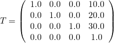

# Scenes and nodes forming the scene structure

## Scenes

There may be multiple scenes stored in one glTF file, but in many cases, there will only be a single scene, which then also is the default scene. Each scene contains an array of `nodes`, which are the IDs of the root nodes of the scene graphs. Again, there may be multiple root nodes, forming different hierarchies, but in many cases, the scene will have a single root node.

So the most simple scene description may look as follows:

```javascript
"scene" : "defaultSceneId",
"scenes" : {
    "defaultSceneId": {
        "nodes": [
            "rootNodeId",
        ],
    }
},
"nodes" : {
    "rootNodeId": { ... }
}
```


## Nodes forming the scene graph

Each [`node`](https://github.com/KhronosGroup/glTF/tree/master/specification#reference-node) is one element of a hierarchy of nodes, and together they define the structure of the scene as a scene graph.  

<p align="center">
<br>
<a name="sceneGraph-png"></a>Image 4a: The scene graph representation stored in the glTF JSON
</p>

Each of the nodes that are given in the `scene` can be traversed, recursively visiting all its children, to process all elements that are attached to the nodes. The simplified pseudocode for this traversal may look as follows:

```
traverse(node) {
    processCamera(node.camera);
    processMeshes(node.meshes);
    processOtherElements(node); // Skin, joint, skeleton - discussed later
    for each (child in node.children) {
        traverse(child);
    }
}
```

In practice there will some additional information be required for the traversal: The processing of some elements that are attached to nodes will require information about *which* node they are attached to. Additionally, the information about the transforms of the nodes have to be accumulated during the traversal. This will be detailed in the following section.


### Local and global transforms

Each node can have a transform. Such a transform will define a translation, rotation and/or scale. This transform will be applied to all elements that are attached to the node itself and to all its child nodes. The hierarchy of nodes thus allows to structure the translations, rotations and scalings that are applied to the scene elements.


#### Local transforms of nodes

There are different possible representations for the local transform of a node. The transform can be given directly by the `matrix` property of the node. This is an array of 16 floating point numbers that describe the matrix in column-major order. For example, the following matrix describes a scaling about (2,1,0.5), a rotation about 30 degrees around the x-axis, and a translation about (10,20,30):

```javascript
"node0": {
    "matrix": [
        2.0,    0.0,    0.0,    0.0,
        0.0,    0.866,  0.5,    0.0,
        0.0,   -0.25,   0.433,  0.0,
       10.0,   20.0,   30.0,    1.0
    ]
}    
```

So the matrix defined here is

<p align="center">
<br>
<a name="matrix-png"></a>Image 4b: An example matrix
</p>


The transform of a node can also be given using the `transform`, `rotation` and `scale` properties of a node - which is sometimes abbreviated as *TRS*:  

```javascript
"node0": {
    "translation": [ 10.0, 20.0, 30.0 ],
    "rotation": [ 0.259, 0.0, 0.0, 0.966 ],
    "scale": [ 2.0, 1.0, 0.5 ]
}
```

Each of these properties can be used to create a matrix, and the product of these matrices then is the local transform of the node:

- The `translation` just contains the translation in x-, y- and z-direction. For example, from a translation of `[ 10.0, 20.0, 30.0 ]`, one can create a translation matrix that contains this translation as its last column:

<p align="center">
<br>
<a name="translationMatrix-png"></a>Image 4c: A translation matrix
</p>


- The `rotation` is given as a [quaternion](https://en.wikipedia.org/wiki/Quaternion). The mathematical background of quaternions is beyond the scope of this tutorial. For now, the most important information is that a quaternion is a compact representation of a rotation about an arbitrary angle and around an arbitrary axis. For example, the quaternion `[ 0.259, 0.0, 0.0, 0.966 ]` describes a rotation about 30 degrees, around the x-axis. So this quaternion can be converted into a rotation matrix:

<p align="center">
<br>
<a name="rotationMatrix-png"></a>Image 4d: A rotation matrix
</p>


- The `scale` contains the scaling factors along the x-, y- and z-axis. The corresponding matrix can be created by using these scaling factors as the entries on the diagonal of the matrix. For example, the scale matrix for the scaling factors `[ 2.0, 1.0, 0.5 ]` is

<p align="center">
<br>
<a name="scaleMatrix-png"></a>Image 4e: A scale matrix
</p>

When computing the final, local transform matrix of the node, these matrices are multiplied together. It is important to perform the multiplication of these matrices in the right order. The local transform matrix always has to be computed as `M = T * R * S`, where `T` is the matrix for the `translation` part, `R` is the matrix for the `rotation` part, and `S` is the matrix for the `scale` part. So the pseudocode for the computation is

```
translationMatrix = createTranslationMatrix(node.translation);
rotationMatrix = createRotationMatrix(node.rotation);
scaleMatrix = createScaleMatrix(node.scale);
localTransform = translationMatrix * rotationMatrix * scaleMatrix;
```

For the example matrices given above, the final, local transform matrix of the node will be

<p align="center">
<br>
<a name="produtMatrix-png"></a>Image 4f: The final local transform matrix computed from the TRS properties
</p>

This matrix will cause the vertices of the meshes to be scaled, then rotated and then translated according to the `scale`, `rotation` and `translation` properties that have been given in the node.

When any of the three properties is not given, then the identity matrix will be used. Similarly, when a node does neither contain a `matrix` property nor TRS-properties, then its local transform will be the identity matrix.


#### Global transforms of nodes

Regardless of the representation in the JSON file, the local transform of a node can be stored as a 4x4 matrix. The *global* transform of a node is given by the product of all local transforms on the path from the root to the respective node:

                         local transform      global transform
    root                 M                    M
     +- nodeA            A                    M*A
         +- nodeB        B                    M*A*B
         +- nodeC        C                    M*A*C

It is important to point out that these global transforms can *not* be computed only once after the file was loaded. Later, it will be shown how *animations* may modify the local transforms of individual nodes. And these modifications will affect the global transforms of all descendant nodes. Therefore, when the global transform of a node is required, it has to be computed directly from the current local transforms of all nodes. Alternatively, and as a potential performance improvement, an implementation could cache the global transforms, detect changes in the local transforms of ancestor nodes, and update the global transforms only when necessary. The different implementation options for this will depend on the programming language and the requirements for the client application, and thus are beyond the scope of this tutorial.


## Cameras

Each [`node`](https://github.com/KhronosGroup/glTF/tree/master/specification#reference-node) may contain the ID of a [`camera`](https://github.com/KhronosGroup/glTF/tree/master/specification#reference-camera). The position and orientation of the camera is derived from the global transform of the node.

There are two kinds of cameras: [`orthographic`](https://github.com/KhronosGroup/glTF/tree/master/specification#reference-camera.orthographic) cameras and [`perspective`](https://github.com/KhronosGroup/glTF/tree/master/specification#reference-camera.perspective) cameras. The parameters that are contained in the different cameras can be used to create the *camera matrix*. Explaining the details of cameras, matrices, viewing and projections is beyond the scope of this tutorial. The WebGL API documentation contains a dedicated section called [WebGL model view projection](https://developer.mozilla.org/en/docs/Web/API/WebGL_API/WebGL_model_view_projection) that contains background information and links to further tutorials.     


All transformations of the camera are only determined by the global transform of the `node` that refers to the camera. When this global transform is the identity matrix, then the eye point of the camera is at the origin, and the viewing direction is along the negative z-axis.

There may be multiple cameras defined in the JSON part of a glTF. However, there is no "default" camera. Instead, the client application has to keep track of the currently active camera. The client application may, for example, offer a dropdown-menu that allows selecting the active camera, and thus, to quickly switch between predefined view configurations. With a bit more implementation effort, the client application can also define an own camera and interaction patterns for the camera control (e.g. zooming with the mouse wheel). However, the logic for the navigation and interaction has to be implemented solely by the client application in this case.


## Animations

As mentioned above, in the section about **Local and global transforms**, each node can contain a local transform. This local transform can either be given as the `node.matrix`, or using the `translation`, `rotation` and `scale` properties of the node. An [`animation`](https://github.com/KhronosGroup/glTF/tree/master/specification#reference-animation) may now be used to describe how the `translation`, `rotation` or `scale` of a node changes over time.

The following is an example of an `animation` that animates the translation and rotation of a node:

```javascript
"animation0": {
    "parameters": {
        "TIME": "accessorForTIME",
        "nodeTranslation": "accessorForTranslation",
        "nodeRotation": "accessorForRotation"
    },
    "samplers": {
        "translationSampler": {
            "input": "TIME",
            "interpolation": "LINEAR",
            "output": "nodeTranslation"
        },
        "rotationSampler": {
            "input": "TIME",
            "interpolation": "LINEAR",
            "output": "nodeRotation"
        }
    },
    "channels": [
        {
            "sampler": "translationSampler",
             "target": {
                "id": "animatedNodeId",
                "path": "translation"
            }
        },
        {
            "sampler": "rotationSampler",
            "target": {
                "id": "animatedNodeId",
                "path": "rotation"
            }
        }
    ]
}
```

It can be seen that the animation contains three types of objects: Animation `parameters`, `samplers` and `channels`.

### Animation parameters


The dictionary of animation `parameters` summarizes the input data of the animation. It contains one [`accessor`](https://github.com/KhronosGroup/glTF/tree/master/specification#reference-accessor) for each parameter. The details of accessors will be explained in a later the section about [Buffers, BufferViews and Accessors](gltfTutorial_007_BuffersBufferViewsAccessors.md). For now, an accessor can be imagined as an abstract source of arbitrary data: An accessor may provide the time stamps of the key frames of the animation, and the values that the animated properties have at these key frames.

<p align="center">
<br>
<a name="animationParameters-png"></a>Image 4g: Animation parameter accessors
</p>


In the given example, there is one accessor for the `TIME` parameter of the animation. It provides the time, in seconds, of the key frames of the animation. The accessor for the translation provides one 3D vector for each key frame, which describes the translation that the node has at the given time. Similarly, the accessor for the rotation provides the four values that are used to create the quaternion describing the rotation of the node at the given time.


### Animation samplers

The `samplers` dictionary contains [`animation.sampler`](https://github.com/KhronosGroup/glTF/blob/master/specification/README.md#reference-animation.sampler) objects that define how the values that are provided by the accessors have to be interpolated between the key frames:

<p align="center">
<br>
<a name="animationSamplers-png"></a>Image 4h: Animation samplers
</p>

In order to compute the value of the translation for the current animation time, the following algorithm can be used:

* Let the current animation time be given as `currentTime`
* Compute the next smaller and the next larger element of the `TIME` accessor:

    `previousTime` = The largest element from the `TIME` accessor that is smaller than the `currentTime`

    `nextTime`  = The smallest element from the `TIME` accessor that is larger than the `currentTime`

* Obtain the elements from the `translation` accessor that correspond to these times:

    `previousTranslation` = The element from the `translation` accessor that corresponds to the `previousTime`

    `nextTranslation` = The element from the `translation` accessor that corresponds to the `nextTime`

* Compute the interpolation value. This is a value betwenn 0.0 and 1.0, that describes the *relative* position of the `currentTime`, between the `previousTime` and the `nextTime`:

    `interpolationValue = (currentTime - previousTime) / (nextTime - previousTime)`

* Use the interpolation value to compute the translation for the current time:

    `currentTranslation = previousTranslation + interpolationValue * (nextTranslation - previousTranslation)`


#### Example:

Imagine the `currentTime` is **1.2**. The next smaller element from the `TIME` accessor is **0.8**. The next larger element is **1.6**. So

    previousTime = 0.8
    nextTime     = 1.6

The corresponding values from the `translation` accessor can be looked up:

    previousTranslation = (14.0, 3.0, -2.0)
    nextTranslation     = (18.0, 1.0,  1.0)

The interpolation value can be computed:

    interpolationValue = (currentTime - previousTime) / (nextTime - previousTime)
                       = (1.2 - 0.8) / (1.6 - 0.8)
                       = 0.4 / 0.8         
                       = 0.5

From the interpolation value, the current translation can be computed:

    currentTranslation = previousTranslation + interpolationValue * (nextTranslation - previousTranslation)`
                       = (14.0, 3.0, -2.0) + 0.5 * ( (18.0, 1.0,  1.0) - (14.0, 3.0, -2.0) )
                       = (14.0, 3.0, -2.0) + 0.5 * (4.0, -2.0, 3.0)
                       = (16.0, 2.0, -0.5)

So when the current time is **1.2**, then the `translation` of the node is **(16.0, 2.0, -0.5)**


### Animation channels

Finally, the animations contain an array of of [`animation.channel`](https://github.com/KhronosGroup/glTF/blob/master/specification/README.md#reference-animation.channel) objects. The channels establish the connection between the input, which is the value that is computed from the sampler, and the output, which is the animated node property. Therefore, each channel refers to one sampler, using the ID of the sampler, and contains an [`animation.channel.target`](https://github.com/KhronosGroup/glTF/blob/master/specification/README.md#reference-animation.channel.target). The `target` refers to a node, using the ID of the node, and contains a `path` that defines the property of the node that should be animated. The value from the sampler will be written into this property.

In the example above, there are two channels for the animation. Both refer to the same node. The path of the first channel refers to the `translation` of the node, and the path of the second channel refers to the `rotation` of the node. So all objects (meshes) that are attached to the node will be translated and rotated by the animation:

<p align="center">
<br>
<a name="animationChannels-png"></a>Image 4i: Animation channels
</p>
