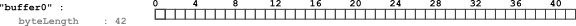
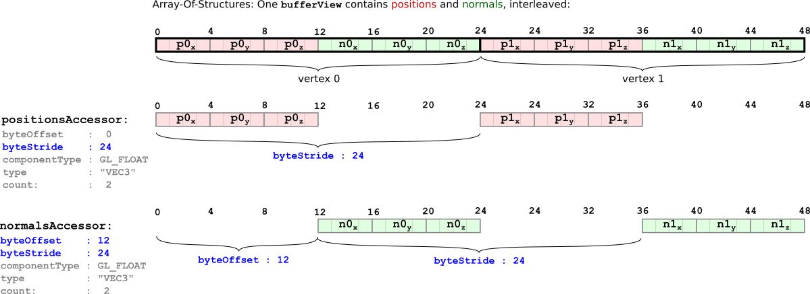

Previous: [Scenes and Nodes](gltfTutorial_004_ScenesNodes.md) | [Table of Contents](README.md) | Next: [Simple Animation](gltfTutorial_006_SimpleAnimation.md)


# Buffers, BufferViews, Accessors

An example for `buffer`, `bufferView` and `accessor` objects was already given in the section containing the [minimal glTF file](gltfTutorial_003_MinimalGltfFile.md). This section will explain these concepts in more detail.

## Buffers

A [`buffer`](https://github.com/KhronosGroup/glTF/tree/master/specification#reference-buffer) represents a block of raw binary data, without an inherent structure or meaning. This data is referred to by a buffer using its `uri`. This URI may either point to an external file, or be a [data URI](gltfTutorial_002_BasicGltfStructure.md#binary-data-in-buffers) that encodes the binary data directly in the JSON file. The [minimal glTF file](gltfTutorial_003_MinimalGltfFile.md) contained an example of a `buffer`, with 42 bytes of data, encoded in a data URI:

```javascript
"buffers" : {
  "buffer0" : {
    "uri" : "data:application/octet-stream;base64,AAABAAIAAAAAAAAAAAAAAAAAAACAPwAAAAAAAAAAAAAAAAAAgD8AAAAA",
    "byteLength" : 42
  }
},
```


<p align="center">
<br>
<a name="buffer-png"></a>Image 5a: The buffer data, consisting of 42 bytes
</p>

Parts of the data of a `buffer` may have to be passed to the renderer as vertex attributes, or as indices, or it may be data that contains skinning information or animation key frames. In order to be able to use this data, additional information about the structure and type of this data is required.


## BufferViews

The first step of structuring the data from a `buffer` is with [`bufferView`](https://github.com/KhronosGroup/glTF/tree/master/specification#reference-bufferView) objects. A `bufferView` represents a "slice" of the data of one buffer. This slice is defined using an offset and a length, in bytes. The [minimal glTF file](gltfTutorial_003_MinimalGltfFile.md) defined two `bufferView` objects:

```javascript
"bufferViews" : {
  "indicesBufferView" : {
    "buffer" : "buffer0",
    "byteOffset" : 0,
    "byteLength" : 6,
    "target" : 34963
  },
  "positionsBufferView" : {
    "buffer" : "buffer0",
    "byteOffset" : 6,
    "byteLength" : 36,
    "target" : 34962
  }
},
```

The first `bufferView` refers to the first 6 bytes of the buffer data. The second one refers to the remaining 36 bytes, as shown in this image:

<p align="center">
<br>
<a name="bufferBufferView-png"></a>Image 5b: The buffer views, referring to parts of the buffer
</p>

Each `bufferView` additionally contains a `target` property. This property may later be used by the renderer, to classify the type or nature of the data that the buffer view refers to. The `target` can be a constant indicating that the data is used for vertex attributes (`34962`, standing for `GL_ARRAY_BUFFER`), or that the data is used for vertex indices (`34963`, standing for `GL_ELEMENT_ARRAY_BUFFER`).

At this point, the `buffer` data has been divided into multiple parts, and each part is described by one `bufferView`. But in order to really use this data in a renderer, additional information about the type and layout of the data is required.


## Accessors

An [`accessor`](https://github.com/KhronosGroup/glTF/tree/master/specification#reference-accessor) object refers to a `bufferView`, and contains properties that define the type and layout of the data of this `bufferView`.

### Data type

The type of the data of an accessor is encoded in the `type` and the `componentType` properties. The value of the `type` property is a string that specifies whether the data elements are scalars, vectors or matrices. For example, the value may be `"SCALAR"` for scalar values, `"VEC3"` for 3D vectors, or `"MAT4"` for 4x4 matrices.

The `componentType` specifies the type of the components of these data elements. This is a GL constant that may, for example, be `5126` (`GL_FLOAT`) or `5123` (`GL_UNSIGNED_SHORT`), to indicate that the elements have `float` or `unsigned short` components, respectively.

Different combinations of these properties may be used to describe arbitrary data types. For example, the [minimal glTF file](gltfTutorial_003_MinimalGltfFile.md) contained two accessors:

```javascript
"accessors" : {
  "indicesAccessor" : {
    "bufferView" : "indicesBufferView",
    "byteOffset" : 0,
    "componentType" : 5123,
    "count" : 3,
    "type" : "SCALAR",
    "max" : [ 2 ],
    "min" : [ 0 ]
  },
  "positionsAccessor" : {
    "bufferView" : "positionsBufferView",
    "byteOffset" : 0,
    "componentType" : 5126,
    "count" : 3,
    "type" : "VEC3",
    "max" : [ 1.0, 1.0, 0.0 ],
    "min" : [ 0.0, 0.0, 0.0 ]
  }
},
```

The first accessor refers to the `"indicesBufferView"`, its `type` is `"SCALAR"`, and its `componentType` is `5123` (`GL_UNSIGNED_SHORT`). This means that the indices are stored as scalar `unsigned short` values. The second accessor refers to the `"positionsBufferView"`. Its `type` is `"VEC3"`, and its `componentType` is  `5126` (`GL_FLOAT`). So this accessor describes 3D vectors with floating point components. The following image illustrates how the raw data of a `buffer` is structured using `bufferView` objects, and augmented with data type information using `accessor` objects:

<p align="center">
<br>
<a name="bufferBufferViewAccessor-png"></a>Image 5c: The accessors defining how to interpret the data of the buffer views
</p>

### Data layout

Additional properties of an `accessor` further specify the data layout of the data. The `count` property of an accessor indicates how many data elements it consists of. In the example above, the count has been 3 for both accessors, standing for the 3 indices and the 3 vertices of the triangle, respectively.

Each accessor may also define `byteOffset` and `byteStride` properties. These properties are required for data that is stored as an *Array-Of-Structures*: A single `bufferView` may, for example, contain the data for vertex positions and for vertex normals in an interleaved fashion. The `byteOffset` defines the start of the first relevant data element. The `byteStride` defines the number of bytes until the start of the next relevant data element:

<p align="center">
<br>
<a name="aos-png"></a>Image 5d: The byte offset and byte stride of an accessor
</p>


### Data contents

An `accessor` also contains `min` and `max` properties that summarize the contents of their data. They are the component-wise minimun and maximum values of all data elements that are contained in the accessor. For the case of vertex positions, the `min` and `max` properties thus define the *bounding box* of an object. This can be useful for prioritizing downloads, or for visibility detection. In general, this information is also useful for storing and processing *quantized* data that is dequantized at runtime, by the renderer, but details of this quantization are beyond the scope of this tutorial.


Previous: [Scenes and Nodes](gltfTutorial_004_ScenesNodes.md) | [Table of Contents](README.md) | Next: [Simple Animation](gltfTutorial_006_SimpleAnimation.md)
