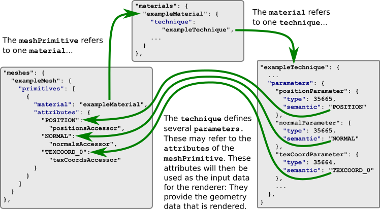

# Meshes

A [`mesh`](https://github.com/KhronosGroup/glTF/tree/master/specification#reference-mesh) describes a geometric object that appears in the scene. Every [`node`](https://github.com/KhronosGroup/glTF/tree/master/specification#reference-node) may refer to the meshes that are attached to the node, using their IDs:

```javascript
"nodes:" {
    "exampleNode": {
        "meshes" : [ "meshId0", "meshId1" ]
        ...
    }
}
```

When the meshes are rendered, they are rendered with the [global transform](gltfTutorial_004_ScenesNodesCamerasAnimations.md#global-transforms-of-nodes) of the node that they are attached to. The same mesh may be "instanced" multiple times in a scene, by referencing it from different nodes that have different transforms.

### Mesh primitives

The mesh itself usually does not have any properties, but only contains an array of [`mesh.primitive`](https://github.com/KhronosGroup/glTF/tree/master/specification#reference-mesh.primitive) objects. These `mesh.primitive` objects are smaller parts or building blocks of a larger object:  

```javascript
"meshes": {
    "meshId0": {
        "primitives": [
          {
            "attributes": {
              "POSITION": "accessorForPositions",
              "NORMAL": "accessorForNormals",
              "TEXCOORD_0": "accessorForTexCoords"
            },
            "indices": "accessorForIndices",
            "mode": 4,
            "material": "exampleMaterial"
          }
        ]
    },
    ...
}
```

The `mesh.primitive` summarizes all information that describes how the respective part of the object will be rendered: It contains references to the geometry data in form of [`accessor`](https://github.com/KhronosGroup/glTF/tree/master/specification#reference-accessor) objects, as well as a reference to the [`material`](https://github.com/KhronosGroup/glTF/tree/master/specification#reference-material) that will be used for rendering. The details of the `accessor`s will be explained in the section about [Buffers, BufferViews and Accessors](gltfTutorial_007_BuffersBufferViewsAccessors.md). Here, only a simple, high-level description of accessors will be used, to give a basic understanding of how the geometry data is represented in the `mesh.primitive` objects of a glTF asset.

#### Mesh primitive attributes

In order to render the geometry of a `mesh.primitive`, the information about *what* should be rendered and *how* it should be rendered has to be combined. The information about *what* should be rendered is given by the actual geometry information. This is at least a set of vertices and certain attributes that belong to the vertices. The `attributes` dictionary of the `mesh.primitive` contains references to `acessor` objects. An `accessor` is an abstract source of data, and in the simplest case it can be imagined as a block of memory, together with some information about the data type and layout of this memory block. In the example above, the `attributes` contain references to three `accessors`. These accessors describe the positions and normal vectors for the vertices of the mesh, and the texture coordinates at these vertices:

<p align="center">
<br>
<a name="meshPrimitiveAttributes-png"></a>Image 5a: Mesh primitive accessors containing the data of vertices
</p>

#### Mesh primitive mode  

By default, the geometry data is assumed to describe a triangle mesh. Three consecutive elements of the accessors are interpreted as the attributes of the three vertices of a triangle. Different other rendering modes are possible: The geometry data may also describe individual points, lines or triangle strips. This is indicated by the `mode` that may be stored in the mesh primitive: Its value is a constant that indicates how the geometry data has to be interpreted, for example, `0` when the geometry consists of points or `4` when it consists of triangles. See [the `primitive.mode` specification](https://github.com/KhronosGroup/glTF/tree/master/specification#primitivemode) for a list of available modes.

#### Mesh primitive indices

The mesh primitive can also contain an accessor with the key name `indices`. This accessor provides the indices of the vertices that the mesh elements consist of. For example, when the rendering `mode` indicates that the geometry consists of triangles, then three consecutive elements of the indices accessor are the vertex indices of one triangle.

#### Mesh primitive material

The mesh primitive refers to the `material` that should be used for rendering, using the ID of this material. A detailed explanation of materials and the related concepts will be given in the section about [Materials, Techniques, Programs and Shaders](gltfTutorial_006_MaterialsTechniquesProgramsShaders.md). For now, the `material` may be considered as one instance of a rendering `technique`. The `technique` is a description of a rendering process that receives input data, and defines how this input data is converted into pixels on the screen.

The important point regarding the mesh primitives is that the `material` refers to a `technique`, and the `technique` may refer to the `attribute` elements of the mesh primitive. This attribute data is one part of the input data for the rendering process - namely, the actual geometry data:

<p align="center">
<br>
<a name="meshPrimitiveMaterial-png"></a>Image 5b: Connection betweeen the mesh primitive, the material and the technique
</p>
