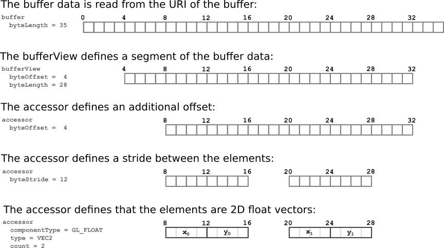
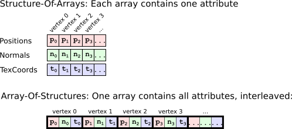

# Buffers, BufferViews, Accessors

Some of the previous sections already mentioned the [`accessor`](https://github.com/KhronosGroup/glTF/tree/master/specification#reference-accessor) objects that are contained in the glTF JSON. These have been described as an abstract source of arbitrary data, and this section will explain them in more detail.

## Buffers

As shown in the section about [Binary data in `buffers`](gltfTutorial_002_BasicGltfStructure.md#binary-data-in-buffers), a [`buffer`](https://github.com/KhronosGroup/glTF/tree/master/specification#reference-buffer) may contain a URI that points to an external file. This external file contains unstructured, raw binary data. The purpose of an `accessor` is to add information about the type and the layout to this raw data, so that this data may be accessed in a structured form. For example, parts of the data of a `buffer` may have to be passed to the renderer as vertex attributes, or as indices, or it may be data that contains skinning information or animation key frames.

## BufferViews

The first step of structuring the data from a `buffer` is with [`bufferView`](https://github.com/KhronosGroup/glTF/tree/master/specification#reference-bufferView) objects. A `bufferView` represents a "slice" of the data of one buffer. This slice is defined using an offset and a length, in bytes. For example, the following glTF JSON defines a buffer that contains 116 bytes in total, and two buffer views. The first one refers to the first 20 bytes of the buffer. The second one refers to the remaining 96 bytes

```javascript
"buffers": {
    "exampleBuffer": {
        "uri": "example.bin",
        "byteLength": 116,
        ...
    }
},
"bufferViews": {
    "exampleBufferViewA": {
        "buffer": "exampleBuffer",
        "byteOffset": 0,
        "byteLength": 20,
        ...
    },
    "exampleBufferViewB": {
        "buffer": "exampleBuffer",
        "byteOffset": 20,
        "byteLength": 96,
        ...
    }
},
```

## Accessors

The next step is to add type- and layout information to the data of a `bufferView`. This is achieved by creating an [`accessor`](https://github.com/KhronosGroup/glTF/tree/master/specification#reference-accessor) that refers to such a `bufferView`. The following is an example of an `accessor` that refers to the second `bufferView` shown above:   

    "exampleAccessorB0": {
      "bufferView": "exampleBufferViewB",
      "byteOffset": 0,
      "byteStride": 12,
      "componentType": 5126,
      "type": "VEC3",
      "count": 4,
      ...
    },

The accessor contains information about the `type` and the `componentType` of the data. Different combinations of these properties may be used to describe arbitrary data types. In the example above, the `type` is `"VEC3"`, and the `componentType` is `5126`, which is the GL constant representing `GL_FLOAT`. So the data of this accessor has to be interpreted as 3D vectors with `float` elements. It additionally contains a `byteOffset`, a `byteStride` and a `count`, which provide further information about the layout of the data. The following image illustrates how the raw `buffer` data is augmented with the information from a `bufferView` and an `accessor`:

<p align="center">
<br>
<a name="accessors-png"></a>Image 7a: Structuring buffer data with buffer views and accessors
</p>

The data that is described by this accessor may, for example, be the 2D texture coordinates of two vertices.

### Why is this so complicated?

It seems like the way of structuring the data using `bufferView`s and `accessor`s is overly complicated. One could argue that the data for a set of vertices could simply be stored as a single data block, in a fixed format. But different renderers offer several degrees of freedom for the data layout, and these degrees of freedom should therefore also be available in glTF.

One example of the flexibility that is achieved with accessors is that vertex data can be stored in an *interleaved* form. In general, there are two options for storing the data that belongs to a set of vertices: The data can be stored as a "Structure Of Arrays" (SOA), where each array contains the data of one attribute. So there is one array that contains all positions, one array for all the normals, and one array for all the texture coordinates. These arrays are then combined to describe a set of vertices with these attributes. The other option is to store the data in an interleaved form, as an "Array of Structures" (AOS). Each element of this array corresponds to one vertex, and contains the position, normal and texture coordinate of the vertex.  

<p align="center">
<br>
<a name="soaVsAos-png"></a>Image 7b: Structure-Of-Arrays vs. Array-Of-Structures
</p>

There are several trade-offs between both representations. The interleaved format may achieve a higher rendering performance, but offers less flexibility when only parts of the data should be updated. Additionally, the interleaved format may require an additional padding to avoid misaligned data accesses. For details of the pros and cons of both formats, a dedicated tutorial should be consulted. The key point regarding glTF is that all these representations may be encoded using the `accessor` structures.
