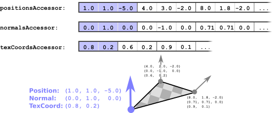

Previous: [Animations](gltfTutorial_007_Animations.md) | [Table of Contents](README.md) | Next: [Materials](gltfTutorial_009_Materials.md)

# Meshes

A [`mesh`](https://github.com/KhronosGroup/glTF/tree/master/specification#reference-mesh)  represents a geometric object that appears in a scene. A first example of a `mesh` has already been shown in the [minimal glTF file](gltfTutorial_003_MinimalGltfFile.md). This example had a single `mesh`, attached to a single `node`, and the mesh consisted of a single `mesh.primitive` that only contained a single attribute - namely, the attribute for the vertex positions. But usually, the mesh primitives will contain more attributes. These attributes may, for example, be the vertex normals or texture coordinates.

This section will explain the handling of meshes, mesh primitives and attributes in more detail, based on an example with additional attributes. The following is a glTF asset that contains a simple mesh with multiple attributes, which will serve as the basis for explaining the related concepts:

```javascript
{
  "scenes" : {
    "scene0" : {
      "nodes" : [ "node0", "node1" ]
    }
  },
  "nodes" : {
    "node0" : {
      "meshes" : [ "mesh0" ]
    },
    "node1" : {
      "meshes" : [ "mesh0" ],
      "translation" : [ 1.0, 0.0, 0.0 ]
    }
  },

  "meshes" : {
    "mesh0" : {
      "primitives" : [ {
        "attributes" : {
          "POSITION" : "positionsAccessor",
          "NORMAL" : "normalsAccessor",
          "TEXCOORD_0" : "texCoordsAccessor"
        },
        "indices" : "indicesAccessor"
      } ]
    }
  },

  "buffers" : {
    "buffer0" : {
      "uri" : "data:application/octet-stream;base64,AAABAAIAAAAAAAAAAAAAAAAAAACAPwAAAAAAAAAAAAAAAAAAgD8AAAAAAAAAAAAAAAAAAIA/AAAAAAAAAAAAAIA/AAAAAAAAAAAAAIA/AAAAAAAAAAAAAIA/AAAAAAAAAAAAAIA/",
      "byteLength" : 108
    }
  },
  "bufferViews" : {
    "indicesBufferView" : {
      "buffer" : "buffer0",
      "byteOffset" : 0,
      "byteLength" : 6,
      "target" : 34963
    },
    "attributesBufferView" : {
      "buffer" : "buffer0",
      "byteOffset" : 6,
      "byteLength" : 96,
      "target" : 34962
    }
  },
  "accessors" : {
    "indicesAccessor" : {
      "bufferView" : "indicesBufferView",
      "byteOffset" : 0,
      "componentType" : 5123,
      "count" : 3,
      "type" : "SCALAR",
      "max" : [ 2.0 ],
      "min" : [ 0.0 ]
    },
    "positionsAccessor" : {
      "bufferView" : "attributesBufferView",
      "byteOffset" : 0,
      "componentType" : 5126,
      "count" : 3,
      "type" : "VEC3",
      "max" : [ 1.0, 1.0, 0.0 ],
      "min" : [ 0.0, 0.0, 0.0 ]
    },
    "normalsAccessor" : {
      "bufferView" : "attributesBufferView",
      "byteOffset" : 36,
      "componentType" : 5126,
      "count" : 3,
      "type" : "VEC3",
      "max" : [ 0.0, 0.0, 1.0 ],
      "min" : [ 0.0, 0.0, 1.0 ]
    },
    "texCoordsAccessor" : {
      "bufferView" : "attributesBufferView",
      "byteOffset" : 72,
      "componentType" : 5126,
      "count" : 3,
      "type" : "VEC2",
      "max" : [ 1.0, 1.0 ],
      "min" : [ 0.0, 0.0 ]
    }
  },

  "asset" : {
    "version" : "1.1"
  }
}
```

When rendering this glTF asset, the result will look shown in this image:

<p align="center">
<br>
<a name="simpleMeshes-png"></a>Image 8a: A simple mesh, attached to two nodes
</p>

Some of the elements in this asset already have been introduced in the [minimal glTF file](gltfTutorial_003_MinimalGltfFile.md).


## Meshes attached to nodes

In the given example, there is a single `scene`, and this scene contains two nodes. The nodes are called `"node0"` and `"node1"`. Both nodes refer to the same `mesh` instance, which is called `"mesh0"`:

```javascript
  "scenes" : {
    "scene0" : {
      "nodes" : [ "node0", "node1" ]
    }
  },
  "nodes" : {
    "node0" : {
      "meshes" : [ "mesh0" ]
    },
    "node1" : {
      "meshes" : [ "mesh0" ],
      "translation" : [ 1.0, 0.0, 0.0 ]
    }
  },

  "meshes" : {
    "mesh0" : {
      ...
    }
  },
```

The node `"node1"` has a `translation` property. As shown in the section about [Scenes and Nodes](gltfTutorial_004_ScenesNodes.md), this will be used to compute the local transform matrix of this node. In this case, the matrix will cause a translation of 1.0 along the x-axis. The product of all local transforms of the nodes will yield the *global* transform. And all elements that are attached to the nodes will be rendered with this global transform.

So in this example, the mesh will be rendered twice: Once with the global transform of `"node0"`, which is the identity transform, and once with the global transform of node `"node1"`, which is a translation of 1.0 along the x-axis.


### Mesh primitives

The `mesh` contains an array of [`mesh.primitive`](https://github.com/KhronosGroup/glTF/tree/master/specification#reference-mesh.primitive) objects. These `mesh.primitive` objects are smaller parts or building blocks of a larger object. Such a `mesh.primitive` summarizes all information about how the respective part of the object will be rendered. Particularly, a mesh primitive defines the geometry data of the object, using its `attributes` dictionary, which is explained below.  

The example contains a single `mesh.primitive`:

```javascript
"meshes" : {
  "mesh0" : {
    "primitives" : [ {
      "attributes" : {
        "POSITION" : "positionsAccessor",
        "NORMAL" : "normalsAccessor",
        "TEXCOORD_0" : "texCoordsAccessor"
      },
      "indices" : "indicesAccessor"
    } ]
  }
},
```

#### Indexed and non-indexed geometry

The geometry data of a `mesh.primitive` may either be *indexed* geometry, or geometry without indices. In the given example, the `mesh.primitive` contains *indexed* geometry. This is indicated by the `indices` property, which refers to the `"indicesAccessor"`. For non-indexed geometry, this property may be omitted.


#### Mesh primitive attributes

The `attributes` dictionary of a `mesh.primitive` contains information about the geometry data that an object consists of. Particularly, it contains references to `accessor` objects that contain the data of vertex attributes. The details of the `accessor`s have been explained in the section about [Buffers, BufferViews and Accessors](gltfTutorial_005_BuffersBufferViewsAccessors.md).

In the given example, there are three entries in the `attributes` dictionary:

```javascript
"meshes" : {
  "mesh0" : {
    "primitives" : [ {
      "attributes" : {
        "POSITION" : "positionsAccessor",
        "NORMAL" : "normalsAccessor",
        "TEXCOORD_0" : "texCoordsAccessor"
      },
      "indices" : "indicesAccessor"
    } ]
  }
},
```

These entries refer to the `positionsAccessor`, the `normalsAccessor` and the `texCoordsAccessor`. Together, the elements of these acessors define all attributes that belong to the individual vertices, as shown in this image:

<p align="center">
<br>
<a name="meshPrimitiveAttributes-png"></a>Image 8b: Mesh primitive accessors containing the data of vertices
</p>

#### Mesh primitive mode  

By default, the geometry data is assumed to describe a triangle mesh. For the case of *indexed* geometry, this means that three consecutive elements of the `indices` accessor are assumed to contain the indices of a single triangle. For non-indexed geometry, three elements of the vertex attribute accessors are assumed to contain the attributes of the three vertices of a triangle.

Different other rendering modes are possible: The geometry data may also describe individual points, lines or triangle strips. This is indicated by the `mode` that may be stored in the mesh primitive: Its value is a constant that indicates how the geometry data has to be interpreted. The mode may, for example, be `0` when the geometry consists of points, or `4` when it consists of triangles. See [the `primitive.mode` specification](https://github.com/KhronosGroup/glTF/tree/master/specification#primitivemode) for a list of available modes.

#### Mesh primitive material

The mesh primitive may also refer to the `material` that should be used for rendering, using the ID of this material. In the given example, no `material` is defined, causing the objects to be rendered with a default material that just defines the objects to have a uniform 50% gray color. A detailed explanation of materials and the related concepts will be given in the next section about [Materials](gltfTutorial_009_Materials.md).


Previous: [Animations](gltfTutorial_007_Animations.md) | [Table of Contents](README.md) | Next: [Materials](gltfTutorial_009_Materials.md)
