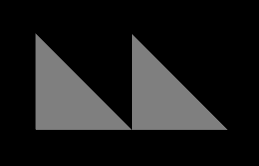

Previous: [Animations](gltfTutorial_007_Animations.md) | [Table of Contents](README.md) | Next: [Meshes](gltfTutorial_009_Meshes.md)

# Simple Meshes

A [`mesh`](https://github.com/KhronosGroup/glTF/tree/master/specification#reference-mesh) represents a geometric object that appears in a scene. An example of a `mesh` has already been shown in the [minimal glTF file](gltfTutorial_003_MinimalGltfFile.md). This example had a single `mesh` attached to a single `node`, and the mesh consisted of a single [`mesh.primitive`](https://github.com/KhronosGroup/glTF/tree/master/specification#reference-mesh.primitive) that contained only a single attribute&mdash;namely, the attribute for the vertex positions. But usually, the mesh primitives will contain more attributes. These attributes may, for example, be the vertex normals or texture coordinates.

The following is a glTF asset that contains a simple mesh with multiple attributes, which will serve as the basis for explaining the related concepts:

```javascript
{
  "scenes" : {
    "scene0" : {
      "nodes" : [ "node0", "node1" ]
    }
  },
  "nodes" : {
    "node0" : {
      "meshes" : [ "mesh0" ]
    },
    "node1" : {
      "meshes" : [ "mesh0" ],
      "translation" : [ 1.0, 0.0, 0.0 ]
    }
  },

  "meshes" : {
    "mesh0" : {
      "primitives" : [ {
        "attributes" : {
          "POSITION" : "positionsAccessor",
          "NORMAL" : "normalsAccessor",
          "TEXCOORD_0" : "texCoordsAccessor"
        },
        "indices" : "indicesAccessor"
      } ]
    }
  },

  "buffers" : {
    "buffer0" : {
      "uri" : "data:application/octet-stream;base64,AAABAAIAAAAAAAAAAAAAAAAAAACAPwAAAAAAAAAAAAAAAAAAgD8AAAAAAAAAAAAAAAAAAIA/AAAAAAAAAAAAAIA/AAAAAAAAAAAAAIA/AAAAAAAAAAAAAIA/AAAAAAAAAAAAAIA/",
      "byteLength" : 108
    }
  },
  "bufferViews" : {
    "indicesBufferView" : {
      "buffer" : "buffer0",
      "byteOffset" : 0,
      "byteLength" : 6,
      "target" : 34963
    },
    "attributesBufferView" : {
      "buffer" : "buffer0",
      "byteOffset" : 6,
      "byteLength" : 96,
      "target" : 34962
    }
  },
  "accessors" : {
    "indicesAccessor" : {
      "bufferView" : "indicesBufferView",
      "byteOffset" : 0,
      "componentType" : 5123,
      "count" : 3,
      "type" : "SCALAR",
      "max" : [ 2 ],
      "min" : [ 0 ]
    },
    "positionsAccessor" : {
      "bufferView" : "attributesBufferView",
      "byteOffset" : 0,
      "componentType" : 5126,
      "count" : 3,
      "type" : "VEC3",
      "max" : [ 1.0, 1.0, 0.0 ],
      "min" : [ 0.0, 0.0, 0.0 ]
    },
    "normalsAccessor" : {
      "bufferView" : "attributesBufferView",
      "byteOffset" : 36,
      "componentType" : 5126,
      "count" : 3,
      "type" : "VEC3",
      "max" : [ 0.0, 0.0, 1.0 ],
      "min" : [ 0.0, 0.0, 1.0 ]
    },
    "texCoordsAccessor" : {
      "bufferView" : "attributesBufferView",
      "byteOffset" : 72,
      "componentType" : 5126,
      "count" : 3,
      "type" : "VEC2",
      "max" : [ 1.0, 1.0 ],
      "min" : [ 0.0, 0.0 ]
    }
  },

  "asset" : {
    "version" : "1.1"
  }
}
```

Image 8a shows the rendered glTF asset.

<p align="center">
<br>
<a name="simpleMeshes-png"></a>Image 8a: A simple mesh, attached to two nodes.
</p>


## The mesh definition

The given example still contains a single mesh, with the ID `"mesh0"`. The mesh has a single mesh primitive. But this mesh primitive contains additional attributes:

```javascript
"meshes" : {
  "mesh0" : {
    "primitives" : [ {
      "attributes" : {
        "POSITION" : "positionsAccessor",
        "NORMAL" : "normalsAccessor",
        "TEXCOORD_0" : "texCoordsAccessor"
      },
      "indices" : "indicesAccessor"
    } ]
  }
},
```

In addition to the `"POSITION"` attribute, it has a `"NORMAL"` and a `"TEXCOORD_0"` attributes. These refer to the `accessor` objects that provide the vertex normals and texture coordinates, respectively, as described in the [Buffers, BufferViews, and Accessors](gltfTutorial_005_BuffersBufferViewsAccessors.md) section.


## The rendered mesh instances

As can be seen in Image 8a, the mesh is rendered *twice*. This is accomplished by attaching the mesh to two different nodes:

```javascript
"nodes" : {
  "node0" : {
    "meshes" : [ "mesh0" ]
  },
  "node1" : {
    "meshes" : [ "mesh0" ],
    "translation" : [ 1.0, 0.0, 0.0 ]
  }
},
```

The `meshes` property of each node is an array containing the ID of the mesh. One of the nodes has a `translation` that causes the attached mesh to be rendered at a different position. 

The [next section](gltfTutorial_009_Meshes.md) will explain meshes and mesh primitives in more detail.


Previous: [Animations](gltfTutorial_007_Animations.md) | [Table of Contents](README.md) | Next: [Meshes](gltfTutorial_009_Meshes.md)
