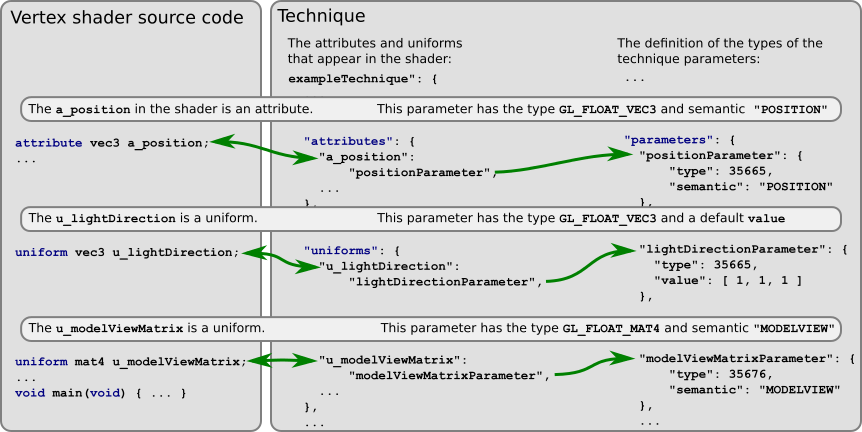
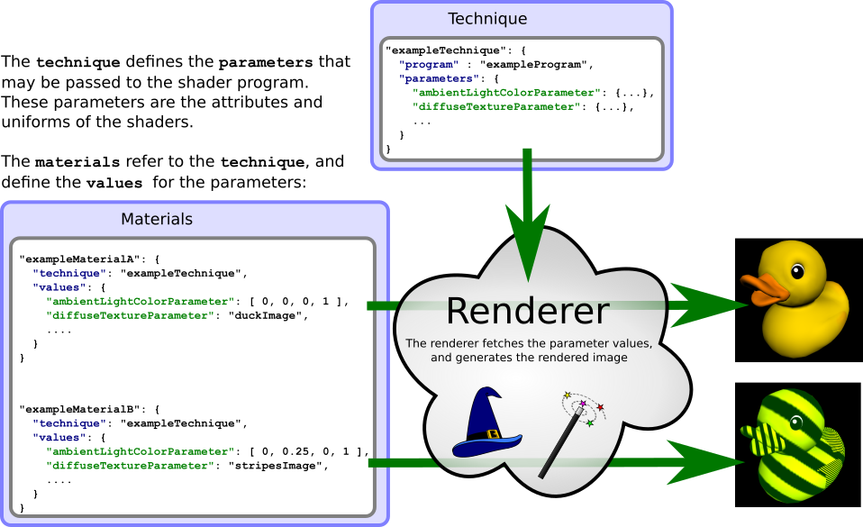

Previous: [Programs and Shaders](gltfTutorial_009b_ProgramsShaders.md) | [Table of Contents](README.md) | Next: [Advanced Material](gltfTutorial_009d_AdvancedMaterial.md)


# Materials and Techniques

As shown in the [Simple Material](gltfTutorial_009a_SimpleMaterial.md) example, the central element for the definition of the appearance of a rendered object in glTF is the [`technique`](https://github.com/KhronosGroup/glTF/tree/master/specification#reference-technique).  Such a technique serves as a template for a [`material`](https://github.com/KhronosGroup/glTF/tree/master/specification#reference-material). The `material` defines the values for different parameters of the technique that determine the final appearance of the rendered objects.

This section will explain the connection between techniques, technique parameters and the material, and show how the values of technique parameters are determined.


## Techniques

A `technique` is a description of a rendering process. It summarizes a set of parameters that are required for controlling the renderer. These parameters directly correspond to the *attributes* and *uniforms* of the shaders that are used for the implementation of the rendering process.

The technique therefore contains `attributes` and `uniforms` dictionaries. The keys of these dictionaries are the variable names of the attributes and uniforms of the shaders. The values of these dictionaries refer to the [`parameters`](https://github.com/KhronosGroup/glTF/tree/master/specification#reference-technique.parameters) dictionary of the technique. These `technique.parameters` define the types of the parameters, and how the values of the parameters are obtained. So for each `attribute` and `uniform` of the shader program, there is a `technique.parameters` entry that defines the type that the variable in the shader program has:

<p align="center">
<br>
<a name="technique-png"></a>Image 9c: The connection between shader source code and technique parameters
</p>

To recall the example from the [simple material](gltfTutorial_009a_SimpleMaterial.md), here is an excerpt of the  JSON part that encodes this information:

```javascript
"techniques": {
  "simpleTechnique": {
    "program": "simpleProgram",
    ...
    "uniforms": {
      ...
      "u_emission": "emissionParameter"
    },
    "parameters": {
      ...
      "emissionParameter": {
        "type": 35666,
        "value": [ 0.5, 0.5, 0.5, 1.0 ]
      },
      ...
    }
  }
}
"programs": {
  "simpleProgram": {
    ...
    "fragmentShader": "simpleFragmentShader",
    ...
  }
},
"shaders": {
  ...
  "simpleFragmentShader": {
    ...
    "uri": "simple.frag"
  }
},
```


The entry in the `uniforms` dictionary of the `technique` says that one of the shaders has a `uniform` variable with the name `"u_emission"` (in this example, it is contained in the `simple.frag` source code). More information about this variable can be found by looking up the `"emissionParameter"` in the `technique.parameters` dictionary. And for this parameter, the entry says that the parameter has a the `type` `35666`, which stands for `GL_FLOAT_VEC4`, and a default `value`, which is `[0.5, 0.5, 0.5, 1.0]`.  


## Materials

A `material` is is an instance of a `technique`, and specifies a set of input values for the `technique.parameters`. Several materials may be created by instantiating `material` objects with the same `technique`, but different parameter values.  

<p align="center">
<br>
<a name="materialAndTechnique-png"></a>Image 9d: Materials and techniques, and how they affect the appearance of objects
</p>


## Technique parameter values

When an object should be rendered with a certain `technique`, then values have to be provided for all input parameters of the corresponding GL program. The following sections will show how these input parameters are defined using the `technique.parameters`, and how the values for these input parameters may be obtained.

There are two methods for determining the value of a technique parameter:

- The value can be defined in the `technique` or the `material`
- The value has to be derived from the context in which the rendered object appears


### Technique parameter values in techniques or materials

In some cases, the technique parameters can have default values. In other cases, the parameter values can be obtained from the material that refers to the technique. This was already shown in the [simple material](gltfTutorial_009a_SimpleMaterial.md) example:

```javascript
"techniques": {
  "simpleTechnique": {
    ...
    "parameters": {
      ...
      "emissionParameter": {
        "type": 35666,
        "value": [ 0.5, 0.5, 0.5, 1.0 ]
      },
      ...
    }
  }
}

"materials" : {
  "simpleMaterial" : {
    "technique" : "simpleTechnique",
    "values" : {
      "emissionParameter" : [ 0.9, 0.5, 0.1, 1.0 ]
    }
  },
},

```

When an object should be rendered with the `"simpleMaterial"`, then the value for the `"emissionParameter"` can be looked up in the `values` dictionary. In this case, the value will be `[0.9, 0.5, 0.1, 1.0]`, causing the object to be rendered with an orange color.   

One could now define new materials that refer to the same `technique`, but have different values for the `"emissionParameter"`:

```javascript
"materials" : {
  "simpleMaterial" : {
    "technique" : "simpleTechnique",
    "values" : {
      "emissionParameter" : [ 0.9, 0.5, 0.1, 1.0 ]
    }
  },
  "simpleBlueMaterial" : {
    "technique" : "simpleTechnique",
    "values" : {
      "emissionParameter" : [ 0.0, 0.0, 1.0, 1.0 ]
    }
  },
  "simpleDefaultMaterial" : {
    "technique" : "simpleTechnique"
  }
},

```

In the newly added `"simpleBlueMaterial"`, the value for the `"emissionParameter"` is set to `[0.0, 0.0, 1.0, 1.0]`, so that objects with this material will appear in blue.

The newly added `"simpleDefaultMaterial"` does not contain a value for the `"emissionParameter"`. When an object is rendered with this material, then the default value from the `technique.parameter` definition will be used. This default value is `[0.5, 0.5, 0.5, 1.0]`, causing the object to be rendered in a 50% gray.


### Technique parameter values from semantics

There are cases where the value of a parameter cannot be encoded in the technique or the material. This is the case when the value for this parameter has a certain *semantic*, and its value can only be derived from the context of where the technique is used.

One example of a parameter that has such a semantic is the model-view-matrix: The actual value for the model-view-matrix depends on the `node` to which the rendered object is attached. More precisely, the model-view-matrix is the product of the [global transform](gltfTutorial_004_ScenesNodes.md#global-transforms-of-nodes) of the node and the view matrix of the currently active camera. Similarly, the technique parameters can have semantics which refer to the `attribute` of a `mesh.primitive` that contains the actual input data for the parameter.  

Therefore, the `technique.parameters` may have a `semantic` property that contains a string describing the semantic of the parameter:

```javascript
"exampleTechnique": {
    ...
    "attributes": {
      "a_position": "positionParameter"
    },
    "uniforms": {
      "u_modelViewMatrix": "modelViewMatrixParameter",
      ...
    },
    "parameters": {
        ...
        "positionParameter": {
            "type": 35665,
            "semantic": "POSITION"
        },
        "modelViewMatrixParameter": {
            "type": 35676,
            "semantic": "MODELVIEW"
        },
        ...
    },
}
```

There are many different possible semantics for `uniform` parameters. These are listed in this [table in the glTF specification](https://github.com/KhronosGroup/glTF/tree/master/specification#semantics). Additional `attribute` semantics are listed in the [glTF specification of meshes](https://github.com/KhronosGroup/glTF/tree/master/specification#meshes).

#### Semantics for attributes

In the example above, the technique says that the `"positionParameter"` has the type `35665`, which stands for `GL_FLOAT_VEC3`, and the semantic `"POSITION"`. This means that when a `mesh.primitive` is rendered with this technique, then this `mesh.primitive` must contain an attribute with this type and name, as described in the section about [mesh primitive attributes](gltfTutorial_008_Meshes.md#mesh-primitive-attributes).

When a `mesh.primitive` is rendered with this technique, then the information about the attribute semantics will be processed as follows:

- The entries in the `technique.attributes` dictionary are examined
- The `a_position` entry is found. This means that the vertex shader of the program of the technique has an `attribute` variable with exactly this name: `a_position`
- In order to provide a value for this attribute, the information about this parameter is looked up in the `technique.parameters` dictionary
- The entry for the `"positionParameter"` says that the `type` of this attribute is a 3D floating point vector, and that the `semantic` is `"POSITION"`.
- The actual value for this parameter is determined. For `attribute` parameters, this means that the name `"POSITION"` is looked up in the [mesh primitive attributes](gltfTutorial_008_Meshes.md#mesh-primitive-attributes) dictionary. It is supposed to refer to an `accessor` that provides the 3D floating point vectors that represent the vertex positions.
- The data of this accessor is provided to the renderer.

The exact mechanism for the last step will depend on the graphics API. For WebGL or OpenGL, this means that the buffer that corresponds to the `bufferView` of the `accessor` is bound, so that its data will be available for the actual rendering call.

<p align="center">
<br>
<a name="meshPrimitiveMaterial-png"></a>Image 9e: Connection between the mesh primitive, the material and the technique
</p>


#### Semantics for uniforms

The `"modelViewMatrixParameter"` is defined to have the semantic `"MODELVIEW"`. Its `type` is `35676`, which stands for `GL_FLOAT_MAT4`, and indicates a 4x4 matrix with floating point values.

When a `mesh.primitive` is rendered with this technique, then this uniform parameter will be handled as follows:

- The entries in the `technique.uniforms` dictionary are examined
- The `u_modelViewMatrix` entry is found. This means that one of the shaders of the program of the technique has a `uniform` variable with exactly this name: `u_modelViewMatrix`
- In order to assign a value to this variable prior to rendering, the information about this parameter is looked up in the `technique.parameters` dictionary
- The entry for the `"modelViewMatrixParameter"` says that the `type` of this uniform is a 4x4 floating point matrix, and that the `semantic` is `"MODELVIEW"`
- The actual value for this uniform is computed. The `semantic` is `"MODELVIEW"`, and referring to the [uniform semantics section of the glTF specification](https://github.com/KhronosGroup/glTF/tree/master/specification#semantics), this means that the value is a 4x4 matrix that is the product of the [global transform](gltfTutorial_004_ScenesNodes.md#global-transforms-of-nodes) of the node that the mesh primitive is attached to, and the view matrix of the currently active camera.
- The value for this uniform is passed to the renderer.


### Technique states and state functions

As shown above, the `technique.parameters` encode the information about the `attribute` and `uniform` variables that appear in the vertex- and fragment shader. But for common graphics APIs, there are additional, "global" parameters that are not explicitly controlled via the shaders.

For the case of WebGL or OpenGL, these parameters refer to the *state* that is maintained by the WebGL or OpenGL renderer, and the certain *functions* that describe rendering settings. The following is an excerpt from a `technique` that may be found in the JSON part of a glTF asset, which shows an example of these [`technique.states`](https://github.com/KhronosGroup/glTF/tree/master/specification#reference-technique.states) and the [`technique.states.functions`](https://github.com/KhronosGroup/glTF/tree/master/specification#reference-technique.states.functions) properties:

```javascript
"techniques": {
  "exampleTechnique": {
    ...
    "states": {
      "enable": [ 2929, 3042 ],
      "functions": {
        "blendColor": [ 0.0, 0.0, 0.0, 0.0 ],
        "blendEquationSeparate": [ 32774, 32774 ],
        "blendFuncSeparate": [ 1, 0, 1, 0 ],
        "colorMask": [ true, true, true, true ],
        "cullFace": [ 1029 ],
        "depthFunc" : [ 513 ],
        "depthMask": [ true ],
        "depthRange": [ 0.0, 1.0 ],
        "frontFace": [ 2305 ],
        "lineWidth": [ 1.0 ],
        "polygonOffset": [ 0.0, 0.0 ]
      }
    }
  }
}
```

For WebGL- and OpenGL-based renderers, the elements of the `states.enable` array will be passed to `gl.enable` and `glEnable` calls, respectively. The properties of the `technique.states.functions` element correspond to GL calls and their parameters. For example, the `"depthRange" : [ 0.0, 1.0 ]` property indicates that when this technique is used for rendering, then the actual draw call should be preceded by a call to `gl.depthRange(0.0, 1.0)` (for WebGL) or `glDepthRange(0.0, 1.0)` (for OpenGL).

For details about the available set of states and functions, refer to the [`technique.states`](https://github.com/KhronosGroup/glTF/tree/master/specification#reference-technique.states) and [`technique.states.functions`](https://github.com/KhronosGroup/glTF/tree/master/specification#reference-technique.states.functions) specification and to the WebGL- and OpenGL specification.

For other graphics APIs, these properties have to be interpreted accordingly, to emulate the behavior that is achieved with the respective GL function calls.


Previous: [Programs and Shaders](gltfTutorial_009b_ProgramsShaders.md) | [Table of Contents](README.md) | Next: [Advanced Material](gltfTutorial_009d_AdvancedMaterial.md)
