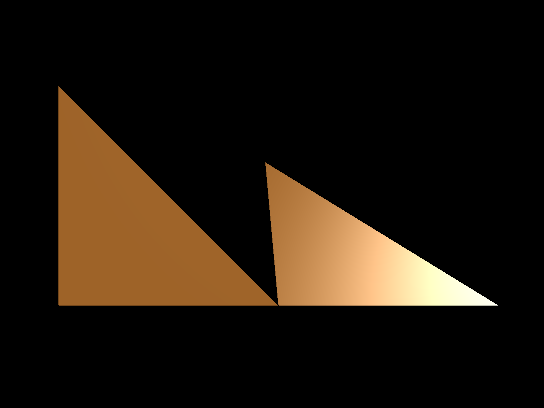

Previous: [Materials and Techniques](gltfTutorial_009c_MaterialsTechniques.md) | [Table of Contents](README.md) | Next: [Advanced Material](gltfTutorial_009d_AdvancedMaterial.md)

**TODO Update navigation links ^**

# An advanced material

This section will show how the concepts from the [Meshes](gltfTutorial_008_Meshes.md)  section and the elements that have been explained in the section about [Materials and Techniques](gltfTutorial_009c_MaterialsTechniques.md)  can be brought together to define a non-trivial material. The material in this example will show multiple parameters and include a *light*, so that the effect of the vertex normals of the mesh become visible.

The following is the JSON part of a simple glTF asset that contains an advanced material:

```javascript
{
  "scenes" : {
    "scene0" : {
      "nodes" : [ "node0", "node1" ]
    }
  },
  "nodes" : {
    "node0" : {
      "meshes" : [ "mesh0" ]
    },
    "node1" : {
      "translation" : [ 1.0, 0.0, 0.0 ],
      "rotation" : [ -0.383, 0.0, 0.0, 0.924 ],
      "meshes" : [ "mesh0" ]
    }
  },

  "meshes" : {
    "mesh0" : {
      "primitives" : [ {
        "attributes" : {
          "POSITION" : "positionsAccessor",
          "NORMAL" : "normalsAccessor",
          "TEXCOORD_0" : "texCoordsAccessor"
        },
        "indices" : "indicesAccessor",
        "material" : "advancedMaterial"
      } ]
    }
  },

  "materials" : {
    "advancedMaterial" : {
      "technique" : "advancedTechnique"
    }
  },
  "techniques": {
    "advancedTechnique": {
      "program": "advancedProgram",
      "attributes": {
        "a_position": "positionParameter",
        "a_normal": "normalParameter"
      },
      "uniforms": {
        "u_modelViewMatrix": "modelViewMatrixParameter",
        "u_normalMatrix": "normalMatrixParameter",
        "u_projectionMatrix": "projectionMatrixParameter",
        "u_ambient": "ambientParameter",
        "u_diffuse": "diffuseParameter",
        "u_specular": "specularParameter",
        "u_shininess": "shininessParameter"
      },
      "parameters": {
        "positionParameter" : {
          "type": 35665,
          "semantic": "POSITION"
        },
        "normalParameter" : {
          "type": 35665,
          "semantic": "NORMAL"
        },
        "modelViewMatrixParameter": {
          "type": 35676,
          "semantic": "MODELVIEW"
        },
        "normalMatrixParameter": {
          "type": 35675,
          "semantic": "MODELVIEWINVERSETRANSPOSE"
        },
        "projectionMatrixParameter": {
          "type": 35676,
          "semantic": "PROJECTION"
        },
        "ambientParameter": {
          "type": 35666,
          "value": [ 0.1, 0.1, 0.1, 1.0 ]
        },
        "diffuseParameter": {
          "type": 35666,
          "value": [ 0.9, 0.5, 0.1, 1.0 ]
        },
        "specularParameter": {
          "type": 35666,
          "value": [ 1.0, 1.0, 1.0, 1.0 ]
        },
        "shininessParameter": {
          "type": 5126,
          "value": [ 40.0 ]
        }
      }
    }
  },
  "programs": {
    "advancedProgram": {
      "vertexShader": "advancedVertexShader",
      "fragmentShader": "advancedFragmentShader",
      "attributes": [
        "a_position",
        "a_normal"
      ]
    }
  },
  "shaders": {
    "advancedVertexShader": {
      "type": 35633,
      "uri": "advanced.vert"
    },
    "advancedFragmentShader": {
      "type": 35632,
      "uri": "advanced.frag"
    }
  },

  "buffers" : {
    "buffer0" : {
      "uri" : "data:application/octet-stream;base64,AAABAAIAAAAAAAAAAAAAAAAAAACAPwAAAAAAAAAAAAAAAAAAgD8AAAAAAAAAAAAAAAAAAIA/AAAAAAAAAAAAAIA/AAAAAAAAAAAAAIA/AAAAAAAAAAAAAIA/AAAAAAAAAAAAAIA/",
      "byteLength" : 108
    }
  },
  "bufferViews" : {
    "indicesBufferView" : {
      "buffer" : "buffer0",
      "byteOffset" : 0,
      "byteLength" : 6,
      "target" : 34963
    },
    "attributesBufferView" : {
      "buffer" : "buffer0",
      "byteOffset" : 6,
      "byteLength" : 96,
      "target" : 34962
    }
  },
  "accessors" : {
    "indicesAccessor" : {
      "bufferView" : "indicesBufferView",
      "byteOffset" : 0,
      "componentType" : 5123,
      "count" : 3,
      "type" : "SCALAR",
      "max" : [ 2.0 ],
      "min" : [ 0.0 ]
    },
    "positionsAccessor" : {
      "bufferView" : "attributesBufferView",
      "byteOffset" : 0,
      "componentType" : 5126,
      "count" : 3,
      "type" : "VEC3",
      "max" : [ 1.0, 1.0, 0.0 ],
      "min" : [ 0.0, 0.0, 0.0 ]
    },
    "normalsAccessor" : {
      "bufferView" : "attributesBufferView",
      "byteOffset" : 36,
      "componentType" : 5126,
      "count" : 3,
      "type" : "VEC3",
      "max" : [ 0.0, 0.0, 1.0 ],
      "min" : [ 0.0, 0.0, 1.0 ]
    },
    "texCoordsAccessor" : {
      "bufferView" : "attributesBufferView",
      "byteOffset" : 72,
      "componentType" : 5126,
      "count" : 3,
      "type" : "VEC2",
      "max" : [ 1.0, 1.0 ],
      "min" : [ 0.0, 0.0 ]
    }
  },
  "asset" : {
    "version" : "1.1"
  }
}
```

**TODO** Vertex and fragment shader code

<p align="center">
<br>
<a name="advancedMaterial-png"></a>An example for an advanced material, including specular highlights
</p>


---

From former "Meshes" section:

<p align="center">
<br>
<a name="meshPrimitiveMaterial-png"></a>Image 5b: Connection betweeen the mesh primitive, the material and the technique
</p>
