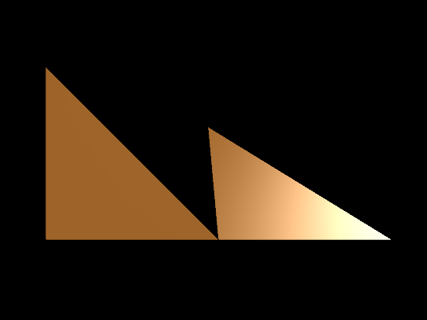
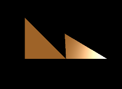

Previous: [Materials and Techniques](gltfTutorial_012_MaterialsTechniques.md) | [Table of Contents](README.md) | Next: [Simple Texture](gltfTutorial_014_SimpleTexture.md)

# An advanced material

This section will show how the concepts from the [Meshes](gltfTutorial_008_Meshes.md)  section and the elements that have been explained in the section about [Materials and Techniques](gltfTutorial_012_MaterialsTechniques.md)  can be brought together to define a non-trivial material. The material in this example will show multiple parameters and include a *light*, so that the effect of the vertex normals of the mesh become visible.

The following is the JSON part of a simple glTF asset that contains an advanced material:

```javascript
{
  "scenes" : {
    "scene0" : {
      "nodes" : [ "node0", "node1" ]
    }
  },
  "nodes" : {
    "node0" : {
      "meshes" : [ "mesh0" ]
    },
    "node1" : {
      "translation" : [ 1.0, 0.0, 0.0 ],
      "rotation" : [ -0.383, 0.0, 0.0, 0.924 ],
      "meshes" : [ "mesh0" ]
    }
  },

  "meshes" : {
    "mesh0" : {
      "primitives" : [ {
        "attributes" : {
          "POSITION" : "positionsAccessor",
          "NORMAL" : "normalsAccessor",
          "TEXCOORD_0" : "texCoordsAccessor"
        },
        "indices" : "indicesAccessor",
        "material" : "advancedMaterial"
      } ]
    }
  },

  "materials" : {
    "advancedMaterial" : {
      "technique" : "advancedTechnique"
    }
  },
  "techniques": {
    "advancedTechnique": {
      "program": "advancedProgram",
      "attributes": {
        "a_position": "positionParameter",
        "a_normal": "normalParameter"
      },
      "uniforms": {
        "u_modelViewMatrix": "modelViewMatrixParameter",
        "u_normalMatrix": "normalMatrixParameter",
        "u_projectionMatrix": "projectionMatrixParameter",
        "u_ambient": "ambientParameter",
        "u_diffuse": "diffuseParameter",
        "u_specular": "specularParameter",
        "u_shininess": "shininessParameter"
      },
      "parameters": {
        "positionParameter" : {
          "type": 35665,
          "semantic": "POSITION"
        },
        "normalParameter" : {
          "type": 35665,
          "semantic": "NORMAL"
        },
        "modelViewMatrixParameter": {
          "type": 35676,
          "semantic": "MODELVIEW"
        },
        "normalMatrixParameter": {
          "type": 35675,
          "semantic": "MODELVIEWINVERSETRANSPOSE"
        },
        "projectionMatrixParameter": {
          "type": 35676,
          "semantic": "PROJECTION"
        },
        "ambientParameter": {
          "type": 35666,
          "value": [ 0.1, 0.1, 0.1, 1.0 ]
        },
        "diffuseParameter": {
          "type": 35666,
          "value": [ 0.9, 0.5, 0.1, 1.0 ]
        },
        "specularParameter": {
          "type": 35666,
          "value": [ 1.0, 1.0, 1.0, 1.0 ]
        },
        "shininessParameter": {
          "type": 5126,
          "value": [ 40.0 ]
        }
      }
    },
    "states": {
      "enable": [
        2929,
        2884
      ]
    }
  },
  "programs": {
    "advancedProgram": {
      "vertexShader": "advancedVertexShader",
      "fragmentShader": "advancedFragmentShader",
      "attributes": [
        "a_position",
        "a_normal"
      ]
    }
  },
  "shaders": {
    "advancedVertexShader": {
      "type": 35633,
      "uri": "advanced.vert"
    },
    "advancedFragmentShader": {
      "type": 35632,
      "uri": "advanced.frag"
    }
  },

  "buffers" : {
    "buffer0" : {
      "uri" : "data:application/octet-stream;base64,AAABAAIAAAAAAAAAAAAAAAAAAACAPwAAAAAAAAAAAAAAAAAAgD8AAAAAAAAAAAAAAAAAAIA/AAAAAAAAAAAAAIA/AAAAAAAAAAAAAIA/AAAAAAAAAAAAAIA/AAAAAAAAAAAAAIA/",
      "byteLength" : 108
    }
  },
  "bufferViews" : {
    "indicesBufferView" : {
      "buffer" : "buffer0",
      "byteOffset" : 0,
      "byteLength" : 6,
      "target" : 34963
    },
    "attributesBufferView" : {
      "buffer" : "buffer0",
      "byteOffset" : 6,
      "byteLength" : 96,
      "target" : 34962
    }
  },
  "accessors" : {
    "indicesAccessor" : {
      "bufferView" : "indicesBufferView",
      "byteOffset" : 0,
      "componentType" : 5123,
      "count" : 3,
      "type" : "SCALAR",
      "max" : [ 2 ],
      "min" : [ 0 ]
    },
    "positionsAccessor" : {
      "bufferView" : "attributesBufferView",
      "byteOffset" : 0,
      "componentType" : 5126,
      "count" : 3,
      "type" : "VEC3",
      "max" : [ 1.0, 1.0, 0.0 ],
      "min" : [ 0.0, 0.0, 0.0 ]
    },
    "normalsAccessor" : {
      "bufferView" : "attributesBufferView",
      "byteOffset" : 36,
      "componentType" : 5126,
      "count" : 3,
      "type" : "VEC3",
      "max" : [ 0.0, 0.0, 1.0 ],
      "min" : [ 0.0, 0.0, 1.0 ]
    },
    "texCoordsAccessor" : {
      "bufferView" : "attributesBufferView",
      "byteOffset" : 72,
      "componentType" : 5126,
      "count" : 3,
      "type" : "VEC2",
      "max" : [ 1.0, 1.0 ],
      "min" : [ 0.0, 0.0 ]
    }
  },
  "asset" : {
    "version" : "1.1"
  }
}
```

As shown in the previous sections, the `material` is an instance of a `technique`, and the `technique` refers to a `program` which is the actual implementation of the rendering technique. The `program` consists of a vertex- and a fragment `shader`. These shaders are stored in external files, which are referred to by the `"advancedVertexShader"` and `"advancedFragmentShader"` objects via their `uri`. The source code of these shaders is shown here for completeness.

The vertex shader source code is stored in `advanced.vert`:

```glsl
#ifdef GL_ES
    precision highp float;
#endif

attribute vec3 a_position;
attribute vec3 a_normal;

uniform mat3 u_normalMatrix;
uniform mat4 u_modelViewMatrix;
uniform mat4 u_projectionMatrix;

varying vec3 v_position;
varying vec3 v_normal;

varying vec3 v_light0Direction;

void main(void) 
{
    vec4 pos = u_modelViewMatrix * vec4(a_position, 1.0);
    v_normal = u_normalMatrix * a_normal;
    v_position = pos.xyz;
    v_light0Direction = mat3(u_modelViewMatrix) * vec3(1.0, 1.0, 1.0);
    gl_Position = u_projectionMatrix * pos;
}
```


The fragment shader source code is stored in `advanced.frag`:

```glsl
#ifdef GL_ES
    precision highp float;
#endif

varying vec3 v_position;
varying vec3 v_normal;

uniform vec4 u_ambient;
uniform vec4 u_diffuse;
uniform vec4 u_specular;
uniform float u_shininess;

varying vec3 v_light0Direction;

void main(void) 
{
    vec3 normal = normalize(v_normal);
    vec4 color = vec4(0.0, 0.0, 0.0, 0.0);
    vec3 diffuseLight = vec3(0.0, 0.0, 0.0);
    vec3 lightColor = vec3(1.0, 1.0, 1.0);
    vec4 ambient = u_ambient;
    vec4 diffuse = u_diffuse;
    vec4 specular = u_specular;

    vec3 specularLight = vec3(0.0, 0.0, 0.0);
    {
        float specularIntensity = 0.0;
        float attenuation = 1.0;
        vec3 l = normalize(v_light0Direction);
        vec3 viewDir = -normalize(v_position);
        vec3 h = normalize(l+viewDir);
        specularIntensity = max(0.0, pow(max(dot(normal,h), 0.0) , u_shininess)) * attenuation;
        specularLight += lightColor * specularIntensity;
        diffuseLight += lightColor * max(dot(normal,l), 0.0) * attenuation;
    }
    specular.rgb *= specularLight;
    diffuse.rgb *= diffuseLight;
    color.rgb += ambient.xyz;
    color.rgb += diffuse.xyz;
    color.rgb += specular.xyz;
    color.a = diffuse.a;
    gl_FragColor = color;
}
}
```

When rendering this glTF asset, the result will look like the following image:

<p align="center">
<br>
<a name="advancedMaterial-png"></a>Image 13a: An example for an advanced material, including specular highlights
</p>

The right triangle is slightly rotated, to emphasize the effect of the light computation: One can see the specular highlight on this triangle, which is caused by the light being reflected on the triangle surface to point directly at the eye position. This reflection is computed based on the normal of the triangle:

<p align="center">
<br>
<a name="advancedMaterialExample-gif"></a>Image 13b: The effect of light, normals and additional properties in the advanced material
</p>

The details of the light computations is beyond the scope of this tutorial. This section will only show how the advanced material is encoded as a part of the glTF asset.

## The new `uniform` parameters for the material properties

The fragment shader contains several uniforms that are used for the computation of the material effect under the influence of light:

```glsl
uniform vec4 u_ambient;
uniform vec4 u_diffuse;
uniform vec4 u_specular;
uniform float u_shininess;
```

These parameters are the basis for a simple implementation of the [`Phong reflection model`](https://en.wikipedia.org/wiki/Phong_reflection_model). In the JSON part of the glTF, these uniforms are listed in the `uniforms` dictionary of the `technique`, and further defined in the `technique.parameters` (similar to the `u_emission` uniform of the [simple material](gltfTutorial_010_SimpleMaterial.md)) :

```javascript
"techniques": {
  "advancedTechnique": {
    ...
    "uniforms": {
      ...
      "u_ambient": "ambientParameter",
      "u_diffuse": "diffuseParameter",
      "u_specular": "specularParameter",
      "u_shininess": "shininessParameter"
    },
    "parameters": {
      ...
      "ambientParameter": {
        "type": 35666,
        "value": [ 0.1, 0.1, 0.1, 1.0 ]
      },
      "diffuseParameter": {
        "type": 35666,
        "value": [ 0.9, 0.5, 0.1, 1.0 ]
      },
      "specularParameter": {
        "type": 35666,
        "value": [ 1.0, 1.0, 1.0, 1.0 ]
      },
      "shininessParameter": {
        "type": 5126,
        "value": [ 40.0 ]
      }
    }
  },
},
```

The `shininess` parameter is a single floating point value, and the remaining parameters are 4D floating point vectors containing the red, green, blue and alpha components of the colors. They all have default values that are directly passed to the renderer, as show in the [Materials and Techniques](gltfTutorial_012_MaterialsTechniques.md#technique-parameter-values in techniques-or-materials) section.


## The `normals` attribute

The vertex shader now contains two attributes. In addition to the position attribute, there is also an attribute for the vertex normals:

```glsl
attribute vec3 a_position;
attribute vec3 a_normal;
```

The following shows the parts of the glTF JSON that are related to this new attribute:

```javascript
"meshes" : {
  "mesh0" : {
    "primitives" : [ {
      "attributes" : {
        "POSITION" : "positionsAccessor",
        "NORMAL" : "normalsAccessor",
        ...
      },
      ...
    } ]
  }
},
...
"techniques": {
  "advancedTechnique": {
    ...
    "attributes": {
      "a_position": "positionParameter",
      "a_normal": "normalParameter"
    },
    ...
    "parameters": {
      "positionParameter" : {
        "type": 35665,
        "semantic": "POSITION"
      },
      "normalParameter" : {
        "type": 35665,
        "semantic": "NORMAL"
      },
      ...
    }
  },
},
"programs": {
  "advancedProgram": {
    ...
    "attributes": [
      "a_position",
      "a_normal"
    ]
  }
},
"accessors" : {
  ...
  "positionsAccessor" : {
    ...
  },
  "normalsAccessor" : {
    ...
  },
  ...
},
```

Summarizing from the previous sections:

- The `mesh` contains [Mesh primitive attributes](gltfTutorial_008_Meshes.md#mesh-primitive-attributes). One of them is the new `NORMAL` attribute. It refers to the [accessor](gltfTutorial_005_BuffersBufferViewsAccessors.md#accessors) that provides the data of the vertex normals.
- The `program` contains a list of all `attribute` variables that are contained in its vertex shader, including the `a_normal` attribute
- The `technique` contains the `attributes` dictionary whose entry for the `a_normal` attribute points to the `technique.parameters` dictionary, which defines the properties of this attribute, as shown in the section about [technique parameter values](gltfTutorial_012_MaterialsTechniques.md#technique-parameter-values)


## The new `uniform` parameters for the matrices

The vertex shader contains several `uniform` variables. One of them is the `u_normalMatrix`, which is the matrix that is used for transforming the normals when the object is transformed with the model-view matrix:

```glsl
uniform mat3 u_normalMatrix;
...
```

Like the other uniforms, this uniform is listed in the `uniforms` dictionary of the `technique`, and further defined in the `technique.parameters`:

```javascript
"techniques": {
  "advancedTechnique": {
    ...
    "uniforms": {
      ...
      "u_normalMatrix": "normalMatrixParameter",
      ...
    },
    "parameters": {
      ...
      "normalMatrixParameter": {
        "type": 35675,
        "semantic": "MODELVIEWINVERSETRANSPOSE"
      },
    }
  }
},
```

In contrast to the other uniforms that have been added to the advanced material, this uniform has a `semantic` property, with the value `"MODELVIEWINVERSETRANSPOSE"`. Also note that its `type ` is `35675`, which stands for `GL_FLOAT_MAT3`, and thus indicates a 3x3 matrix (and not a 4x4 matrix). Particularly, this matrix consists of the upper left 3x3 entries of the transposed of the inverse of the model-view-matrix.

The model-view matrix is the product of the [global transform](gltfTutorial_004_ScenesNodes.md#global-transforms-of-nodes)  of the `node` that contains to the `mesh` that is rendered with this material, and the view matrix of the camera that is used for rendering. When this model-view-matrix has been computed, then the normal matrix is just given as

    mat3 normalMatrix = mat3(transpose(inverse(modelViewMatrix)))


Previous: [Materials and Techniques](gltfTutorial_012_MaterialsTechniques.md) | [Table of Contents](README.md) | Next: [Simple Texture](gltfTutorial_014_SimpleTexture.md)
