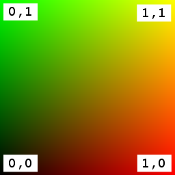
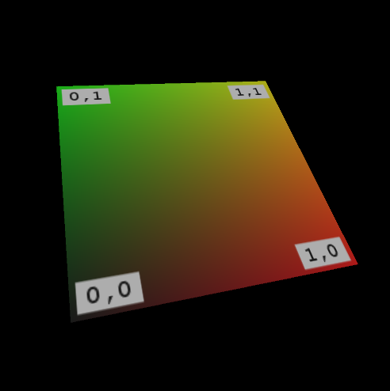

Previous: [Textures, Images, and Samplers](gltfTutorial_016_TexturesImagesSamplers.md) | [Table of Contents](README.md) | Next: [Advanced Material](gltfTutorial_014_AdvancedMaterial.md)

# A Simple Texture

As shown in the previous sections, the material definition in a glTF asset contains different parameters for the color of the material or the overall appearance of the material under the influence of light. These properties may be given via single values, for example, defining the color or the roughness of the object as a whole. Alternatively, these values may be provided via textures that are mapped on the object surface. The following is a glTF asset that defines a material with a simple, single texture:

```javascript
{
  "scenes" : [ {
    "nodes" : [ 0 ]
  } ],
  "nodes" : [ {
    "mesh" : 0
  } ],
  "meshes" : [ {
    "primitives" : [ {
      "attributes" : {
        "POSITION" : 1,
        "TEXCOORD_0" : 2
      },
      "indices" : 0,
      "material" : 0
    } ]
  } ],

  "materials" : [ {
    "pbrMetallicRoughness" : {
      "baseColorTexture" : {
        "index" : 0
      },
      "metallicFactor" : 0.0,
      "roughnessFactor" : 1.0
    }
  } ],

  "textures" : [ {
    "sampler" : 0,
    "source" : 0
  } ]
  "images" : [ {
    "uri" : "testTexture.png"
  } ],
  "samplers" : [ {
    "magFilter" : 9729,
    "minFilter" : 9987,
    "wrapS" : 33648,
    "wrapT" : 33648
  } ],

  "buffers" : [ {
    "uri" : "data:application/gltf-buffer;base64,AAABAAIAAQADAAIAAAAAAAAAAAAAAAAAAACAPwAAAAAAAAAAAAAAAAAAgD8AAAAAAACAPwAAgD8AAAAAAAAAAAAAgD8AAAAAAACAPwAAgD8AAAAAAAAAAAAAAAAAAAAAAACAPwAAAAAAAAAA",
    "byteLength" : 108
  } ],
  "bufferViews" : [ {
    "buffer" : 0,
    "byteOffset" : 0,
    "byteLength" : 12,
    "target" : 34963
  }, {
    "buffer" : 0,
    "byteOffset" : 12,
    "byteLength" : 96,
    "byteStride" : 12,
    "target" : 34962
  } ],
  "accessors" : [ {
    "bufferView" : 0,
    "byteOffset" : 0,
    "componentType" : 5123,
    "count" : 6,
    "type" : "SCALAR",
    "max" : [ 3 ],
    "min" : [ 0 ]
  }, {
    "bufferView" : 1,
    "byteOffset" : 0,
    "componentType" : 5126,
    "count" : 4,
    "type" : "VEC3",
    "max" : [ 1.0, 1.0, 0.0 ],
    "min" : [ 0.0, 0.0, 0.0 ]
  }, {
    "bufferView" : 1,
    "byteOffset" : 48,
    "componentType" : 5126,
    "count" : 4,
    "type" : "VEC2",
    "max" : [ 1.0, 1.0 ],
    "min" : [ 0.0, 0.0 ]
  } ],

  "asset" : {
    "version" : "2.0"
  },
}
```

The actual image that the texture consists of is stored as a PNG file called `"testTexture.png"` (see Image 15a).

<p align="center">
<br>
<a name="testTexture-png"></a>Image 15a: The image for the simple texture example.
</p>

Bringing this all together in a renderer will result in the scene rendered in Image 15b.

<p align="center">
<br>
<a name="simpleTexture-png"></a>Image 15b: A simple texture on a unit square.
</p>


## The Textured Material Definition

The material definition in this example differs from the [Simple Material](gltfTutorial_011_SimpleMaterial.md) that was shown earlier. While the simple material only defined a single color for the whole object, the material definition now refers to the newly added texture:

```javascript
"materials" : [ {
  "pbrMetallicRoughness" : {
    "baseColorTexture" : {
      "index" : 0
    },
    "metallicFactor" : 0.0,
    "roughnessFactor" : 1.0
  }
} ],
```

The `baseColorTexture` is the index of the texture that will be applied to the object surface. The `metallicFactor` and `roughnessFactor` are still single values. A more complex material where these properties are also given via textures will be shown in a later section.

In order to apply a texture to a mesh primitive, there must be information about the texture coordinates that should be used for each vertex. The texture coordinates are only another attribute for the vertices defined in the `mesh.primitive`. By default, a texture will use the texture coordinates that have the attribute name `TEXCOORD_0`. If there are multiple sets of texture coordinates, the one that should be used for one particular texture may be selected by adding a `texCoord` property to the texture reference:

```javascript
"baseColorTexture" : {
  "index" : 0,
  "texCoord": 2  
},
```
In this case, the texture would use the texture coordinates that are contained in the attribute called `TEXCOORD_2`.


Previous: [Textures, Images, and Samplers](gltfTutorial_016_TexturesImagesSamplers.md) | [Table of Contents](README.md) | Next: [Advanced Material](gltfTutorial_014_AdvancedMaterial.md)
