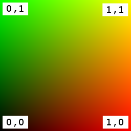

Previous: [Advanced Material](gltfTutorial_014_AdvancedMaterial.md) | [Table of Contents](README.md) | Next: [Textures, Images, and Samplers](gltfTutorial_016_TexturesImagesSamplers.md)

# A Simple Texture

The materials shown in the previous sections contained different parameters for defining the color of the materials or the overall appearance of the material under the influence of light. One important aspect for a more realistic appearance has been missing so far: textures.

The following is a glTF asset that defines a material with a simple, single texture:

```javascript
{
  "scenes" : {
    "scene0" : {
      "nodes" : [ "node0" ]
    }
  },
  "nodes" : {
    "node0" : {
      "meshes" : [ "mesh0" ]
    }
  },
  
  "meshes" : {
    "mesh0" : {
      "primitives" : [ {
        "attributes" : {
          "POSITION" : "positionsAccessor",
          "NORMAL" : "normalsAccessor",
          "TEXCOORD_0" : "texCoordsAccessor"
        },
        "indices" : "indicesAccessor",
        "material" : "textureMaterial"
      } ]
    }
  },

  "materials" : {
    "textureMaterial" : {
      "technique" : "textureTechnique"
    }
  },
  "techniques": {
    "textureTechnique": {
      "program": "textureProgram",
      "attributes": {
        "a_position": "positionParameter",
        "a_normal": "normalParameter",
        "a_texcoord0": "texcoord0Parameter"
      },
      "uniforms": {
        "u_modelViewMatrix": "modelViewMatrixParameter",
        "u_normalMatrix": "normalMatrixParameter",
        "u_projectionMatrix": "projectionMatrixParameter",
        "u_ambient": "ambientParameter",
        "u_diffuse": "diffuseParameter",
        "u_specular": "specularParameter",
        "u_shininess": "shininessParameter"
      },
      "parameters": {
        "positionParameter" : {
          "type": 35665,
          "semantic": "POSITION"
        },
        "normalParameter" : {
          "type": 35665,
          "semantic": "NORMAL"
        },
        "texcoord0Parameter" : {
          "type": 35664,
          "semantic": "TEXCOORD_0"
        },
        "modelViewMatrixParameter": {
          "type": 35676,
          "semantic": "MODELVIEW"
        },
        "normalMatrixParameter": {
          "type": 35675,
          "semantic": "MODELVIEWINVERSETRANSPOSE"
        },
        "projectionMatrixParameter": {
          "type": 35676,
          "semantic": "PROJECTION"
        },
        "ambientParameter": {
          "type": 35666,
          "value": [ 0.1, 0.1, 0.1, 1.0 ]
        },
        "diffuseParameter": {
          "type": 35678,
          "value": [ "exampleTexture" ]
        },
        "specularParameter": {
          "type": 35666,
          "value": [ 1.0, 1.0, 1.0, 1.0 ]
        },
        "shininessParameter": {
          "type": 5126,
          "value": [ 40.0 ]
        }
      },
      "states": {
        "enable": [
          2929
        ]
      }
    }
  },
  "programs": {
    "textureProgram": {
      "vertexShader": "textureVertexShader",
      "fragmentShader": "textureFragmentShader",
      "attributes": [
        "a_position",
        "a_normal",
        "a_texcoord0"
      ]
    }
  },
  "shaders": {
    "textureVertexShader": {
      "type": 35633,
      "uri": "texture.vert"
    },
    "textureFragmentShader": {
      "type": 35632,
      "uri": "texture.frag"
    }
  },
  
  
  "textures": {
    "exampleTexture": {
      "target": 3553,
      "internalFormat": 6408,
      "format": 6408,
      "type": 5121,
      "source": "exampleImage",
      "sampler": "exampleSampler"
    }
  },
  "images": {
    "exampleImage": {
      "uri": "testTexture.png"
    }
  },
  "samplers": {
    "exampleSampler": {
       "magFilter": 9729,
       "minFilter": 9987,
       "wrapS": 33648,
       "wrapT": 33648
     }
  },
  

  "buffers" : {
    "geometryBuffer" : {
      "uri" : "data:application/octet-stream;base64,AAABAAIAAQADAAIAAAAAAAAAAAAAAAAAAACAPwAAAAAAAAAAAAAAAAAAgD8AAAAAAACAPwAAgD8AAAAAAAAAAAAAAAAAAIA/AAAAAAAAAAAAAIA/AAAAAAAAAAAAAIA/AAAAAAAAAAAAAIA/AAAAAAAAAAAAAIA/AAAAAAAAAAAAAIA/AACAPwAAgD8=",
      "byteLength" : 140
    }
  },
  "bufferViews" : {
    "indicesBufferView" : {
      "buffer" : "geometryBuffer",
      "byteOffset" : 0,
      "byteLength" : 12,
      "target" : 34963
    },
    "attributesBufferView" : {
      "buffer" : "geometryBuffer",
      "byteOffset" : 12,
      "byteLength" : 128,
      "target" : 34962
    }
  },
  "accessors" : {
    "indicesAccessor" : {
      "bufferView" : "indicesBufferView",
      "byteOffset" : 0,
      "componentType" : 5123,
      "count" : 6,
      "type" : "SCALAR",
      "max" : [ 3 ],
      "min" : [ 0 ]
    },
    "positionsAccessor" : {
      "bufferView" : "attributesBufferView",
      "byteOffset" : 0,
      "componentType" : 5126,
      "count" : 4,
      "type" : "VEC3",
      "max" : [ 1.0, 1.0, 0.0 ],
      "min" : [ 0.0, 0.0, 0.0 ]
    },
    "normalsAccessor" : {
      "bufferView" : "attributesBufferView",
      "byteOffset" : 48,
      "componentType" : 5126,
      "count" : 4,
      "type" : "VEC3",
      "max" : [ 0.0, 0.0, 1.0 ],
      "min" : [ 0.0, 0.0, 1.0 ]
    },
    "texCoordsAccessor" : {
      "bufferView" : "attributesBufferView",
      "byteOffset" : 96,
      "componentType" : 5126,
      "count" : 4,
      "type" : "VEC2",
      "max" : [ 1.0, 1.0 ],
      "min" : [ 0.0, 0.0 ]
    }
  },
  
  "asset" : {
    "version" : "1.1"
  }
}
```

The vertex shader source code is stored in `texture.vert`:

```glsl
#ifdef GL_ES
    precision highp float;
#endif

attribute vec3 a_position;
attribute vec3 a_normal;
attribute vec2 a_texcoord0;

uniform mat3 u_normalMatrix;
uniform mat4 u_modelViewMatrix;
uniform mat4 u_projectionMatrix;

varying vec3 v_position;
varying vec3 v_normal;
varying vec2 v_texcoord0;

varying vec3 v_light0Direction;

void main(void)
{
    vec4 pos = u_modelViewMatrix * vec4(a_position, 1.0);
    v_normal = u_normalMatrix * a_normal;
    v_position = pos.xyz;
    v_light0Direction = mat3(u_modelViewMatrix) * vec3(1.0, 1.0, 1.0);
    v_texcoord0 = a_texcoord0;
    gl_Position = u_projectionMatrix * pos;
}
```


The fragment shader source code is stored in `texture.frag`:

```glsl
#ifdef GL_ES
    precision highp float;
#endif

varying vec3 v_position;
varying vec3 v_normal;
varying vec2 v_texcoord0;

uniform vec4 u_ambient;
uniform sampler2D u_diffuse;
uniform vec4 u_specular;
uniform float u_shininess;

varying vec3 v_light0Direction;

void main(void)
{
    vec3 normal = normalize(v_normal);
    vec4 color = vec4(0.0, 0.0, 0.0, 0.0);
    vec3 diffuseLight = vec3(0.0, 0.0, 0.0);
    vec3 lightColor = vec3(1.0, 1.0, 1.0);
    vec4 ambient = u_ambient;
    vec4 diffuse = texture2D(u_diffuse, v_texcoord0);
    vec4 specular = u_specular;

    vec3 specularLight = vec3(0.0, 0.0, 0.0);
    {
        float specularIntensity = 0.0;
        float attenuation = 1.0;
        vec3 l = normalize(v_light0Direction);
        vec3 viewDir = -normalize(v_position);
        vec3 h = normalize(l+viewDir);
        specularIntensity = max(0.0, pow(max(dot(normal,h), 0.0) , u_shininess)) * attenuation;
        specularLight += lightColor * specularIntensity;
        diffuseLight += lightColor * max(dot(normal,l), 0.0) * attenuation;
    }
    specular.rgb *= specularLight;
    diffuse.rgb *= diffuseLight;
    color.rgb += ambient.rgb;
    color.rgb += diffuse.rgb;
    color.rgb += specular.rgb;
    color.a = diffuse.a;
    gl_FragColor = color;
}
```

The actual image that the texture consists of is stored as a PNG file called `"testTexture.png"` (see Image 15a).

<p align="center">
<br>
<a name="testTexture-png"></a>Image 15a: The image for the simple texture example.
</p>

Bringing this all together in a renderer will result in the scene rendered in Image 15b.

<p align="center">
<br>
<a name="simpleTexture-png"></a>Image 15b: A simple texture on a unit square.
</p>

## Texture, image, and sampler objects

There are three new top-level dictionaries in the glTF JSON: the `textures`, `images`, and `samplers` dictionaries. The details of these new object types will be explained in the [Textures, Images, and Samplers](gltfTutorial_016_TexturesImagesSamplers.md) section. This section will focus on the elements of the `technique` and the shaders used to apply the texture to the rendered objects and will point out the differences from the [Advanced Material](gltfTutorial_014_AdvancedMaterial.md) shown in the previous section.

## The texture coordinates

In order to apply a texture to a mesh primitive, there must be information about the texture coordinates that should be used for each vertex. The texture coordinates are only another attribute for the vertices defined in the `technique` and later used in the shader programs. The following is an excerpt from the example, pointing out where information about this new attribute has been added:


```javascript
{
  ...
  "meshes" : {
    "mesh0" : {
      "primitives" : [ {
        "attributes" : {
          ...
          "TEXCOORD_0" : "texCoordsAccessor"
        },
        ...
      } ]
    }
  },
  ...
  "techniques": {
    "textureTechnique": {
      "program": "textureProgram",
      "attributes": {
        ...
        "a_texcoord0": "texcoord0Parameter"
      },
      ...
      "parameters": {
        ...
        "texcoord0Parameter" : {
          "type": 35664,
          "semantic": "TEXCOORD_0"
        },
        ...
      },
      ...
    }
  },
  "programs": {
    "textureProgram": {
      ...
      "attributes": [
        ...
        "a_texcoord0"
      ]
    }
  },
  ...
  "accessors" : {
    ...
    "texCoordsAccessor" : {
      "bufferView" : "attributesBufferView",
      "byteOffset" : 96,
      "componentType" : 5126,
      "count" : 4,
      "type" : "VEC2",
      "max" : [ 1.0, 1.0 ],
      "min" : [ 0.0, 0.0 ]
    }
  },
  ..
}
```

Summarizing from the previous sections:

- The `mesh.primitive` contains an additional attribute, as shown in the [Meshes](gltfTutorial_008_Meshes.md#mesh-primitive-attributes) section. The attribute is called `"TEXCOORD_0"`, and refers to the `accessor` with the ID `"texCoordsAccessor"` that provides the texture coordinates.
- The `"texCoordsAccessor"` provides access to the texture coordinate data. The properties of this accessor are explained in the [Buffers, BufferViews, and Accessors](gltfTutorial_005_BuffersBufferViewsAccessors.md#accessors) section. Here they indicate that the texture coordinates are 2D vectors consisting of floating point values.
- The `technique` defines a new attribute called `a_texcoord0`, and the `technique.parameters` contains information about the type and semantic of this attribute. This concept has been explained in the [Materials and Techniques](gltfTutorial_013_MaterialsTechniques.md) section. Here, the new attribute has the type `GL_FLOAT_VEC2` and defines the semantic to be `"TEXCOORD_0"`. So the data of this attribute will be obtained from the `"TEXCOORD_0"` attribute of the rendered `mesh.primitive`.
- Finally, the `program` lists this new `"a_texcoord0"` attribute, which is a new attribute in its vertex shader.


## The texture uniform

The actual texture data has to be passed to the shader as well. This is accomplished by defining a new `uniform` variable in the shader, with the type `sampler2D`. The value for this uniform is provided by the `technique`. The relevant parts of the JSON are pointed out here:

```javascript
{
  ...
  "techniques": {
    "textureTechnique": {
      ..
      "uniforms": {
        ..
        "u_diffuse": "diffuseParameter",
        ...
      },
      "parameters": {
        ...
        "diffuseParameter": {
          "type": 35678,
          "value": "exampleTexture"
        },
        ...
      },
      ...
    }
  },
  ...
  "textures": {
    "exampleTexture": {
      ...
    }
  },
  ...
}
```

The `technique` defines a new uniform variable, which is called `u_diffuse`. As shown in the [Materials and Techniques](gltfTutorial_013_MaterialsTechniques.md) section, the type and value of this uniform is defined in the `technique.parameters`. Here, the type is `GL_SAMPLER2D`, and the value of the uniform is the ID of the respective texture&mdash;in this case, the `"exampleTexture"` that was added in the `textures` dictionary.


## Using the texture in the shader

The vertex shader has a new attribute for the texture coordinates, called `"a_texcoord0"`. It is passed as a varying variable called `"v_texcoord0"` directly to the fragment shader:


```glsl
...
attribute vec2 a_texcoord0;

...
varying vec2 v_texcoord0;

void main(void)
{
    ...
    v_texcoord0 = a_texcoord0;
}
```


In the fragment shader, the texture coordinates arrive in the `"v_texcoord0"` variable. Additionally, the fragment shader contains the uniform variable `"u_diffuse"`, which defines the sampler for the actual texture data. The texture data is looked up at the given coordinates, using the `texture2D` function, to obtain the diffuse base color for the fragment:

```glsl
...
varying vec2 v_texcoord0;

...
uniform sampler2D u_diffuse;
...

void main(void)
{
    ...
    vec4 diffuse = texture2D(u_diffuse, v_texcoord0);
    ...
}
```


Previous: [Advanced Material](gltfTutorial_014_AdvancedMaterial.md) | [Table of Contents](README.md) | Next: [Textures, Images, and Samplers](gltfTutorial_016_TexturesImagesSamplers.md)
