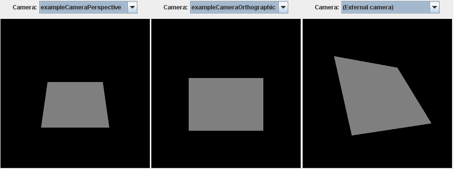

Previous: [Textures, Images, and Samplers](gltfTutorial_016_TexturesImagesSamplers.md) | [Table of Contents](README.md) | Next: [Cameras](gltfTutorial_018_Cameras.md)

# Simple Cameras

The previous sections showed how a basic scene structure with geometric objects is represented in a glTF asset, and how different materials can be applied to these objects. This did not yet include information about the view configuration that should be used for rendering the scene. This view configuration is usually described as a virtual *camera* that is contained in the scene, at a certain position, and pointing in a certain direction.

The following is a simple, complete glTF asset. It is similar to the assets that have already been shown: it defines a simple `scene` containing `node` objects and a single geometric object that is given as a `mesh`, attached to one of the nodes. But this asset additionally contains two [`camera`](https://github.com/KhronosGroup/glTF/tree/master/specification/2.0/#reference-camera) objects:


```javascript
{
  "scenes" : [
    {
      "nodes" : [ 0, 1, 2 ]
    }
  ],
  "nodes" : [
    {
      "rotation" : [ -0.383, 0.0, 0.0, 0.924 ],
      "mesh" : 0
    },
    {
      "translation" : [ 0.5, 0.5, 3.0 ],
      "camera" : 0
    },
    {
      "translation" : [ 0.5, 0.5, 3.0 ],
      "camera" : 1
    }
  ],

  "cameras" : [
    {
      "type": "perspective",
      "perspective": {
        "aspectRatio": 1.0,
        "yfov": 0.7,
        "zfar": 100,
        "znear": 0.01
      }
    },
    {
      "type": "orthographic",
      "orthographic": {
        "xmag": 1.0,
        "ymag": 1.0,
        "zfar": 100,
        "znear": 0.01
      }
    }
  ],

  "meshes" : [
    {
      "primitives" : [ {
        "attributes" : {
          "POSITION" : 1
        },
        "indices" : 0
      } ]
    }
  ],

  "buffers" : [
    {
      "uri" : "data:application/octet-stream;base64,AAABAAIAAQADAAIAAAAAAAAAAAAAAAAAAACAPwAAAAAAAAAAAAAAAAAAgD8AAAAAAACAPwAAgD8AAAAA",
      "byteLength" : 60
    }
  ],
  "bufferViews" : [
    {
      "buffer" : 0,
      "byteOffset" : 0,
      "byteLength" : 12,
      "target" : 34963
    },
    {
      "buffer" : 0,
      "byteOffset" : 12,
      "byteLength" : 48,
      "target" : 34962
    }
  ],
  "accessors" : [
    {
      "bufferView" : 0,
      "byteOffset" : 0,
      "componentType" : 5123,
      "count" : 6,
      "type" : "SCALAR",
      "max" : [ 3 ],
      "min" : [ 0 ]
    },
    {
      "bufferView" : 1,
      "byteOffset" : 0,
      "componentType" : 5126,
      "count" : 4,
      "type" : "VEC3",
      "max" : [ 1.0, 1.0, 0.0 ],
      "min" : [ 0.0, 0.0, 0.0 ]
    }
  ],

  "asset" : {
    "version" : "2.0"
  }
}
```

The geometry in this asset is a simple unit square. It is rotated by -45 degrees around the x-axis, to emphasize the effect of the different cameras. Image 17a shows three options for rendering this asset. The first examples use the cameras from the asset. The last example shows how the scene looks from an external, user-defined viewpoint.

<p align="center">
<br>
<a name="cameras-png"></a>Image 17a: The effect of rendering the scene with different cameras.
</p>


## Camera definitions

The new top-level element of this glTF asset is the `cameras` array, which contains the  [`camera`](https://github.com/KhronosGroup/glTF/tree/master/specification/2.0/#reference-camera) objects:

```javascript
"cameras" : [
  {
    "type": "perspective",
    "perspective": {
      "aspectRatio": 1.0,
      "yfov": 0.7,
      "zfar": 100,
      "znear": 0.01
    }
  },
  {
    "type": "orthographic",
    "orthographic": {
      "xmag": 1.0,
      "ymag": 1.0,
      "zfar": 100,
      "znear": 0.01
    }
  }
],
```

When a camera object has been defined, it may be attached to a `node`. This is accomplished by assigning the index of the camera to the `camera` property of a node. In the given example, two new nodes have been added to the scene graph, one for each camera:

```javascript
"nodes" : {
  ...
  {
    "translation" : [ 0.5, 0.5, 3.0 ],
    "camera" : 0
  },
  {
    "translation" : [ 0.5, 0.5, 3.0 ],
    "camera" : 1
  }
},
```

The differences between perspective and orthographic cameras and their properties, the effect of attaching the cameras to the nodes, and the management of multiple cameras will be explained in detail in the [Cameras](gltfTutorial_018_Cameras.md) section.


Previous: [Textures, Images, and Samplers](gltfTutorial_016_TexturesImagesSamplers.md) | [Table of Contents](README.md) | Next: [Cameras](gltfTutorial_018_Cameras.md)
