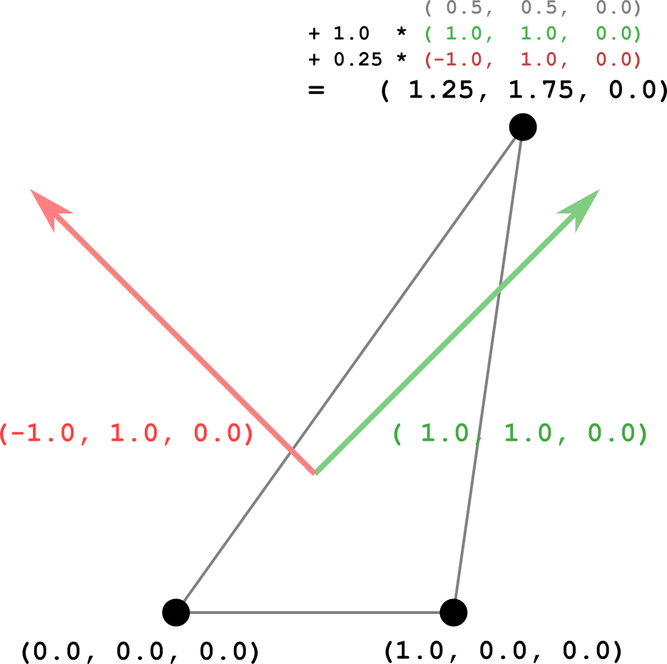

Previous: [Simple Morph Target](gltfTutorial_017_SimpleMorphTarget.md) | [Table of Contents](README.md) | Next: [SimpleSkin](gltfTutorial_019_SimpleSkin.md)

# Morph Targets

The example in the previous section contains a mesh that consists of a single triangle with two morph targets:

```javascript
{
  "meshes":[
    {
      "primitives":[
        {
          "attributes":{
            "POSITION":1
          },
          "targets":[
            {
              "POSITION":2
            },
            {
              "POSITION":3
            }
          ],
          "indices":0
        }
      ],
      "weights":[
        1.0,
        0.5
      ]
    }
  ],
```


The actual base geometry of the mesh, namely the triangle geometry, is defined by the `mesh.primitive` attribute called `"POSITIONS"`. The morph targets of the `mesh.primitive` are dictionaries that map the attribute name `"POSITIONS"` to `accessor` objects that contain the *displacements* for each vertex. Image 18a shows the initial triangle geometry in black, and the displacement for the first morph target in red, and the displacement for the second morph target in green.

<p align="center">
<br>
<a name="simpleMorphInitial-png"></a>Image 18a: The initial triangle and morph target displacements.
</p>

The `weights` of the mesh determine how these morph target displacements are added to the initial geometry in order to obtain the current state of the geometry. The pseudocode for computing the rendered vertex positions for a mesh `primitive` is as follows:
```
renderedPrimitive.POSITION = primitive.POSITION + 
  weights[0] * primitive.targets[0].POSITION +
  weights[1] * primitive.targets[1].POSITION;
```

This means that the current state of the mesh primitive is computed by taking the initial mesh primitive geometry and adding a linear combination of the morph target displacements, where the `weights` are the factors for the linear combination.

The asset additionally contains an `animation` that affects the weights for the morph targets. The following table shows the key frames of the animated weights:

| Time | Weights   |
|:----:|:---------:|
|  0.0 | 0.0, 0.0  |
|  1.0 | 0.0, 1.0  |
|  2.0 | 1.0, 1.0  |
|  3.0 | 1.0, 0.0  |
|  4.0 | 0.0, 0.0  |


Throughout the animation, the weights are interpolated linearly, and applied to the morph target displacements. At each point, the rendered state of the mesh primitive is updated accordingly. The following is an example of the state that is computed at 1.25 seconds. The weights that are provided by the animation sampler for this animation time are (0.25, 1.0), and they are used for computing the linear combination of the morph target displacements.

<p align="center">
<br>
<a name="simpleMorphIntermediate-png"></a>Image 18b: An intermediate state of the morph target animation.
</p>


Previous: [Simple Morph Target](gltfTutorial_017_SimpleMorphTarget.md) | [Table of Contents](README.md) | Next: [SimpleSkin](gltfTutorial_019_SimpleSkin.md)


