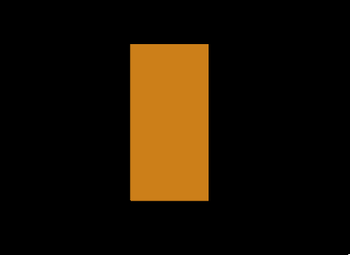

Previous: [Cameras](gltfTutorial_018_Cameras.md) | [Table of Contents](README.md) | Next: [Skins](gltfTutorial_020_Skins.md)

# A Simple Skin

glTF supports *vertex skinning*, which allows the geometry (vertices) of a mesh to be deformed based on the pose of a skeleton. This is essential in order to give animated geometry, for example of virtual characters, a realistic appearance. The core for the definition of vertex skinning in a glTF asset is the [`skin`](https://github.com/KhronosGroup/glTF/tree/master/specification/2.0/#reference-skin), but vertex skinning in general implies several interdependencies between the elements of a glTF asset that have been presented so far.

The following is a glTF asset that shows basic vertex skinning for a simple geometry. The elements of this asset will be summarized quickly in this section, referring to the previous sections where appropriate, and pointing out the new elements that have been added for the vertex skinning functionality. The details and background information for vertex skinning will be given in the next section.

```javascript
{
  "scenes" : {
    "scene0" : {
      "nodes" : [ "node0" ]
    }
  },
  "nodes" : {
    "node0" : {
      "meshes" : [ "mesh0" ],
      "skeletons": [ "jointNode0" ],
      "skin": "simpleSkin"
    },
    "jointNode0" : {
      "jointName" : "joint0",
      "children" : [ "jointNode1" ],
      "translation" : [ 0.0, 1.0, 0.0 ]
    },
    "jointNode1" : {
      "jointName" : "joint1",
      "rotation" : [ 0.0, 0.0, 0.0, 1.0 ]
    }
  },

  "skins": {
    "simpleSkin": {
      "bindShapeMatrix": [
         1.0, 0.0, 0.0, 0.0,
         0.0, 1.0, 0.0, 0.0,
         0.0, 0.0, 1.0, 0.0,
        -0.5, 0.0, 0.0, 1.0
      ],
      "jointNames": [
        "joint0",
        "joint1"
      ],
      "inverseBindMatrices": "inverseBindMatricesAccessor"
    }
  },

  "animations": {
    "animation0": {
      "samplers" : {
        "rotationSampler" : {
          "input" : "TIMEAccessor",
          "interpolation" : "LINEAR",
          "output" : "rotationAccessor"
        }
      },
      "channels" : [ {
        "sampler" : "rotationSampler",
        "target" : {
          "id" : "jointNode1",
          "path" : "rotation"
        }
      } ]
    }
  },

  "meshes" : {
    "mesh0" : {
      "primitives" : [ {
        "attributes" : {
          "POSITION" : "positionsAccessor",
          "JOINT" : "jointsAccessor",
          "WEIGHT" : "weightsAccessor"
        },
        "indices" : "indicesAccessor",
        "material" : "simpleSkinMaterial"
      } ]
    }
  },


  "materials": {
    "simpleSkinMaterial": {
      "technique": "simpleSkinTechnique"
    }
  },

  "techniques": {
    "simpleSkinTechnique": {
      "attributes": {
        "a_position": "position",
        "a_joint": "joint",
        "a_weight": "weight"
      },
      "uniforms": {
        "u_jointMat": "jointMat",
        "u_modelViewMatrix": "modelViewMatrix",
        "u_projectionMatrix": "projectionMatrix"
      },
      "parameters": {
        "position": {
          "semantic": "POSITION",
          "type": 35665
        },
        "joint": {
          "semantic": "JOINT",
          "type": 35666
        },
        "weight": {
          "semantic": "WEIGHT",
          "type": 35666
        },
        "jointMat": {
          "count": 2,
          "semantic": "JOINTMATRIX",
          "type": 35676
        },
        "modelViewMatrix": {
          "semantic": "MODELVIEW",
          "type": 35676
        },
        "projectionMatrix": {
          "semantic": "PROJECTION",
          "type": 35676
        }
      },
      "program": "simpleSkinProgram",
      "states": {
        "enable": [
          2929
        ]
      }
    }
  },

  "programs": {
    "simpleSkinProgram": {
      "attributes": [
        "a_position",
        "a_joint",
        "a_weight"
      ],
      "vertexShader": "simpleSkinVertexShader",
      "fragmentShader": "simpleSkinFragmentShader"
    }
  },
  "shaders": {
    "simpleSkinVertexShader": {
      "type": 35633,
      "uri": "simpleSkin.vert"
    },
    "simpleSkinFragmentShader": {
      "type": 35632,
      "uri": "simpleSkin.frag"
    }
  },


  "buffers" : {
    "geometryBuffer" : {
      "uri" : "data:application/octet-stream;base64,AAABAAMAAAADAAIAAgADAAUAAgAFAAQABAAFAAcABAAHAAYABgAHAAkABgAJAAgAAAAAAAAAAAAAAAAAAACAPwAAAAAAAAAAAAAAAAAAAD8AAAAAAACAPwAAAD8AAAAAAAAAAAAAgD8AAAAAAACAPwAAgD8AAAAAAAAAAAAAwD8AAAAAAACAPwAAwD8AAAAAAAAAAAAAAEAAAAAAAACAPwAAAEAAAAAA",
      "byteLength" : 168
    },
    "skinningBuffer" : {
      "uri" : "data:application/octet-stream;base64,AAAAAAAAgD8AAAAAAAAAAAAAAAAAAIA/AAAAAAAAAAAAAAAAAACAPwAAAAAAAAAAAAAAAAAAgD8AAAAAAAAAAAAAAAAAAIA/AAAAAAAAAAAAAAAAAACAPwAAAAAAAAAAAAAAAAAAgD8AAAAAAAAAAAAAAAAAAIA/AAAAAAAAAAAAAAAAAACAPwAAAAAAAAAAAAAAAAAAgD8AAAAAAAAAAAAAgD8AAAAAAAAAAAAAAAAAAIA/AAAAAAAAAAAAAAAAAABAPwAAgD4AAAAAAAAAAAAAQD8AAIA+AAAAAAAAAAAAAAA/AAAAPwAAAAAAAAAAAAAAPwAAAD8AAAAAAAAAAAAAgD4AAEA/AAAAAAAAAAAAAIA+AABAPwAAAAAAAAAAAAAAAAAAgD8AAAAAAAAAAAAAAAAAAIA/AAAAAAAAAAA=",
      "byteLength" : 320
    },
    "inverseBindMatricesBuffer" : {
      "uri" : "data:application/octet-stream;base64,AACAPwAAAAAAAAAAAAAAAAAAAAAAAIA/AAAAAAAAAAAAAAAAAAAAAAAAgD8AAAAAAAAAAAAAgL8AAAAAAACAPwAAgD8AAAAAAAAAAAAAAAAAAAAAAACAPwAAAAAAAAAAAAAAAAAAAAAAAIA/AAAAAAAAAAAAAIC/AAAAAAAAgD8=",
      "byteLength" : 128
    },
    "animationBuffer" : {
      "uri" : "data:application/octet-stream;base64,AAAAAAAAAD8AAIA/AADAPwAAAEAAACBAAABAQAAAYEAAAIBAAACQQAAAoEAAALBAAAAAAAAAAAAAAAAAAACAPwAAAAAAAAAAkxjEPkSLbD8AAAAAAAAAAPT9ND/0/TQ/AAAAAAAAAAD0/TQ/9P00PwAAAAAAAAAAkxjEPkSLbD8AAAAAAAAAAAAAAAAAAIA/AAAAAAAAAAAAAAAAAACAPwAAAAAAAAAAkxjEvkSLbD8AAAAAAAAAAPT9NL/0/TQ/AAAAAAAAAAD0/TS/9P00PwAAAAAAAAAAkxjEvkSLbD8AAAAAAAAAAAAAAAAAAIA/",
      "byteLength" : 240
    }
  },

  "bufferViews" : {
    "indicesBufferView" : {
      "buffer" : "geometryBuffer",
      "byteOffset" : 0,
      "byteLength" : 48,
      "target" : 34963
    },
    "positionsBufferView" : {
      "buffer" : "geometryBuffer",
      "byteOffset" : 48,
      "byteLength" : 120,
      "target" : 34962
    },
    "skinningBufferView" : {
      "buffer" : "skinningBuffer",
      "byteOffset" : 0,
      "byteLength" : 320,
      "target" : 34962
    },
    "inverseBindMatricesBufferView" : {
      "buffer" : "inverseBindMatricesBuffer",
      "byteOffset" : 0,
      "byteLength" : 128
    },
    "animationBufferView" : {
      "buffer" : "animationBuffer",
      "byteOffset" : 0,
      "byteLength" : 240
    }
  },
  "accessors" : {
    "indicesAccessor" : {
      "bufferView" : "indicesBufferView",
      "byteOffset" : 0,
      "componentType" : 5123,
      "count" : 24,
      "type" : "SCALAR",
      "max" : [ 9 ],
      "min" : [ 0 ]
    },
    "positionsAccessor" : {
      "bufferView" : "positionsBufferView",
      "byteOffset" : 0,
      "componentType" : 5126,
      "count" : 10,
      "type" : "VEC3",
      "max" : [ 1.0, 2.0, 0.0 ],
      "min" : [ 0.0, 0.0, 0.0 ]
    },
    "jointsAccessor" : {
      "bufferView" : "skinningBufferView",
      "byteOffset" : 0,
      "componentType" : 5126,
      "count" : 10,
      "type" : "VEC4",
      "max" : [ 1.0, 1.0, 0.0, 0.0 ],
      "min" : [ 0.0, 0.0, 0.0, 0.0 ]
    },
    "weightsAccessor" : {
      "bufferView" : "skinningBufferView",
      "byteOffset" : 160,
      "componentType" : 5126,
      "count" : 10,
      "type" : "VEC4",
      "max" : [ 1.0, 1.0, 0.0, 0.0 ],
      "min" : [ 0.0, 0.0, 0.0, 0.0 ]
    },
    "inverseBindMatricesAccessor" : {
      "bufferView" : "inverseBindMatricesBufferView",
      "byteOffset" : 0,
      "componentType" : 5126,
      "count" : 2,
      "type" : "MAT4",
      "max" : [1.0, 0.0, 0.0, 0.0, 0.0, 1.0, 0.0, 0.0, 0.0, 0.0, 1.0, 0.0, 0.0, -1.0, 0.0, 1.0],
      "min" : [1.0, 0.0, 0.0, 0.0, 0.0, 1.0, 0.0, 0.0, 0.0, 0.0, 1.0, 0.0, 0.0, -2.0, 0.0, 1.0]
    },
    "TIMEAccessor" : {
      "bufferView" : "animationBufferView",
      "byteOffset" : 0,
      "componentType" : 5126,
      "count" : 12,
      "type" : "SCALAR",
      "max" : [ 1.0 ],
      "min" : [ 0.0 ]
    },
    "rotationAccessor" : {
      "bufferView" : "animationBufferView",
      "byteOffset" : 48,
      "componentType" : 5126,
      "count" : 12,
      "type" : "VEC4",
      "max" : [ 0.0, 0.0, 0.707, 1.0 ],
      "min" : [ 0.0, 0.0, -0.707, -0.707 ]
    }
  },
  "asset" : {
    "version" : "1.1"
  }
}
```

The vertex shader for this example has special uniform variables that are required for vertex skinning because the deformed positions of the vertices will actually be computed by the vertex shader. These uniforms will also be explained later. For now, here is the source code of the vertex shader, which is stored in `simpleSkin.vert`:

```glsl
#ifdef GL_ES
    precision highp float;
#endif

attribute vec3 a_position;

attribute vec4 a_joint;
attribute vec4 a_weight;

uniform mat4 u_jointMat[2];

uniform mat4 u_modelViewMatrix;
uniform mat4 u_projectionMatrix;

void main(void)
{
    mat4 skinMat =
        a_weight.x * u_jointMat[int(a_joint.x)] +
        a_weight.y * u_jointMat[int(a_joint.y)] +
        a_weight.z * u_jointMat[int(a_joint.z)] +
        a_weight.w * u_jointMat[int(a_joint.w)];
    vec4 pos = u_modelViewMatrix * skinMat * vec4(a_position,1.0);
    gl_Position = u_projectionMatrix * pos;
}
```


The fragment shader for this example is trivial and only assigns a constant color to all fragments. Its source code is stored in `simpleSkin.frag`:

```glsl
#ifdef GL_ES
    precision highp float;
#endif

void main(void)
{
    gl_FragColor = vec4(0.8, 0.5, 0.1, 1.0);
}
}
```


The result of rendering this asset is shown in Image 19a.

<p align="center">
<br>
<a name="simpleSkin-gif"></a>Image 19a: A scene with simple vertex skinning.
</p>


## Elements of the simple skin example

The elements of the given example are briefly summarized here:

- The `scenes` and `nodes` elements have been explained in the [Scenes and Nodes](gltfTutorial_004_ScenesNodes.md) section. For the vertex skinning, new nodes have been added: the `"jointNode0"` and `"jointNode1`" define a new node hierarchy for the *skeleton*. These nodes can be considered the joints between the "bones" that will eventually cause the deformation of the mesh.
- The new top-level dictionary `skins` contains a single skin in the given example. The properties of this skin object will be explained later.
- The concepts of `animations` has been explained in the [Animations](gltfTutorial_007_Animations.md) section. In the given example, the animation refers to the *skeleton* nodes so that the effect of the vertex skinning is actually visible during the animation.
- The [Meshes](gltfTutorial_009_Meshes.md) section already explained the contents of the `meshes` and `mesh.primitive` objects. In this example, new mesh primitive attributes have been added, which are required for vertex skinning, namely the `"JOINTS"` and `"WEIGHTS"` attributes.
- Details about the `materials`, `techniques`, `programs`, and `shaders` can be found in the [Materials and Techniques](gltfTutorial_013_MaterialsTechniques.md) and [Programs and Shaders](gltfTutorial_012_ProgramsShaders.md) sections, respectively. In the given example, there is a single program that refers to the shaders shown above and a single technique that defines the new technique parameters required for vertex skinning.
- There are several new `buffers`, `bufferViews`, and `accessors`. Their basic properties have been described in the [Buffers, BufferViews, and Accessors](gltfTutorial_005_BufferBufferViewsAccessors.md) section. In the given example, they contain the additional data required for vertex skinning.

Details about how these elements are interconnected to achieve the vertex skinning will be explained in the [Skins](gltfTutorial_020_Skins.md) section.


Previous: [Cameras](gltfTutorial_018_Cameras.md) | [Table of Contents](README.md) | Next: [Skins](gltfTutorial_020_Skins.md)
