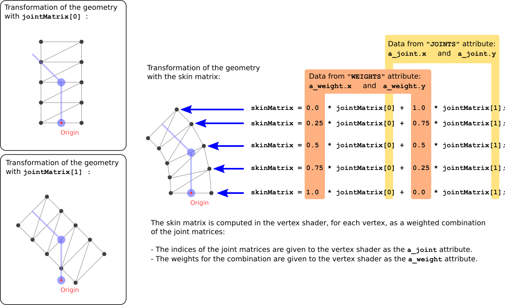

Previous: [Simple Skin](gltfTutorial_019_SimpleSkin.md) | [Table of Contents](README.md)


# Skins

The process of vertex skinning is a bit complex. It brings together nearly all elements that are contained in a glTF asset. This section will explain the basics of vertex skinning, based on the example in the [Simple Skin](gltfTutorial_019_SimpleSkin.md) section.


## The geometry data

The geometry of the vertex skinning example is an indexed triangle mesh, consisting of 8 triangles and 10 vertices. They form a rectangle in the xy-plane, with a width of 1.0 and a height of 2.0. The bottom center of the rectangle is at the origin (0,0,0). So the positions of the vertices are

    -0.5, 0.0, 0.0,
     0.5, 0.0, 0.0,
    -0.5, 0.5, 0.0,
     0.5, 0.5, 0.0,
    -0.5, 1.0, 0.0,
     0.5, 1.0, 0.0,
    -0.5, 1.5, 0.0,
     0.5, 1.5, 0.0,
    -0.5, 2.0, 0.0,
     0.5, 2.0, 0.0

and the indices of the triangles are

    0, 1, 3,
    0, 3, 2,
    2, 3, 5,
    2, 5, 4,
    4, 5, 7,
    4, 7, 6,
    6, 7, 9,
    6, 9, 8,

The raw data is stored in the first `buffer`. The indices and vertex positions are defined by the `bufferView` objects at index 0 and 1, and the corresponding `accessor` objects at index 0 and 1 offer typed access to these buffer views. Image 20a shows this geometry with outline rendering to better show the structure.

<p align="center">
<br>
<a name="simpleSkinOutline01-png"></a>Image 20a: The geometry for the skinning example, with outline rendering, in its initial configuration.
</p>

This geometry data is contained in the mesh primitive of the only mesh, which is attached to the main node of the scene. The mesh primitive contains additional attributes, namely the `"JOINTS_0"` and `"WEIGHTS_0"` attributes. The purpose of these attributes will be explained below.


## The skeleton structure

In the given example, there are two nodes that define the skeleton. They are referred to as "skeleton nodes", or "joint nodes", because they can be imagined as the joints between the bones of the skeleton. The `skin` refers to these nodes, by listing their indices in its `joints` property.

```javascript
  "nodes" : [ 
   ...
   {
    "children" : [ 2 ]
   }, 
   {
    "translation" : [ 0.0, 1.0, 0.0 ],
    "rotation" : [ 0.0, 0.0, 0.0, 1.0 ]
   }
  ],

```

The first joint node is located at the origin, and does not contain any transformations. The second node has a `translation` property, defining a translation about 1.0 along the y-axis, and a `rotation` property that initially describes a rotation about 0 degrees (thus, no rotation at all). This rotation will later be changed by the animation to let the skeleton bend left and right and show the effect of the vertex skinning.

## The skin


The `skin` is the core element of the vertex skinning. In the example, there is a single skin:

```javascript
  "skins" : [ 
   {
    "inverseBindMatrices" : 4,
    "joints" : [ 1, 2 ]
   }
  ],

```

The skin contains an array called `joints`, which lists the indices of the nodes that define the skeleton hierarchy. Additionally, the skin contains a reference to an accessor in the property `inverseBindMatrices`. This accessor provides one matrix for each joint. Each of these matrices transforms the geometry into the space of the respective joint. This means that each matrix is the *inverse* of the global transform of the respective joint, in its initial configuration. 

In the given example, joint `0` does not have an explicit transform, meaning that its global transform is the identity matrix. Therefore, the inverse bind matrix of joint `0` is also the identity matrix. 

Joint contains a translation about 1.0 along the y-axis. The inverse bind matrix of joint `1` is therefore

    1.0   0.0   0.0    0.0   
    0.0   1.0   0.0   -1.0   
    0.0   0.0   1.0    0.0   
    0.0   0.0   0.0    1.0  

This matrix translates the mesh about -1.0 along the y-axis, as shown Image 20b.

<p align="center">
<br>
<a name="skinInverseBindMatrix-png"></a>Image 20b: The transformation of the geometry with the inverse bind matrix of joint 1.
</p>

This transformation may look counterintuitive at first glance. But the goal of this transformation is to bring the coordinates of the skinned vertices into the same space as each joint.


## Vertex skinning implementation

Users of existing rendering libraries will hardly ever have to manually process the vertex skinning data contained in a glTF asset: the actual skinning computations usually take place in the vertex shader, which is a low-level implementation detail of the respective library. However, knowing how the vertex skinning data is supposed to be processed may help to create proper, valid models with vertex skinning. So this section will give a short summary of how the vertex skinning is applied, using some pseudocode and examples in GLSL.

### The joint matrices

The vertex positions of a skinned mesh are eventually computed by the vertex shader. During these computations, the vertex shader has to take into account the current pose of the skeleton in order to compute the proper vertex position. This information is passed to the vertex shader as an array of matrices, namely as the *joint matrices*. This is an array - that is, a `uniform` variable - that contains one 4&times;4 matrix for each joint of the skeleton. In the shader, these matrices are combined to compute the actual skinning matrix for each vertex:


```glsl
...
uniform mat4 u_jointMat[2];

...
void main(void)
{
    mat4 skinMat =
        a_weight.x * u_jointMat[int(a_joint.x)] +
        a_weight.y * u_jointMat[int(a_joint.y)] +
        a_weight.z * u_jointMat[int(a_joint.z)] +
        a_weight.w * u_jointMat[int(a_joint.w)];
    ....
}
```

The joint matrix for each joint has to perform the following transformations to the vertices:

- The vertices have to be transformed with the `inverseBindMatrix` of the joint node, to bring them into the same coordinate space as the joint.
- The vertices have to be transformed with the *current* global transform of the joint node. Together with the transformation from the `inverseBindMatrix`, this will cause the vertices to be transformed only based on the current transform of the node, in the coordinate space of the current joint node.

So the pseudocode for computing the joint matrix of joint `j` may look as follows:

    jointMatrix(j) =
      globalTransformOfJointNode(j) *
      inverseBindMatrixForJoint(j);
      
Note: Vertex skinning in other contexts often involves a matrix that is called "Bind Shape Matrix". This matrix is supposed to transform the geometry of the skinned mesh into the coordinate space of the joints. In glTF, this matrix is omitted, and it is assumed that this transform is either premultiplied with the mesh data, or postmultiplied to the inverse bind matrices. 

Image 20c shows the transformations that are done to the geometry in the [Simple Skin](gltfTutorial_019_SimpleSkin.md) example, using the joint matrix of joint 1. The image shows the transformation for an intermediate state of the animation, namely, when the rotation of the joint node has already been modified by the animation, to describe a rotation about 45 degrees around the z-axis.

<p align="center">
<br>
<a name="skinJointMatrices-png"></a>Image 20c: The transformation of the geometry done for joint 1.
</p>

The last panel of Image 20c shows how the geometry would look like if it were *only* transformed with the joint matrix of joint 1. This state of the geometry is never really visible: The *actual* geometry that is computed in the vertex shader will *combine* the geometries as they are created from the different joint matrices, based on the joints- and weights that are explained below.


### The skinning joints and weights

As mentioned above, the mesh primitive contains new attributes that are required for the vertex skinning. Particularly, these are the `"JOINTS_0"` and the `"WEIGHTS_0"` attributes. Each attribute refers to an accessor that provides one data element for each vertex of the mesh.

The `"JOINTS_0"` attribute refers to an accessor that contains the indices of the joints that should have an influence on the vertex during the skinning process. For simplicity and efficiency, these indices are usually stored as 4D vectors, limiting the number of joints that may influence a vertex to 4. In the given example, the joints information is very simple:

    Vertex 0:  0, 0, 0, 0,
    Vertex 1:  0, 0, 0, 0,
    Vertex 2:  0, 1, 0, 0,
    Vertex 3:  0, 1, 0, 0,
    Vertex 4:  0, 1, 0, 0,
    Vertex 5:  0, 1, 0, 0,
    Vertex 6:  0, 1, 0, 0,
    Vertex 7:  0, 1, 0, 0,
    Vertex 8:  0, 1, 0, 0,
    Vertex 9:  0, 1, 0, 0,

This means that every vertex may be influenced by joint 0 and joint 1, except the first two vertices are influenced only by joint 0, and the last two vertices are influenced only by joint 1. The last 2 components of each vector are ignored here. If there were multiple joints, then one entry of this accessor could, for example, contain

    3, 1, 8, 4,

meaning that the corresponding vertex should be influenced by the joints 3, 1, 8, and 4.

The `"WEIGHTS_0"` attribute refers to an accessor that provides information about how strongly each joint should influence each vertex. In the given example, the weights are as follows:

    Vertex 0:  1.00,  0.00,  0.0, 0.0,
    Vertex 1:  1.00,  0.00,  0.0, 0.0,
    Vertex 2:  0.75,  0.25,  0.0, 0.0,
    Vertex 3:  0.75,  0.25,  0.0, 0.0,
    Vertex 4:  0.50,  0.50,  0.0, 0.0,
    Vertex 5:  0.50,  0.50,  0.0, 0.0,
    Vertex 6:  0.25,  0.75,  0.0, 0.0,
    Vertex 7:  0.25,  0.75,  0.0, 0.0,
    Vertex 8:  0.00,  1.00,  0.0, 0.0,
    Vertex 9:  0.00,  1.00,  0.0, 0.0,

Again, the last two components of each entry are not relevant, because there are only two joints.

Combining the `"JOINTS_0"` and `"WEIGHTS_0"` attributes yields exact information about the influence that each joint has on each vertex. For example, the given data means that vertex 6 should be influenced to 25% by joint 0 and to 75% by joint 1.

In the vertex shader, this information is used to create a linear combination of the joint matrices. This matrix is called the *skin matrix* of the respective vertex. Therefore, the data of the `"JOINTS_0"` and `"WEIGHTS_0"` attributes are passed to the shader. In this example, they are given as the `a_joint` and `a_weight` attribute variable, respectively:

```glsl
...
attribute vec4 a_joint;
attribute vec4 a_weight;

uniform mat4 u_jointMat[2];

...
void main(void)
{
    mat4 skinMat =
        a_weight.x * u_jointMat[int(a_joint.x)] +
        a_weight.y * u_jointMat[int(a_joint.y)] +
        a_weight.z * u_jointMat[int(a_joint.z)] +
        a_weight.w * u_jointMat[int(a_joint.w)];
    vec4 worldPosition = skinMat * vec4(a_position,1.0);
    vec4 cameraPosition = u_viewMatrix * worldPosition;
    gl_Position = u_projectionMatrix * cameraPosition;
}
```
The skin matrix is then used to transform the original position of the vertex into the world space. The transform of the node that the skin is attached to is ignored. The result of this transformation can be imagined as a weighted transformation of the vertices with the respective joint matrices, as shown in Image 20d.

<p align="center">
<br>
<a name="skinSkinMatrix-png"></a>Image 20d: Computation of the skin matrix.
</p>

The result of applying this skin matrix to the vertices for the given example is shown in Image 20e.

<p align="center">
<br>
<a name="simpleSkinOutline02-png"></a>Image 20e: The geometry for the skinning example, with outline rendering, during the animation.
</p>


Previous: [Simple Skin](gltfTutorial_019_SimpleSkin.md) | [Table of Contents](README.md)
