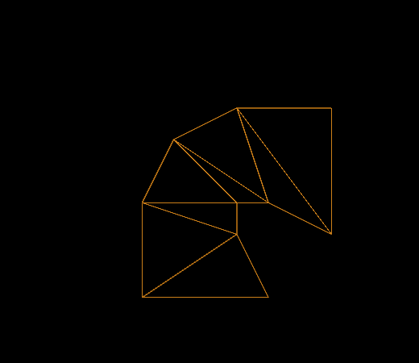

Previous: [Simple Skin](gltfTutorial_019_Cameras.md) | [Table of Contents](README.md)

**NOTE: Parts of the skinning may undergo minor changes for glTF 1.1. See https://github.com/KhronosGroup/glTF/issues/723 and https://github.com/KhronosGroup/glTF/issues/624**


# Skins

The process of vertex skinning is a bit complex. It brings together nearly all elements that are contained in a glTF asset. This section will explain the basics of vertex skinning, based on the [Simple Skin](gltfTutorial_019_SimpleSkin.md) example from the previous section.


## The geometry data

The geometry of the vertex skinning example is an indexed triangle mesh, consisting of 8 triangles and 10 vertices. They form a rectangle in the xy-plane, with the lower left point at the origin (0,0,0), and the upper right point at (1,2,0). So the positions of the vertices are 

    0.0, 0.0, 0.0,
    1.0, 0.0, 0.0,
    0.0, 0.5, 0.0,
    1.0, 0.5, 0.0,
    0.0, 1.0, 0.0,
    1.0, 1.0, 0.0,
    0.0, 1.5, 0.0,
    1.0, 1.5, 0.0,
    0.0, 2.0, 0.0,
    1.0, 2.0, 0.0

and the indices of the triangles are

    0, 1, 3,
    0, 3, 2,
    2, 3, 5,
    2, 5, 4,
    4, 5, 7,
    4, 7, 6,
    6, 7, 9,
    6, 9, 8,

The raw data is stored in the buffer that has the ID `"geometryBuffer"`. The indices and vertex positions are defined by the buffer views with the IDs `"indicesBufferView"` and `"positionsBufferView"`, respectively, and the corresponding accessors with the IDs `"indicesAccessor"` and `"positionsAccessor"` offer typed access to these buffer views. The following is an image of this geometry, with outline rendering, to better show the structure: 

<p align="center">
<br>
<a name="simpleSkinOutline01-png"></a>Image 20a: The geometry for the skinning example, with outline rendering, in its initial configuration
</p>

This geometry data is contained in the mesh primitive of the mesh with the ID `"mesh0"`, which is attached to the main node of the scene. The mesh primitive contains additional attributes, namely the `"JOINTS"` and `"WEIGHTS"` attributes. The purpose of these attributes will be explained below.


## The skeleton structure

In the given example, there are two nodes that define the skeleton. They are referred to as "skeleton nodes" or "joint nodes" here, because they can be imagined as the joints between the bones of the skeleton. Each joint node has a property `"jointName"`, which indicates that this node is part of a skeleton hierarchy, and this name is used by the `skin` to refer to this node.

The first joint node, `"jointNode0"`, has a translation about 1.0 along the y-axis. The second joint node, `"jointNode0"`, has a `rotation` property which initially describes a rotation about 0 degrees (thus, no rotation at all). 


```javascript
  "nodes" : {
    ...
    "jointNode0" : {
      "jointName" : "joint0",
      "children" : [ "jointNode1" ],
      "translation" : [ 0.0, 1.0, 0.0 ]
    },
    "jointNode1" : {
      "jointName" : "joint1",
      "rotation" : [ 0.0, 0.0, 0.0, 1.0 ]
    }
  },

```

The position of these nodes in relation to the mesh geometry is shown in this image:

<p align="center">
<br>
<a name="skinSkeletonNodes-png"></a>Image 20a: The joint nodes and their position in relation to the geometry
</p>


## The skin


The `skin` is the core element of the vertex skinning. In the example, there is a single skin with the ID `"simpleSkin"`:

```javascript
  
  "skins": {
    "simpleSkin": {
      "bindShapeMatrix": [
         1.0, 0.0, 0.0, 0.0,
         0.0, 1.0, 0.0, 0.0,
         0.0, 0.0, 1.0, 0.0,
        -0.5, 0.0, 0.0, 1.0
      ],
      "jointNames": [
        "joint0",
        "joint1"
      ],
      "inverseBindMatrices": "inverseBindMatricesAccessor"
    }
  },

```

One property of the skin is the `bindShapeMatrix`. This is a 4x4 matrix, in column-major order, that defines the transformation that has to be applied to the mesh in order to bring it into the space of the skeleton. The follwing image shows this transformation for the given example: It moves the mesh so that the first joint node is at the center of the bottom of the rectangle, and the skeleton bones are in the center of the mesh:

<p align="center">
<br>
<a name="skinBindShapeMatrix-png"></a>Image 20b: The translation that is applied to the mesh with the bindShapeMatrix
</p>

**TODO: This wil change in 1.1:**

The skin also contains an array called `jointNames` which lists the name of the joints that belong to this skin. These are the `jointName` properties of the joint nodes. In the given example, these are `"joint0"` and `"joint1"`, belonging to the `"jointNode0"` and `"jointNode1"`, respectively.


Finally, the skin contains a reference to an accessor, in the property `inverseBindMatrices`. This accessor provides one matrix for each joint. Each of these matrices transforms the geometry into the space of the respective joint. This means that each matrix is the *inverse* of the global transform of the repsective joint, in its initial configuration. In the given example, this inverse of the initial global transform is the same for both joint nodes:

    1.0   0.0   0.0    0.0   
    0.0   1.0   0.0   -1.0   
    0.0   0.0   1.0    0.0   
    0.0   0.0   0.0    1.0  
            
This matrix for translates the mesh about -1 along the y-axis, as shown in this image:

<p align="center">
<br>
<a name="skinInverseBindMatrix-png"></a>Image 20b: The transformation of the geometry with the inverse bind matrix of joint 1
</p>

The goal of this transformation is to "undo" the transformation that is done by the initial global transform of the respective joint node, so that the influences of the joint to the mesh vertices may be computed based on their actual global transform.


## The joint matrices 

**TODO**

        // [jointMatrix(j)] = 
        //     [globalTransformOfNode^-1] *
        //     [globalTransformOfJointNode] *
        //     [inverseBindMatrix(j)] *
        //     [bindShapeMatrix]


## The skinning joints and weights

As mentioned above, the mesh primitive contains new attributes that are required for the vertex skinning. Particularly, these are the `"JOINTS"` and the `"WEIGHTS"` attribute. Each attribute refers to an accessor that provides one data element for each vertex of the mesh. 

The `"JOINTS"` attribute refers to an accessor that contains the indices of the joints that should have an influence on the vertex during the skinning process. For simplicity and efficiency, these indices are usally stored as 4D vectors, limiting the number of joints that may influence a vertex to 4. In the given example, the joints information is very simple:

    Vertex 0:  0, 1, 0, 0, 
    Vertex 1:  0, 1, 0, 0, 
    Vertex 2:  0, 1, 0, 0, 
    Vertex 3:  0, 1, 0, 0, 
    Vertex 4:  0, 1, 0, 0, 
    Vertex 5:  0, 1, 0, 0, 
    Vertex 6:  0, 1, 0, 0, 
    Vertex 7:  0, 1, 0, 0, 
    Vertex 8:  0, 1, 0, 0, 
    Vertex 9:  0, 1, 0, 0, 

This means that every vertex should be influenced by joint 0 and joint 1. (The last 2 components of each vector are ignored here. If there were multiple joints, then one entry of this accessor could, for example, contain

    3, 1, 8, 4, 
    
meaning that the corresponding vertex should be influenced by the joints 3, 1, 8 and 4) 

The `"WEIGHTS"` attribute refers to an accessor that provides information about how strongly each joint should influence each vertex. In the given example, the weights are as follows:

    Vertex 0:  1.00,  0.00,  0.0, 0.0, 
    Vertex 1:  1.00,  0.00,  0.0, 0.0, 
    Vertex 2:  0.75,  0.25,  0.0, 0.0, 
    Vertex 3:  0.75,  0.25,  0.0, 0.0, 
    Vertex 4:  0.50,  0.50,  0.0, 0.0, 
    Vertex 5:  0.50,  0.50,  0.0, 0.0, 
    Vertex 6:  0.25,  0.75,  0.0, 0.0, 
    Vertex 7:  0.25,  0.75,  0.0, 0.0, 
    Vertex 8:  0.00,  1.00,  0.0, 0.0, 
    Vertex 9:  0.00,  1.00,  0.0, 0.0, 

Again, the last two components of each entry are not relevant, because there are only two joints.

Combining the `"JOINTS"` and `"WEIGHTS"` attributes yields exact information about the influence that each joint has on each vertex. For example, the given data means that vertex 6 should be influenced to 25% by joint 0 and to 75% by joint 1. 


<p align="center">
<br>
<a name="simpleSkinOutline02-png"></a>Image 20b: The geometry for the skinning example, with outline rendering, during the animation
</p>


Previous: [Simple Skin](gltfTutorial_019_Cameras.md) | [Table of Contents](README.md)


