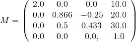

上一章: [最小的 glTF 文件](gltfTutorial_003_MinimalGltfFile.md) | [目录](README.md) | 下一章: [缓冲区、缓冲区视图和访问器](gltfTutorial_005_BuffersBufferViewsAccessors.md)

# 场景和节点

## 场景

一个 glTF 文件中可能存储多个场景。`scene` 属性指示这些场景中的哪一个应该作为加载资产时显示的默认场景。每个场景包含一个 `nodes` 数组，这是场景图的根节点的索引。同样，可能有多个根节点，形成不同的层次结构，但在许多情况下，场景将有一个单一的根节点。上一节中已经展示了最简单的场景描述，它由一个具有单个节点的场景组成：

```javascript
  "scene": 0, 
  "scenes" : [
    {
      "nodes" : [ 0 ]
    }
  ],

  "nodes" : [
    {
      "mesh" : 0
    }
  ],
```


## 形成场景图的节点

每个 [`node`](https://www.khronos.org/registry/glTF/specs/2.0/glTF-2.0.html#reference-node) 可以包含一个称为 `children` 的数组，该数组包含其子节点的索引。因此，每个节点都是节点层次结构中的一个元素，它们共同定义了场景的结构作为一个场景图。

<p align="center">
<br>
<a name="sceneGraph-png"></a>图 4a: 存储在 glTF JSON 中的场景图表示。
</p>

可以遍历场景中给出的每个节点，递归访问其所有子节点，以处理附加到节点的所有元素。这种遍历的简化伪代码可能如下所示：

```
traverse(node) {
    // 处理附加到此节点的网格、相机等
    // - 将在后面讨论
    processElements(node);

    // 递归处理所有子节点
    for each (child in node.children) {
        traverse(child);
    }
}
```

在实践中，遍历需要一些额外的信息：处理附加到节点的某些元素将需要有关它们附加到*哪个*节点的信息。此外，在遍历期间必须累积有关节点变换的信息。


### 局部和全局变换

每个节点可以有一个变换。这种变换将定义平移、旋转和/或缩放。这个变换将应用于附加到节点本身的所有元素以及其所有子节点。因此，节点层次结构使得可以构建应用于场景元素的平移、旋转和缩放。


#### 节点的局部变换

节点的局部变换有不同的可能表示方式。变换可以由节点的 `matrix` 属性直接给出。这是一个包含 16 个浮点数的数组，它以列主序描述矩阵。例如，以下矩阵描述了关于 (2,1,0.5) 的缩放，围绕 x 轴旋转 30 度，以及关于 (10,20,30) 的平移：

```javascript
"node0": {
    "matrix": [
        2.0,    0.0,    0.0,    0.0,
        0.0,    0.866,  0.5,    0.0,
        0.0,   -0.25,   0.433,  0.0,
       10.0,   20.0,   30.0,    1.0
    ]
}    
```

这里定义的矩阵如图 4b 所示。

<p align="center">
<br>
<a name="matrix-png"></a>图 4b: 一个示例矩阵。
</p>


节点的变换也可以使用节点的 `translation`、`rotation` 和 `scale` 属性给出，有时缩写为 *TRS*：

```javascript
"node0": {
    "translation": [ 10.0, 20.0, 30.0 ],
    "rotation": [ 0.259, 0.0, 0.0, 0.966 ],
    "scale": [ 2.0, 1.0, 0.5 ]
}
```

这些属性中的每一个都可以用来创建一个矩阵，这些矩阵的乘积就是节点的局部变换：

- `translation` 只包含 x、y 和 z 方向上的平移。例如，从 `[ 10.0, 20.0, 30.0 ]` 的平移中，可以创建一个平移矩阵，它在最后一列中包含这个平移，如图 4c 所示。

<p align="center">
<br>
<a name="translationMatrix-png"></a>图 4c: 一个平移矩阵。
</p>


- `rotation` 以 [四元数](https://en.wikipedia.org/wiki/Quaternion) 的形式给出。四元数的数学背景超出了本教程的范围。目前，最重要的信息是四元数是围绕任意角度和任意轴的旋转的紧凑表示。它存储为一个元组 `(x,y,z,w)`，其中 `w` 分量是旋转角度一半的余弦。例如，四元数 `[ 0.259, 0.0, 0.0, 0.966 ]` 描述了围绕 x 轴旋转 30 度。所以这个四元数可以转换为一个旋转矩阵，如图 4d 所示。

<p align="center">
<br>
<a name="rotationMatrix-png"></a>图 4d: 一个旋转矩阵。
</p>


- `scale` 包含沿 x、y 和 z 轴的缩放因子。相应的矩阵可以通过将这些缩放因子用作矩阵对角线上的条目来创建。例如，缩放因子 `[ 2.0, 1.0, 0.5 ]` 的缩放矩阵如图 4e 所示。

<p align="center">
<br>
<a name="scaleMatrix-png"></a>图 4e: 一个缩放矩阵。
</p>

计算节点的最终局部变换矩阵时，这些矩阵会相乘。按正确的顺序执行这些矩阵的乘法很重要。局部变换矩阵必须始终计算为 `M = T * R * S`，其中 `T` 是 `translation` 部分的矩阵，`R` 是 `rotation` 部分的矩阵，`S` 是 `scale` 部分的矩阵。因此，计算的伪代码是

```
translationMatrix = createTranslationMatrix(node.translation);
rotationMatrix = createRotationMatrix(node.rotation);
scaleMatrix = createScaleMatrix(node.scale);
localTransform = translationMatrix * rotationMatrix * scaleMatrix;
```

对于上面给出的示例矩阵，节点的最终局部变换矩阵将如图 4f 所示。

<p align="center">
<br>
<a name="produtMatrix-png"></a>图 4f: 从 TRS 属性计算的最终局部变换矩阵。
</p>

该矩阵将使网格的顶点按照节点中给出的 `scale`、`rotation` 和 `translation` 属性进行缩放、旋转和平移。

当未给出三个属性中的任何一个时，将使用恒等矩阵。同样，当节点既不包含 `matrix` 属性也不包含 TRS 属性时，其局部变换将是恒等矩阵。


#### 节点的全局变换

无论 JSON 文件中的表示如何，节点的局部变换都可以存储为一个 4&times;4 矩阵。节点的*全局*变换由从根到相应节点的路径上所有局部变换的乘积给出：

    结构:                局部变换         全局变换
    root                 R                R
     +- nodeA            A                R*A
         +- nodeB        B                R*A*B
         +- nodeC        C                R*A*C

需要指出的是，在文件加载后，这些全局变换*不能*只计算一次。后面将展示*动画*如何修改单个节点的局部变换。这些修改将影响所有后代节点的全局变换。因此，当需要节点的全局变换时，必须直接从所有节点的当前局部变换计算它。或者，作为潜在的性能改进，实现可以缓存全局变换，检测祖先节点的局部变换的变化，并仅在必要时更新全局变换。这方面的不同实现选项将取决于编程语言和客户端应用程序的要求，因此超出了本教程的范围。


上一章: [最小的 glTF 文件](gltfTutorial_003_MinimalGltfFile.md) | [目录](README.md) | 下一章: [缓冲区、缓冲区视图和访问器](gltfTutorial_005_BuffersBufferViewsAccessors.md)
