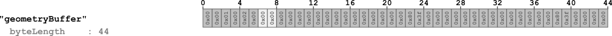
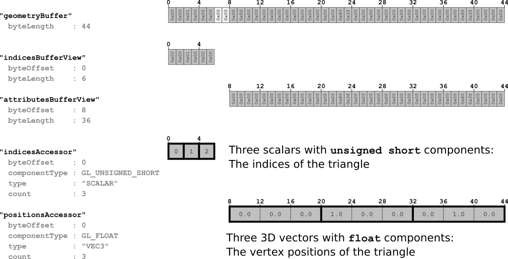

上一章: [场景和节点](gltfTutorial_004_ScenesNodes.md) | [目录](README.md) | 下一章: [简单动画](gltfTutorial_006_SimpleAnimation.md)

# 缓冲区、缓冲区视图和访问器

`buffer`、`bufferView` 和 `accessor` 对象的示例已经在 [最小的 glTF 文件](gltfTutorial_003_MinimalGltfFile.md) 部分给出。本节将更详细地解释这些概念。

## 缓冲区

[`buffer`](https://www.khronos.org/registry/glTF/specs/2.0/glTF-2.0.html#reference-buffer) 表示一块原始二进制数据，没有固有的结构或含义。缓冲区使用其 `uri` 引用这些数据。这个 URI 可以指向外部文件，也可以是 [数据 URI](gltfTutorial_002_BasicGltfStructure.md#数据-uri-中的二进制数据)，它直接在 JSON 文件中编码二进制数据。[最小的 glTF 文件](gltfTutorial_003_MinimalGltfFile.md) 包含了一个 `buffer` 的示例，其中有 44 字节的数据，编码为数据 URI：

```javascript
  "buffers" : [
    {
      "uri" : "data:application/octet-stream;base64,AAABAAIAAAAAAAAAAAAAAAAAAAAAAIA/AAAAAAAAAAAAAAAAAACAPwAAAAA=",
      "byteLength" : 44
    }
  ],
```

<p align="center">
<br>
<a name="buffer-png"></a>图 5a: 缓冲区数据，由 44 字节组成。
</p>

`buffer` 数据的部分可能必须作为顶点属性或索引传递给渲染器，或者数据可能包含蒙皮信息或动画关键帧。为了能够使用这些数据，需要有关此数据结构和类型的额外信息。

## 缓冲区视图

使用 [`bufferView`](https://www.khronos.org/registry/glTF/specs/2.0/glTF-2.0.html#reference-bufferview) 对象是结构化 `buffer` 数据的第一步。`bufferView` 表示一个缓冲区数据的"切片"。这个切片使用偏移量和长度（以字节为单位）来定义。[最小的 glTF 文件](gltfTutorial_003_MinimalGltfFile.md) 定义了两个 `bufferView` 对象：

```javascript
  "bufferViews" : [
    {
      "buffer" : 0,
      "byteOffset" : 0,
      "byteLength" : 6,
      "target" : 34963
    },
    {
      "buffer" : 0,
      "byteOffset" : 8,
      "byteLength" : 36,
      "target" : 34962
    }
  ],
```

第一个 `bufferView` 引用缓冲区数据的前 6 个字节。第二个引用缓冲区的 36 个字节，偏移量为 8 字节，如下图所示：

<p align="center">
<br>
<a name="bufferBufferView-png"></a>图 5b: 缓冲区视图，引用缓冲区的部分。
</p>

浅灰色显示的字节是填充字节，这些字节是为了正确对齐访问器所必需的，如下所述。

每个 `bufferView` 还包含一个 `target` 属性。渲染器稍后可以使用此属性来分类缓冲区视图引用的数据的类型或性质。`target` 可以是一个常量，表示数据用于顶点属性（`34962`，代表 `ARRAY_BUFFER`），或者数据用于顶点索引（`34963`，代表 `ELEMENT_ARRAY_BUFFER`）。

在这一点上，`buffer` 数据已被分成多个部分，每个部分由一个 `bufferView` 描述。但是为了在渲染器中真正使用这些数据，还需要有关数据类型和布局的额外信息。

## 访问器

[`accessor`](https://www.khronos.org/registry/glTF/specs/2.0/glTF-2.0.html#reference-accessor) 对象引用一个 `bufferView` 并包含定义此 `bufferView` 数据类型和布局的属性。

### 数据类型

访问器数据的类型编码在 `type` 和 `componentType` 属性中。`type` 属性的值是一个字符串，指定数据元素是标量、向量还是矩阵。例如，值可能是 `"SCALAR"` 表示标量值，`"VEC3"` 表示 3D 向量，或者 `"MAT4"` 表示 4&times;4 矩阵。

`componentType` 指定这些数据元素的组件类型。这是一个 GL 常量，可能是例如 `5126`（`FLOAT`）或 `5123`（`UNSIGNED_SHORT`），分别表示元素具有 `float` 或 `unsigned short` 组件。

这些属性的不同组合可用于描述任意数据类型。例如，[最小的 glTF 文件](gltfTutorial_003_MinimalGltfFile.md) 包含两个访问器：

```javascript
  "accessors" : [
    {
      "bufferView" : 0,
      "byteOffset" : 0,
      "componentType" : 5123,
      "count" : 3,
      "type" : "SCALAR",
      "max" : [ 2 ],
      "min" : [ 0 ]
    },
    {
      "bufferView" : 1,
      "byteOffset" : 0,
      "componentType" : 5126,
      "count" : 3,
      "type" : "VEC3",
      "max" : [ 1.0, 1.0, 0.0 ],
      "min" : [ 0.0, 0.0, 0.0 ]
    }
  ],
```

第一个访问器引用索引为 0 的 `bufferView`，它定义了包含索引的 `buffer` 数据部分。其 `type` 是 `"SCALAR"`，其 `componentType` 是 `5123`（`UNSIGNED_SHORT`）。这意味着索引存储为标量 `unsigned short` 值。

第二个访问器引用索引为 1 的 `bufferView`，它定义了包含顶点属性的 `buffer` 数据部分 - 特别是顶点位置。其 `type` 是 `"VEC3"`，其 `componentType` 是 `5126`（`FLOAT`）。所以这个访问器描述了具有浮点组件的 3D 向量。

### 数据布局

访问器的其他属性进一步指定数据的布局。访问器的 `count` 属性表示它由多少个数据元素组成。在上面的例子中，两个访问器的计数都是 `3`，分别代表三角形的三个索引和三个顶点。每个访问器还有一个 `byteOffset` 属性。对于上面的例子，两个访问器的偏移量都是 `0`，因为每个 `bufferView` 只有一个 `accessor`。但是当多个访问器引用同一个 `bufferView` 时，`byteOffset` 描述了访问器的数据相对于它引用的 `bufferView` 从哪里开始。

### 数据对齐

`accessor` 引用的数据可能被发送到图形卡进行渲染，或者在主机端作为动画或蒙皮数据使用。因此，`accessor` 的数据必须根据数据的*类型*进行对齐。例如，当 `accessor` 的 `componentType` 是 `5126`（`FLOAT`）时，数据必须在 4 字节边界上对齐，因为单个 `float` 值由四个字节组成。访问器的这种对齐要求涉及其 `bufferView` 和底层的 `buffer`。特别是，对齐要求如下：

- `accessor` 的 `byteOffset` 必须能被其 `componentType` 的大小整除。
- 访问器的 `byteOffset` 和它引用的 `bufferView` 的 `byteOffset` 之和必须能被其 `componentType` 的大小整除。

在上面的例子中，索引为 1 的 `bufferView`（引用顶点属性）的 `byteOffset` 被选为 `8`，以便将顶点位置访问器的数据对齐到 4 字节边界。因此，`buffer` 的第 `6` 和 `7` 字节是*填充*字节，不包含相关数据。

图 5c 说明了如何使用 `bufferView` 对象结构化 `buffer` 的原始数据，并使用 `accessor` 对象增加数据类型信息。

<p align="center">
<br>
<a name="bufferBufferViewAccessor-png"></a>图 5c: 访问器定义如何解释缓冲区视图的数据。
</p>

### 数据交错

存储在单个 `bufferView` 中的属性数据可以作为*结构数组*存储。例如，单个 `bufferView` 可能以交错方式包含顶点位置和顶点法线的数据。在这种情况下，访问器的 `byteOffset` 定义相应属性的第一个相关数据元素的开始，而 `bufferView` 定义了额外的 `byteStride` 属性。这是其访问器的一个元素的开始与下一个元素的开始之间的字节数。图 5d 显示了交错的位置和法线属性如何存储在 `bufferView` 中的示例。

<p align="center">
<br>
<a name="aos-png"></a>图 5d: 一个缓冲区视图中的交错访问器。
</p>

### 数据内容

`accessor` 还包含 `min` 和 `max` 属性，这些属性汇总了它们数据的内容。它们是访问器中包含的所有数据元素的分量最小值和最大值。在顶点位置的情况下，`min` 和 `max` 属性因此定义了对象的*边界框*。这对于优先下载或可见性检测可能很有用。一般来说，这些信息对于存储和处理*量化*数据也很有用，这些数据在运行时由渲染器进行反量化，但是这种量化的细节超出了本教程的范围。

## 稀疏访问器（Sparse accessors）

在 glTF 2.0 版本中，引入了*稀疏访问器*的概念。这是一种特殊的数据表示，允许非常紧凑地存储仅有少数不同条目的多个数据块。例如，当存在包含顶点位置的几何数据时，这些几何数据可能用于多个对象。这可以通过从两个对象引用同一个 `accessor` 来实现。如果两个对象的顶点位置大部分相同，仅对少数顶点有所不同，那么就不必将整个几何数据存储两次。相反，可以只存储一次数据，并使用稀疏访问器仅存储第二个对象有所不同的顶点位置。

以下是一个完整的 glTF 资产，以嵌入式表示形式展示了稀疏访问器的示例：

```javascript
{
  "scenes" : [ {
    "nodes" : [ 0 ]
  } ],
  
  "nodes" : [ {
    "mesh" : 0
  } ],
  
  "meshes" : [ {
    "primitives" : [ {
      "attributes" : {
        "POSITION" : 1
      },
      "indices" : 0
    } ]
  } ],
  
  "buffers" : [ {
    "uri" : "data:application/gltf-buffer;base64,AAAIAAcAAAABAAgAAQAJAAgAAQACAAkAAgAKAAkAAgADAAoAAwALAAoAAwAEAAsABAAMAAsABAAFAAwABQANAAwABQAGAA0AAAAAAAAAAAAAAAAAAACAPwAAAAAAAAAAAAAAQAAAAAAAAAAAAABAQAAAAAAAAAAAAACAQAAAAAAAAAAAAACgQAAAAAAAAAAAAADAQAAAAAAAAAAAAAAAAAAAgD8AAAAAAACAPwAAgD8AAAAAAAAAQAAAgD8AAAAAAABAQAAAgD8AAAAAAACAQAAAgD8AAAAAAACgQAAAgD8AAAAAAADAQAAAgD8AAAAACAAKAAwAAAAAAIA/AAAAQAAAAAAAAEBAAABAQAAAAAAAAKBAAACAQAAAAAA=",
    "byteLength" : 284
  } ],
  
  "bufferViews" : [ {
    "buffer" : 0,
    "byteOffset" : 0,
    "byteLength" : 72,
    "target" : 34963
  }, {
    "buffer" : 0,
    "byteOffset" : 72,
    "byteLength" : 168
  }, {
    "buffer" : 0,
    "byteOffset" : 240,
    "byteLength" : 6
  }, {
    "buffer" : 0,
    "byteOffset" : 248,
    "byteLength" : 36
  } ],
  
  "accessors" : [ {
    "bufferView" : 0,
    "byteOffset" : 0,
    "componentType" : 5123,
    "count" : 36,
    "type" : "SCALAR",
    "max" : [ 13 ],
    "min" : [ 0 ]
  }, {
    "bufferView" : 1,
    "byteOffset" : 0,
    "componentType" : 5126,
    "count" : 14,
    "type" : "VEC3",
    "max" : [ 6.0, 4.0, 0.0 ],
    "min" : [ 0.0, 0.0, 0.0 ],
    "sparse" : {
      "count" : 3,
      "indices" : {
        "bufferView" : 2,
        "byteOffset" : 0,
        "componentType" : 5123
      },
      "values" : {
        "bufferView" : 3,
        "byteOffset" : 0
      }
    }
  } ],
  
  "asset" : {
    "version" : "2.0"
  }
}
```

渲染此资产的结果如图 5e 所示：

<p align="center">
<br>
<a name="simpleSparseAccessor-png"></a>图 5e: 渲染简单稀疏访问器资产的结果。
</p>

示例包含两个访问器：一个用于网格的索引，一个用于顶点位置。引用顶点位置的访问器定义了一个额外的 `accessor.sparse` 属性，其中包含有关应该应用的稀疏数据替换的信息：

```javascript
  "accessors" : [ 
  ...
  {
    "bufferView" : 1,
    "byteOffset" : 0,
    "componentType" : 5126,
    "count" : 14,
    "type" : "VEC3",
    "max" : [ 6.0, 4.0, 0.0 ],
    "min" : [ 0.0, 0.0, 0.0 ],
    "sparse" : {
      "count" : 3,
      "indices" : {
        "bufferView" : 2,
        "byteOffset" : 0,
        "componentType" : 5123
      },
      "values" : {
        "bufferView" : 3,
        "byteOffset" : 0
      }
    }
  } ],
```

这个 `sparse` 对象本身定义了将受替换影响的元素的 `count`。`sparse.indices` 属性引用一个 `bufferView`，其中包含将被替换的元素的索引。`sparse.values` 引用一个 `bufferView`，其中包含实际数据。

在示例中，原始几何数据存储在索引为 1 的 `bufferView` 中。它描述了一个矩形顶点数组。`sparse.indices` 引用索引为 2 的 `bufferView`，其中包含索引 `[8, 10, 12]`。`sparse.values` 引用索引为 3 的 `bufferView`，其中包含新的顶点位置，即 `[(1,2,0), (3,3,0), (5,4,0)]`。应用相应替换的效果如图 5f 所示。

<p align="center">
<br>
<a name="simpleSparseAccessorDescription-png"></a>图 5f: 使用稀疏访问器进行的替换。
</p>

上一章: [场景和节点](gltfTutorial_004_ScenesNodes.md) | [目录](README.md) | 下一章: [简单动画](gltfTutorial_006_SimpleAnimation.md)
